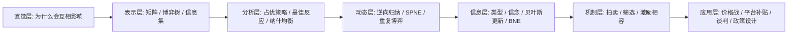

# 00-学习路线总览

这份总览不是简单的目录页，而是整个仓库的课程导航。你可以把它理解成“先学什么，后学什么，为什么要这样学”的路线图。

> [!abstract] 课程控制台
> 
> > [!example] 快速进入
> > [01-博弈论导论](../01-Foundations/01-博弈论导论.md) · [04-占优策略与迭代剔除](../02-Static-Games/04-占优策略与迭代剔除.md) · [07-动态博弈与逆向归纳](../03-Dynamic-Games/07-动态博弈与逆向归纳.md)
> 
> > [!example] 练习入口
> > [练习总览](../11-Exercises/00-exercise-guide.md) · [1-22 讲练习索引](../11-Exercises/lecture1-22-exercise-index.md)
> 
> > [!example] 资源入口
> > [课程与教材](../08-Resources/课程与教材总表.md) · [PDF 与公开讲义](../08-Resources/PDF与公开讲义总表.md) · [视频资源](../08-Resources/视频资源总表.md)
> 
> > [!example] 复盘工具
> > [复盘方法与输出模板](03-复盘方法与输出模板.md) · [课程地图与先修关系](02-课程地图与先修关系.md)

## 一句话理解整套学习逻辑

博弈论不是先背纳什均衡，而是先理解“为什么我的选择会受别人选择影响”，再逐步进入矩阵、均衡、动态顺序、信息不对称和机制设计。

完整学习链路如下：

`战略互动是什么 -> 如何表示博弈 -> 如何找稳定结果 -> 为什么时间顺序重要 -> 为什么信息不对称改变结果 -> 如何设计规则让人说真话/做对事`

## 推荐的四阶段学习路径

### 第一阶段：先把“战略互动”真正搞懂

目标：

- 明白博弈论和单人最优化有什么根本差别
- 理解玩家、策略、收益、信息、行动顺序这些构件
- 看懂矩阵博弈与博弈树

建议阅读：

- [01-博弈论导论](../01-Foundations/01-博弈论导论.md)
- [02-玩家策略收益与信息](../01-Foundations/02-玩家策略收益与信息.md)
- [03-标准式博弈与扩展式博弈](../01-Foundations/03-标准式博弈与扩展式博弈.md)
- [01-博弈论导论](../01-Foundations/01-博弈论导论.md)

### 第二阶段：学会分析静态博弈

目标：

- 会判断占优策略
- 会画最佳反应
- 会找纯策略和混合策略纳什均衡
- 会区分囚徒困境、协调博弈、零和博弈等典型结构

建议阅读：

- [04-占优策略与迭代剔除](../02-Static-Games/04-占优策略与迭代剔除.md)
- [05-最佳反应与纳什均衡](../02-Static-Games/05-最佳反应与纳什均衡.md)
- [06-混合策略均衡](../02-Static-Games/06-混合策略均衡.md)
- [05-最佳反应与纳什均衡](../02-Static-Games/05-最佳反应与纳什均衡.md)
- [22-囚徒困境与合作](../06-Applications/22-囚徒困境与合作.md)

### 第三阶段：引入时间与承诺

目标：

- 理解先动优势、后动反应、逆向归纳
- 知道为什么有些威胁不可信
- 看懂重复博弈里的“未来的阴影”

建议阅读：

- [07-动态博弈与逆向归纳](../03-Dynamic-Games/07-动态博弈与逆向归纳.md)
- [08-子博弈精炼纳什均衡](../03-Dynamic-Games/08-子博弈精炼纳什均衡.md)
- [09-重复博弈](../03-Dynamic-Games/09-重复博弈.md)
- [07-动态博弈与逆向归纳](../03-Dynamic-Games/07-动态博弈与逆向归纳.md)

### 第四阶段：处理信息不对称与机制设计

目标：

- 理解类型、先验、后验、贝叶斯更新
- 明白信号传递、筛选、逆向选择的逻辑
- 看懂拍卖和机制设计为什么是在“设计规则”

建议阅读：

- [10-不完全信息与贝叶斯博弈](../04-Incomplete-Information/10-不完全信息与贝叶斯博弈.md)
- [11-信号传递与逆向选择](../04-Incomplete-Information/11-信号传递与逆向选择.md)
- [12-筛选与机制设计](../04-Incomplete-Information/12-筛选与机制设计.md)
- [10-不完全信息与贝叶斯博弈](../04-Incomplete-Information/10-不完全信息与贝叶斯博弈.md)
- [12-筛选与机制设计](../04-Incomplete-Information/12-筛选与机制设计.md)

## 学习流程图

## 不同学习者的建议节奏

### 零基础学习者

- 先读讲义层，再回原章节
- 每章先看“核心问题”和“直觉理解”
- 数学部分先知道变量含义，不必第一遍就死磕证明

### 有课程背景的学习者

- 先用原章节快速扫完整体系
- 再用讲义层补薄弱环节
- 最后做练习和案例分析

### 想做研究或写论文的学习者

- 每读完一章，问自己三件事：
- 这个模型的核心假设是什么？
- 这个模型解释了什么，不能解释什么？
- 如果放到现实里，变量和收益该怎么定义？

## 学完每章以后，你至少要能回答

- 这个模型是为了解决什么问题提出的？
- 它与前一章的区别是什么？
- 核心均衡概念是什么？
- 关键假设一旦放松，会发生什么？
- 现实里有哪些问题更像这个模型，而不是别的模型？

## 下一步建议

- 先读 [01-如何使用本仓库](01-如何使用本仓库.md)
- 再看 [02-课程地图与先修关系](02-课程地图与先修关系.md)
- 然后从 [01-博弈论导论](../01-Foundations/01-博弈论导论.md) 进入
