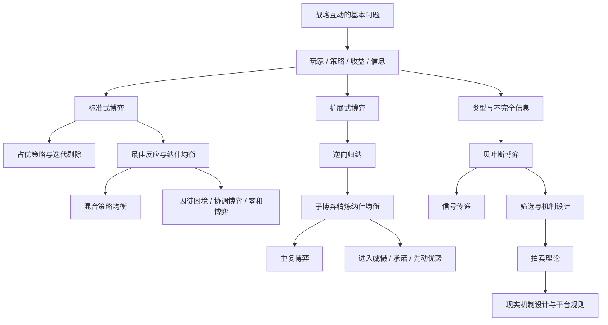

# 02-课程地图与先修关系

这份文档解决两个关键问题：

- 哪些章节必须先学
- 哪些概念容易混淆，但其实属于不同层次

## 整体课程地图

## 先修关系表

| 主题 | 建议先修 |
| --- | --- |
| 标准式博弈 | 玩家、策略、收益、信息 |
| 纳什均衡 | 标准式博弈、最佳反应 |
| 混合策略 | 纳什均衡、期望收益 |
| 逆向归纳 | 扩展式博弈、博弈树 |
| SPNE | 逆向归纳、纳什均衡 |
| 贝叶斯博弈 | 类型、概率、期望、纳什均衡 |
| 信号传递 | 贝叶斯更新、动态顺序、不完全信息 |
| 拍卖理论 | 贝叶斯博弈、激励、机制设计 |

## 最容易混淆的概念对

### 占优策略 vs 最佳反应

- 占优策略：不管别人怎么选，我都更喜欢它
- 最佳反应：给定别人已经这样选，我最喜欢它

### 纳什均衡 vs 帕累托最优

- 纳什均衡：没有人想单方面改
- 帕累托最优：不能让一个人更好而不让别人更差

这两个概念完全不是一回事。囚徒困境最经典的地方就在于：均衡存在，但效率很差。

### 标准式博弈 vs 扩展式博弈

- 标准式更像“同时写答案”
- 扩展式更像“按顺序走棋”

### 完全信息 vs 完美信息

- 完全信息：大家知道彼此的收益结构和类型
- 完美信息：轮到你行动时，你知道此前发生了什么

这两个“完”说的不是同一件事。

### 贝叶斯博弈 vs 信号博弈

- 贝叶斯博弈：先有私人类型，再在不完全信息下行动
- 信号博弈：一方先知道类型，再主动释放可被观察的信号

信号博弈可以看作贝叶斯博弈中的一个特别重要的结构化子类。

## 推荐的阶段性目标

### 学完基础后，你应该做到

- 会把现实问题抽象成玩家、策略、收益
- 会看懂矩阵和博弈树
- 知道“博弈论的核心不是算，而是战略相互依赖”

### 学完静态博弈后，你应该做到

- 会用占优策略和最佳反应找均衡
- 会解释为什么有的均衡不高效
- 会区分囚徒困境、协调博弈、零和博弈

### 学完动态博弈后，你应该做到

- 会用逆向归纳解释可信与不可信威胁
- 能分析先动优势和后动反应
- 知道为什么动态结构会改变结果

### 学完不完全信息后，你应该做到

- 会区分先验、后验、类型、信念
- 会写出“策略是类型到行动的映射”
- 能解释为什么规则设计会改变参与者行为

## 推荐配套阅读

- 基础理解：`01-Foundations`、`02-Static-Games`、`03-Dynamic-Games`
- 结构图示：`10-Assets`
- 练习检验：`11-Exercises`

## 下一步

建议继续阅读 [03-复盘方法与输出模板](03-复盘方法与输出模板.md)，把“如何判断自己真的学会了”也一起建立起来。
