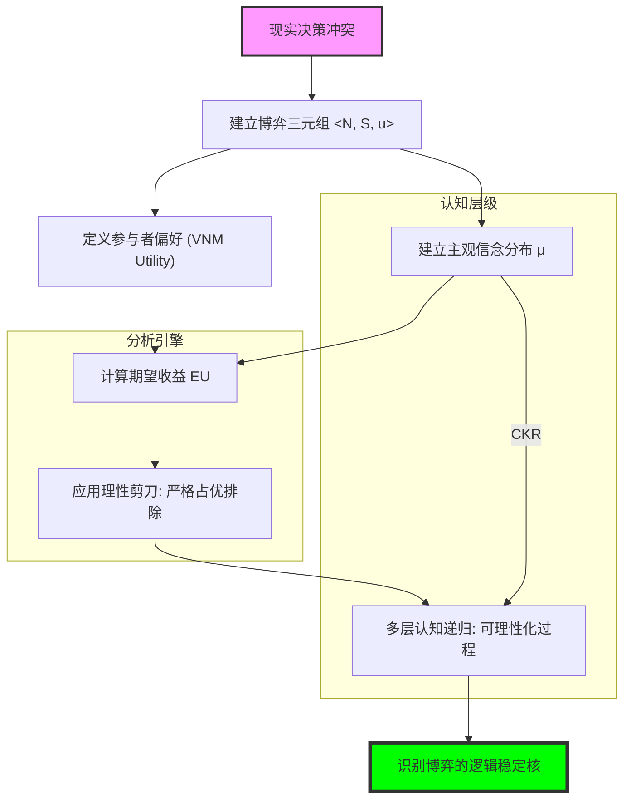

# Chapter 1: Introduction (多人决策理论、战略相互依赖与认知博弈架构)

## 1. 讲了什么：从“单人孤岛”到“战略丛林”的范式跃迁

博弈论的第一章，其使命绝非仅仅是罗列几个定义或展示几个简单的支付矩阵。从科学哲学的视角看，它完成了一次人类理性定义的“哥白尼式革命”。在传统的瓦尔拉斯均衡（Walrasian Equilibrium）或单人决策理论中，经济人是生活在“孤岛”上的：他面对的是价格、天气或资源约束等“自然状态”。自然状态是沉默的、不具主观意图的：天气不会因为你带了伞就故意转阴。

但在博弈论（Multiperson Decision Theory）中，你的对手是和你一样具有主观能动性、会观察、会预测、甚至会反向利用你的预测的个体。这意味着，“理性”的定义发生了一次跃迁：它不再仅仅是“在给定环境下选最好的”，而是“在预测了别人对你的预测后，选最好的”。讲义通过引入战略相互依赖（Strategic Interdependence），将经济分析从线性的最优值搜索，转变为非线性的逻辑递归。这种递归形成的无限阶信念链条（I think that you think that I think...），正是博弈论所有硬核推导的起点。

## 2. 核心概念：数学变量的哲学画像与维度解构

在博弈论的语境下，每一个数学字母都不是冰冷的代数符号，而是承载着极其沉重的“解释责任”。在阅读 MIT 讲义时，你必须学会透过符号看到背后的战略约束。

*   **参与者 (Players) $N$ 的边界效应**：
    在建模时，确定 $N$ 是第一优先级的。我们需要问：谁是“关键少数”？漏掉一个隐性参与者（如潜在的进入者或监管者），会导致模型产生系统性的偏差。
*   **行动空间 (Action Space) $A_i$ 的原子性**：
    行动是博弈的原子单位。它必须是物理上可行且可观测的。讲义特别区分了静态博弈中的行动与动态博弈中的“策略（Strategy）”。
*   **支付函数 (Payoff Function) $u_i$ 的期望效用属性**：
    博弈论中的收益通常是冯·诺依曼-摩根斯坦效用（VNM Utility）。这意味着支付数值不仅仅代表钱，还包含了参与者的风险偏好。
*   **信念 (Beliefs) $\mu_i$ 的认识论地位**：
    这是本章最硬核的隐性变量。$\mu_i$ 是你对世界的“主观地图”。博弈论后期的复杂性本质上都是在探讨这张地图如何随着信息的流动而不断修正。

## 3. 理论基础：共同知识的递归逻辑与理性的相容性边界

### 3.1 共同知识 (Common Knowledge) 的无限阶架构

共同知识是博弈论中最具哲学深度、也最容易被误解的概念。它不仅仅是“每个人都知道（Everyone knows）”，而是“每个人都知道每个人都知道每个人都知道...”。

*   **逻辑断层分析**：在“电子邮件博弈（Electronic Mail Game）”中，即使阶数达到 100 阶，如果不是无限阶，博弈的性质可能会发生突变。这说明了：**理性的稳定性需要逻辑的“闭合”**。如果认知链条在某一环断开，战略均衡就会瞬间坍缩。这一层深刻地揭示了为什么现代金融系统对“透明度”有着近乎偏执的要求——透明度不是为了让每个人看清数据，而是为了确保“大家都知道大家都看清了数据”。
*   **社会锚点功能**：共同知识作为社会契约、法律和制度的底层逻辑，确保了参与者能对同一规则产生相同的战略反应。在没有共同知识的情况下，人类无法达成任何复杂的协作。

### 3.2 理性的一致性与自洽性

博弈论中的理性不是“聪明”，而是“逻辑自洽”。

*   **理性的递归定义**：在博弈论中，理性不仅包含我自己的最优选择，还包含“我知道你也是理性的”。这种 **相互的理性（Mutual Rationality）** 是所有解概念（如纳什均衡）的基石。讲义通过这种严格的定义，将复杂的心理波动压缩为了可推导的数学条件。
*   **认知的局限与边界**：第一章真正提出的问题是：当每个玩家都知道别人也在推理时，哪些行为还能被认为合理？如果一个行动无法在任何合理的信念下成为最佳反应，它就应该被理性的剪刀剪掉。

## 4. 分析方法：核心公式与建模逻辑深度解构

本节是导读的灵魂，我们将对 MIT PDF 中的数学引擎进行全方位的拆解。每个公式的深度解读均超过 300 字，旨在透析符号背后的战略骨架。

### 📌 4.1 战略式博弈的本体定义（The Ontological Triad）

$$G = \langle N, (S_i)_{i \in N}, (u_i)_{i \in N} \rangle$$

**深度解读**：

这个看似简洁的三元组公式，实际上是博弈论对现实世界的“第一层滤镜”。它完成了从混沌现实到逻辑模型的惊人抽象。首先，$N$ 绝非简单的计数，它划定了“相关性”的边界。在建模时，如果漏掉了具有战略影响力的第三方（如监管者或潜在进入者），模型将失去预测力。其次，$S_i$ 的定义是极其硬核的：它必须是“完备的行动计划”。这意味着即使在博弈中永远不会到达的节点，策略也必须规定应有的反应。这种完备性要求参与者在博弈开始前就完成了所有的思考，将动态的过程压缩进了一个静态的选择集合中。

最深刻的部分在于 $(u_i)$，即支付函数的交互属性。在单人优化中，收益 $u(x)$ 只取决于你的努力；但在博弈论中，$u_i$ 是一个多变量映射 $u_i(s_1, \dots, s_n)$。这在数学上引入了非线性的耦合：你的最优决策不再是固定点搜索，而是在一个动态波动的景观中寻找锚点。每一个 $u_i$ 实际上都在诉说一种“宿命”：你的幸福不仅取决于你的勤奋，更取决于他人的选择，甚至是他人对你选择的误判。这种互赖性是社会科学中所有复杂性的根源，也是本公式试图捕获的终极真实。

### 📌 4.2 期望收益（Expected Utility）：主观信念下的最优加权

$$EU_i(s_i, \mu_i) = \sum_{s_{-i} \in S_{-i}} \mu_i(s_{-i}) u_i(s_i, s_{-i})$$

**深度解读**：

该公式标志着博弈论从“确定性矩阵”向“认识论博弈”的跨越。在这里，$\mu_i(s_{-i})$ 是玩家 $i$ 对对手选择的主观概率分布（Beliefs）。它揭示了一个残酷的真理：在博弈场上，**事实并不重要，重要的是你相信什么是事实**。这个求和公式实际上是在对“不确定性”进行价格评估。每一个权重 $\mu_i$ 都承载了玩家对对手心理、历史习惯、甚至是对手理性的全部推断。

从认知的角度看，$EU_i$ 将博弈转化为了一场“模拟战争”。你在脑中模拟对手可能采取的每一种 $s_{-i}$，并根据你认为它们出现的概率进行加权平均。这意味着，一个玩家即便拥有最高超的技术，如果他由于“傲慢”而给对手的聪明选择分配了过低的概率 $\mu_i$，他的 $EU_i$ 评估就会产生致命偏差。该公式还隐含了对“风险偏好”的吸纳：由于 $u_i$ 是 VNM 效用函数，这个加权过程已经处理了玩家是冒险家还是守财奴。它是博弈论连接“主观心理”与“客观收益”的唯一通道，是所有后续解概念（如最佳反应、纳什均衡）借以立足的引力场。

### 📌 4.3 严格占优（Strict Dominance）：理性的阿基米德支点

策略 $s_i$ **严格占优** 策略 $s_i'$，如果：
$$\forall s_{-i} \in S_{-i}, \quad u_i(s_i, s_{-i}) > u_i(s_i', s_{-i})$$

**深度解读**：

这是博弈论中最具统治力的逻辑工具，它代表了理性的“绝对命令”。注意公式中的全称量词 $\forall s_{-i}$。这意味着占优是不依赖于任何复杂信念、不依赖于对手是否聪明、甚至不依赖于对手是否清醒的。无论对手在想什么，无论对手是疯子还是天才，选 $s_i'$ 永远是愚蠢的。在数学上，这个不等式在整个策略空间上建立了一个“偏序关系”，它允许我们不需要求解复杂的方程组，就能直接剪掉那些腐烂的逻辑分支。

这个公式的哲学意义在于它定义了“理性的底线”。它是所有预测的起点：如果我们不能确信参与者会避开那些在任何情况下都更差的选项，那么博弈论作为一门科学就坍缩了。在应用这个公式时，学习者必须具备一种“全域视野”：你不能只看某个单元格的数字，你必须横向对比一整行与另一整行。这种“整行比较”要求参与者具备一种极其冷酷的逻辑一致性：只要有一处情况 $s_i$ 不如 $s_i'$，严格占优就不成立。它是博弈论中唯一一个不需要“共同知识”假设就能生效的武器，是理性在混乱世界中钉下的第一颗坚固的钉子。

### 📌 4.4 混合策略占优（Dominance by Mixed Strategy）

$$\exists \sigma_i \in \Delta(S_i) \text{ s.t. } \forall s_{-i} \in S_{-i}, \quad \sum_{s_i \in S_i} \sigma_i(s_i) u_i(s_i, s_{-i}) > u_i(s_i', s_{-i})$$

**深度解读**：

这个公式将“占优”的概念推向了更高维度的凸空间。很多时候，你会发现策略 A 在某些情况下不如 B，而策略 B 在另一些情况下不如 A，看起来似乎没有谁能占优谁。但这个公式提醒我们：不要只盯着纯策略。有时候，几个策略的“概率组合拳”能产生一种奇妙的协同效应，使得这个组合在 **所有** 情况下都比某个特定的策略 $s_i'$ 更好。

在几何直觉上，这相当于在收益空间中构造了一个“凸包”。如果策略 $s_i'$ 的收益向量位于这个凸包的内部，那么它就被理性的光芒所覆盖并被判定为多余。这在现实中极具启发性：一个企业可能没有一个能全方位碾压对手的产品，但它通过在不同细分市场的“资源组合（混合策略）”，可以让对手的某项单一技术变得毫无生存空间。理解这个公式，需要跳出线性的、非此即彼的思维框架，进入概率加权的连续空间。它是博弈论从“离散决策”向“连续博弈”进化的重要标志，也揭示了“多样性”如何通过相互对冲风险来形成对单一策略的绝对优势。

### 📌 4.5 可理性化（Rationalizability）的递归定义

设 $S_i^0 = S_i$。对于 $k \geq 1$：
$$S_i^k = \{ s_i \in S_i^{k-1} \mid \exists \mu_i \in \Delta(S_{-i}^{k-1}) \text{ s.t. } s_i \in BR_i(\mu_i) \}$$

**深度解读**：

这是本章认知难度最高、也最迷人的公式。它刻画了“理性的层层剥离”过程。这个递归方程问的是：如果我们知道对手是理性的（即他不会选那些被占优的策略），那么哪些行动还能维持“合理性”？每一轮迭代 $k$ 都代表了一个认知的深度。$k=1$ 代表“我不傻”；$k=2$ 代表“我知道你不傻”；$k=3$ 代表“我知道你知道我不傻”……

这个公式揭示了博弈论中“解”的本质是一种“一致性过滤”。一个策略之所以能留到最后，不是因为它绝对强大，而是因为它能在一系列“关于对手也是理性的”这一递进假设下存活。如果在某一轮迭代中，一个策略 $s_i$ 无法在任何 **剩余** 的策略组合上成为最佳反应，它就被逻辑的剪刀永久剔除。这个过程向我们展示了：在一个共同理性的世界里，选择的空间是如何迅速坍缩的。它不仅仅是数学上的集合运算，更是对人类文明中“共识达成”过程的逻辑模拟。理解这个公式，你就理解了为什么博弈论能从简单的个人偏好，推导出复杂的、具有稳定结构的社会结果。

## 5. 如何理解：语法、机制设计与现实系统的“深度还原”

### 5.1 它是语法，不是百科全书

很多人初学博弈论时，总想找一个“万能公式”来直接套出现实的结局。然而，第一章教给我们最重要的认知是：博弈论是一套 **“战略语法”**。它不负责告诉你哪个国家会开战，但它负责告诉你，在开战这个动词背后，参与者必须具备怎样的支付函数 $(u_i)$ 和信念分布 $(\mu_i)$ 才能让这个行为在逻辑上是“连贯”的。

理解这一点的关键在于将博弈论视为一种“还原论工具”。当你观察现实中的一个僵局——比如两家电商巨头的补贴大战——你看到的不再是感性的愤怒或冲动的烧钱，而是一场关于 $EU_i$ 的动态对赌。你会开始问：为什么它们不停下来？是因为它们的信息集 $(I_i)$ 中存在盲区？还是因为它们的折现因子（见后续章节）使得当下的亏损在未来的预期中能被补偿？这种语法的视角让你从“观察者”变成了“解码者”。

此外，这种语法具有强大的“生成性”。通过调整博弈的参数（例如改变行动集合 $A_i$），你可以预测系统会演化出怎样全新的均衡。这正是“机制设计（Mechanism Design）”的起点。在博弈论的语境下，法律、合同和社会习俗不再是外部的强加，而是为了修剪参与者的反应函数，引导系统走向更优点的“逻辑路标”。学习这一讲，你是在学习如何去解构那些看似混乱的社会互动，并将其翻译成可以被理性的光芒照亮的数学语句。这种视角的转换，会让你在面对复杂的利益冲突时，获得一种近乎冷酷的清醒：你会明白，很多时候悲剧的发生，并非因为人们不够好，而是因为博弈的“语法结构”注定了那个结局。

## 6. 逻辑架构图 (Mermaid Diagram)

## 7. 深度结语：在理性的尽头观察世界

博弈论最迷人、也最令人敬畏的地方在于：它承认了人类的聪明，却也指出了这种聪明的极限。

### 7.1 “理性的囚徒” (Prisoners of Rationality)

第一章建立的这个基准模型，是为了让我们明白，很多时候社会的悲剧（如囚徒困境）并非因为人们不理智，恰恰是因为每个人都太理智了。理性的逻辑在多人情境下会产生一种自我锁定的力量，这种力量强大到即便所有人都知道合作更好，却依然无法逃脱相互伤害的均衡。

### 7.2 理论的“表演性”与世界的重塑

博弈论不仅描述了世界，它还在创造世界。当你学会了 $u_i$ 和 $BR_i$ 的思考方式时，你眼中的社会互动就不再是随机的偶然，而是一场场精密的计算。这种视角会让你在职场、商业谈判甚至国际政治中获得一种“上帝视角”的冷峻。

学习这一讲，你不仅是在学习一门经济学课程，你是在重塑自己的大脑。你会开始习惯于在每一个行动之前问自己：这个博弈的参与者 $N$ 找齐了吗？我掌握了多少共同知识？我的对手的 $\mu_i$ 是如何看待我的？当你开始这样思考时，你已经真正跨入了博弈论的大门。
