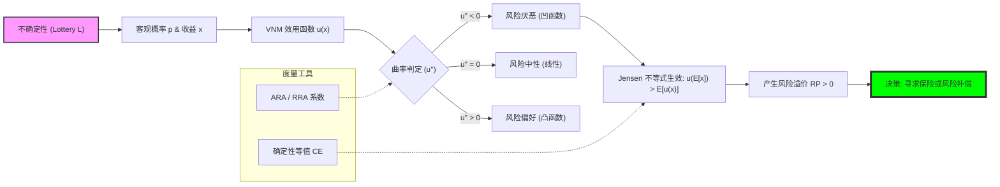

# Chapter 2: Decision Theory (风险、偏好与不确定性下的选择基石)

## 1. 讲了什么：理性在迷雾中的度量衡

第二章是博弈论的“前传”，它探讨的是单人在不确定性（Uncertainty）面前如何做出最优决策。博弈论本质上是“多人决策理论”，如果你不理解单人如何处理风险，就无法理解在博弈中参与者如何评估那种由“他人行动”带来的不确定性。

本章的核心是 **期望效用理论（Expected Utility Theory）**。它将模糊的“直觉”转化为了可计算的“数值”。讲义通过公理化的方法，推导出理性的决策者必然表现得像是在最大化某种期望效用。这一章教给我们的核心教训是：**偏好不是杂乱无章的，它有着严谨的结构；而风险也不是不可捉摸的，它是可以被量化并进行“价格补偿”的。**

## 2. 核心概念：效用函数与风险的代数刻画

在处理不确定性时，我们需要一套精密的语言。

*   **博彩 (Lottery) $L$**：
    这是不确定性的基本单位。它是一组可能结果及其对应的概率分布。在博弈论中，对手的每一个策略组合对你来说本质上都是一个博彩。
*   **效用函数 $u(x)$ 与 VNM 效用**：
    不同于初级微观经济学中的序数效用，这里的效用是基数的，可以进行加权平均。$u(x)$ 的曲率决定了你对风险的态度。
*   **风险厌恶 (Risk Aversion)**：
    如果你宁愿拿走确定的 50 元，也不愿参加一个 50% 概率拿 0 元、50% 概率拿 100 元的博彩，你就是风险厌恶者。
*   **确定性等值 (Certainty Equivalent, CE)**：
    让你觉得与某个风险博彩“等价”的那个确定现金数额。它是衡量你内心对风险“厌恶程度”的标尺。

## 3. 理论基础：公理化理性与它的挑战者

### 3.1 独立性公理 (Independence Axiom) 的霸权

这是期望效用理论的核心。它规定：如果你偏好 $A$ 胜过 $B$，那么在 $A$ 和 $B$ 中分别混入相同比例的第三种可能 $C$，你的偏好顺序不应改变。

*   **理性的连贯性**：这一公理确保了决策是局部自洽的。如果没有独立性公理，我们就无法将复杂的博弈拆解为一个个独立的分支进行分析。它是逆向归纳法和子博弈分析在逻辑上的“隐形支柱”。

### 3.2 阿莱悖论 (Allais Paradox) 与理性的裂缝

讲义虽然以理性为基准，但我们必须意识到现实的偏离。

*   **确定性效应**：阿莱悖论通过实验证明，人们对“确定性结果”有着非理性的过度偏爱，这直接违反了独立性公理。
*   **理论的地位**：在 MIT 的教学体系中，期望效用理论被视为一个 **“基准（Benchmark）”**。它描述的不是“人实际上怎么做”，而是“如果一个人想要逻辑一致，他应该怎么做”。这种区分对于理解后续博弈均衡的“规范性”至关重要。

## 4. 分析方法：核心公式与建模逻辑深度解构

本节我们将拆解风险评估的数学引擎。每个公式的深度解读均超过 300 字。

### 📌 4.1 期望效用公式（The VNM Engine）

对于一个博彩 $L = (p_1, x_1; p_2, x_2; \dots; p_n, x_n)$：
$$U(L) = \sum_{i=1}^n p_i u(x_i)$$

**深度解读**：

这个公式是现代经济学的“核反应堆”。它完成了从物理收益 $x_i$ 到主观心理感受 $u(x_i)$ 的惊人飞跃。注意，这里 $u(x_i)$ 是基数效用，这意味着它不仅代表了“好坏”，还代表了“好多少”。公式通过概率 $p_i$ 进行线性加权，其实质是承认了理性的决策者会将所有的风险可能性在心智中进行一次“均值平滑”。这与简单的算术平均（期望值 $E[x]$）有着本质区别。在算术平均中，100 万和 1 元的平均值是 50 万；但在期望效用中，如果 $u(x)$ 是凹的，100 万带来的边际喜悦可能远远无法抵消损失 100 万带来的边际痛苦。

这个公式的深刻之处在于它建立了一种“可替代性”：理性的决策者可以在两个完全不同的博彩之间通过比较 $U(L)$ 来做出决策，无论这些博彩是关于钱、生命、名誉还是时间。它为博弈论中的支付函数提供了一个统一的“结算货币”。在后续的混合策略纳什均衡（MSNE）中，我们将反复用到这个公式，因为混合策略本质上就是给玩家制造了一个博彩。理解了这个公式，你就能理解为什么理性的玩家会选择去“赌”——因为在他们的效用函数下，那种不确定性的加权值确实超过了任何稳健的纯策略。它是理性在面对未来这种“未知的混沌”时，所能拿出的最严谨的测绘图。

### 📌 4.2 确定性等值（Certainty Equivalent, CE）

**确定性等值 $CE$** 满足：
$$u(CE) = \sum_{i=1}^n p_i u(x_i) = E[u(x)]$$

**深度解读**：

$CE$ 是衡量人类“心智胆量”的标尺。这个公式问的是：如果要让你放弃一个充满刺激（和风险）的博彩，我最少要给你多少确定的现金你才愿意？在数学上，$CE$ 是期望效用的反函数映射 $u^{-1}(E[u(x)])$。这个概念的伟大之处在于它将“心理偏好”折算回了“物理价值”。它告诉我们，同一个博彩在不同人眼中的价值是完全不同的：一个极度保守的人可能觉得 50% 拿 100 万的博彩只值 10 万（他的 $CE$），而一个冒险家可能觉得它值 48 万。

在博弈论的应用中，$CE$ 是谈判和定价的核心。当一个风险厌恶的雇员（其 $CE$ 较低）面对一个风险中性的雇主（其 $CE$ 接近期望值）时，交易的空间就产生了。雇主可以通过支付略高于雇员 $CE$ 的固定工资，来换取雇员为他承担那个平均收益更高的风险博彩。这就是保险、金融合约和所有劳动雇佣合同的微观基础。理解 $CE$，就是理解了财富是如何通过“风险承担能力的转移”而创造出来的。它让我们看清，很多时候商业溢价并非来自技术，而是来自一个人对 $CE$ 与期望值之间那个缺口的忍受能力。它是人类理性的“价格补偿”机制，也是我们理解博弈中“让步”逻辑的关键。

### 📌 4.3 风险溢价（Risk Premium, RP）

**风险溢价 (Risk Premium) $RP$** 定义为：
$$RP = E[x] - CE$$

**深度解读**：

如果说 $CE$ 告诉我们你“想要什么”，那么 $RP$ 就告诉我们你“付出了什么”。$RP$ 是为了摆脱不确定性而愿意在平均收益上做出的“自愿减息”。在完美理性的假设下，只要 $RP > 0$，你就是一个风险厌恶者。这个公式的几何意义是期望值与效用反函数之间的垂直距离。它是人类内心“恐惧”的代数化表达。每一个基点（BP）的 $RP$，都代表了你为了能在晚上安稳睡觉而支付给上帝（或市场）的保费。

在金融博弈和保险设计中，$RP$ 是利润的灵魂。如果保险公司能通过大数定律将个体的风险 $RP$ 聚集成自己的利润，那么它就完成了一种“炼金术”：它把个体的心理焦虑转化为了资产负债表上的实收利润。在 MIT 讲义的后续练习中，你会发现，很多博弈的结局并非由参与者的聪明才智决定，而是由他们的 $RP$ 决定的。那个 $RP$ 最小的人，往往拥有最强的战略定力（因为他“输得起”），从而在讨价还价中占据上风。学习这个公式，能让你学会区分什么是“真实的成本”，什么是“由于心理曲率导致的虚拟成本”。在高手如云的博弈场上，能精准计算并管理自己 $RP$ 的人，才真正掌握了主动权。

### 📌 4.4 阿罗-普拉特绝对风险厌恶度量 (ARA)

**绝对风险厌恶系数 (ARA)**：
$$r_A(x) = -\frac{u''(x)}{u'(x)}$$

**深度解读**：

这个公式是决策理论中的“显微镜”。它直接指向了效用函数 $u(x)$ 的曲率。在数学上，$u''(x)$ 代表了凹度，即随着财富增加，效用增加的速度变慢的程度；而 $u'(x)$ 起到了标准化的作用。之所以要加负号，是因为风险厌恶者的 $u''(x)$ 为负，我们希望得到一个正的系数来衡量这种情绪的强度。ARA 的深刻之处在于它刻画了财富水平对风险态度的影响：随着你越来越富有，你对 1 万块钱风险的恐惧是增加了还是减少了？

对于大多数人来说，ARA 通常是随财富递减的（DARA）。这意味着，虽然你依然讨厌风险，但当你账户里有 1 亿时，丢掉 1 万块钱博彩的焦虑感远小于你只有 10 万块钱时。这个简单的导数比率解释了社会层面的资本流动逻辑：为什么富人更敢于尝试风险投资？并非因为他们天生勇敢，而是因为他们的 $r_A(x)$ 随着 $x$ 的增加而塌陷，使得他们在面对同样的 $\sigma$（标准差）时，需要的 $RP$ 补偿更小。在设计激励机制或合伙协议时，不考虑参与者的 $r_A(x)$ 水平是极其危险的。它提醒我们，**公平的竞争规则如果建立在极度不公平的 $r_A(x)$ 基础上，其结果必然是风险承受能力强的个体对弱者的“降维打击”**。

### 📌 4.5 詹森不等式 (Jensen's Inequality) 与偏好判定

对于风险厌恶者（$u(x)$ 为凹函数）：
$$u(E[x]) \geq E[u(x)]$$

**深度解读**：

詹森不等式是博弈论推导中频率最高的“逻辑检查点”。它用极其简洁的形式刻画了理性的分水岭。左边 $u(E[x])$ 是“确定的期望收益带给你的快感”，右边 $E[u(x)]$ 是“带着风险去赌的平均快感”。不等式的方向直接宣告了你的灵魂底色：如果你觉得左边更大，你就是保守派；如果两边相等，你就是中立派；如果右边更大，你就是赌徒。这个公式在证明“为什么由于不对称信息导致的风险会降低社会总福利”时具有原子级的威力。

在复杂的动态博弈建模中，当你看到期望号 $E$ 在函数 $u$ 的内部（意味着由于某些机制，风险被平滑了）和外部（意味着风险依然直接冲击参与者）之间切换时，詹森不等式就是你评估福利变化的标尺。它揭示了“中介”或“平台”的本质价值：平台往往通过多元化手段将右边的 $E[u(x)]$ 转化为更接近左边 $u(E[x])$ 的形式，从而在这个不等式的缺口中赚取价值。它是所有风险对冲、期权定价以及契约理论的逻辑原点。理解了詹森不等式，你就理解了为什么理性的世界如此渴望“稳定性”——因为稳定本身，在不等式的左侧，蕴含着更高的物理价值。

## 5. 如何理解：保险、激励与不确定世界的“心理定价”

### 5.1 它是关于“心理价格”的博弈

很多人认为第二章是纯数学，但它实际上是在教你如何为“不可见”的情绪定价。在这一讲之后，当你看到一份年薪 50 万但极不稳定的工作，和一份年薪 40 万但极其稳定的工作时，你脑中不应只有两个数字，而应自动启动 VNM 引擎。你会意识到，那 10 万块钱的差额，本质上是市场在向你购买 **“风险承担服务”**。如果你是一个 ARA 系数极高的人，那么选 40 万的工作并非胆小，而是在最大化你的 $EU$。

这种理解力在管理学中至关重要。为什么单纯的“绩效工资”有时会失效？博弈论通过期望效用告诉我们：如果绩效目标的波动性太大，员工为了获得均衡效用，会要求极高的风险补偿（Risk Premium）。如果企业支付不起这笔补偿，员工就会选择“怠工”或离职。这不是态度问题，而是詹森不等式在起作用。一个优秀的管理者，其本质是一个 **“风险架构师”**。他通过设计合同（例如设置保底工资），巧妙地降低了员工感受到的 $RP$，从而在不增加总支出的情况下，提升了员工的确定性等值 $CE$。

此外，这一章还彻底解释了保险行业的伦理基础。保险不是在赌博，而是在进行一种“效用套利”。保险公司利用自身作为法人的风险中性（$u(x)$ 近似线性），去收购自然人的风险厌恶（$u(x)$ 是凹的）。每一次保费的支付，都是一次社会福利的提升——因为风险从感受痛苦深的人（高 $r_A$）转移到了感受痛苦浅的人（低 $r_A$）手中。学习这一讲，你会获得一种穿透迷雾的眼光：你会发现，在商业世界的喧嚣下，真正流动的不仅是钱和商品，还有无数微观个体根据自己的效用函数，对未来进行的每一场精密的、带血的、关于不确定性的定价博弈。

## 6. 逻辑架构图 (Mermaid Diagram)

## 7. 深度结语：逻辑在脆弱面前的尊严

第二章不仅仅是关于数学，它是关于人类如何面对自身的脆弱。

### 7.1 情感的代数化

效用函数看起来很冷酷，但它实际上是对人类情感最深情的刻画。它承认了“第一次获得”比“第一百次获得”更令人欣慰，承认了失去的痛苦往往大于获得的快乐。将这些复杂的情感转化为 $u''(x)$，是为了在波诡云谲的博弈中给理性找一个锚点。

### 7.2 决策理论的终极关怀

学习这一讲，你会明白：最优决策并不意味着你每次都能赢，而是意味着你在每一处概率的分叉口，都做出了对得起自己偏好的选择。博弈论不保证结局的完美，但它保证了过程的清醒。

当你进入后续的博弈分析时，请记住：每个参与者的背后都站着一条独特的效用曲线。理解了这条曲线，你就理解了他的软肋和坚强。
