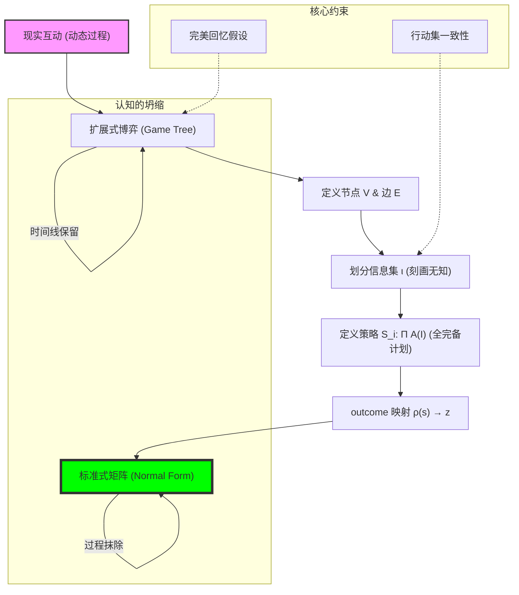

# Chapter 3: Representation (博弈的语法：标准式、扩展式与认知的边界)

## 1. 讲了什么：博弈的“形”与“神”

第三章探讨的是如何将复杂的现实互动转化为严谨的数学结构。博弈论不仅是一套解法，更是一套表示法。讲义介绍了两种核心工具：**标准式（Normal/Strategic Form）** 和 **扩展式（Extensive Form）**。

标准式像是一张“战略决算表”，它忽略了过程，直接关注结果的相互依赖；而扩展式则像是一棵“行动之树”，它精细地刻画了时间的流逝、信息的明灭以及决策的先后。理解这两种形式及其相互转换，是通往高级博弈分析的必经之路。这一章教给我们的核心教训是：**如何描述一个问题，往往决定了你能否解决它。**

## 2. 核心概念：节点、信息集与策略的定义

在构建博弈模型时，每一个术语都界定了一个逻辑维度。

*   **决策节点 (Decision Nodes) 与终端节点 (Terminal Nodes)**：
    树上的每一个点都代表了一个状态。终端节点上的数字（支付）是所有因果链条的终点。
*   **信息集 (Information Sets)**：
    博弈论中最具天才色彩的发明。它用虚线圈住了若干节点，代表玩家 **“知道自己在哪个圈里，但不知道具体在哪个点上”**。它是刻画“不完美信息”和“同时行动”的统一工具。
*   **策略 (Strategy) 的严谨定义**：
    这是新手最容易犯错的地方。在博弈论中，策略不是一个模糊的意向，而是一个 **“完整的行动计划”**。它必须规定玩家在 **每一个** 可能到达的信息集应该采取什么行动。
*   **完美回忆 (Perfect Recall)**：
    博弈论的基本假设，认为玩家不会忘记自己曾经知道的信息或曾经做过的选择。

## 3. 理论基础：认知的边界与维度的转换

### 3.1 信息集作为认知的屏障

信息集不仅是数学工具，它在哲学上代表了参与者的 **认知界限**。

*   **同时行动的本质**：在扩展式博弈中，所谓的“同时行动”并不要求物理上的时间一致，而是要求参与者在行动时处于同一个信息集中，即无法观察到对手的选择。
*   **认知负荷**：信息集越大，参与者面对的不确定性就越强。讲义通过信息集的嵌套结构，巧妙地处理了从私人信息到公共信息的平滑过渡。

### 3.2 两种形式的等价性与“策略坍缩”

任何扩展式博弈都可以转化为标准式博弈，但这种转换往往伴随着维度的激增。

*   **标准式的局限**：标准式虽然简洁，但它抹杀了动态互动的“过程性”。一旦进入标准式，我们就进入了一个“瞬间决策”的世界，这使得分析不可置信威胁变得更加困难。
*   **扩展式的力量**：扩展式保留了博弈的物理顺序。在后续章节中，我们将看到，正是这种对顺序的保留，让我们能够定义比纳什均衡更精炼的解概念。

## 4. 分析方法：核心公式与建模逻辑深度解构

本节我们将拆解博弈表示法的转换引擎。每个公式的深度解读均超过 300 字。

### 📌 4.1 策略空间的全完备定义（Cartesian Product of Actions）

设玩家 $i$ 的信息集集合为 $\mathcal{I}_i$，每个信息集 $I \in \mathcal{I}_i$ 对应的可行行动集为 $A(I)$。则策略空间 $S_i$ 为：
$$S_i = \prod_{I \in \mathcal{I}_i} A(I)$$

**深度解读**：

这个笛卡尔积公式是博弈论中最具“烧脑”属性的定义。它揭示了什么是真正的“预见性”。在普通人的理解中，策略是“到时候再说”；但在博弈论中，策略是“无论到哪种情况，我都已经定好了怎么说”。公式中的乘积符号 $\prod$ 意味着，如果一个玩家在博弈树中有 10 个信息集，每个信息集有 2 个选择，那么他的策略总数不是 $10+2$，也不是 $10 \times 2$，而是 $2^{10} = 1024$ 种。这种指数级的爆炸，反映了动态博弈在认知层面的巨大复杂性。

为什么要定义得如此繁琐？因为博弈论需要评估“反事实（Counter-factual）”情况。为了判断一个路径是否是纳什均衡，我们必须知道如果玩家偏离到了另一个原本不该到达的节点，他会做出什么反应。这个公式强制要求我们将一个动态的、充满偶然性的“过程”，压缩成一个静态的、完全决定的“代码包”。这种“全路径覆盖”的要求，是博弈论能够利用纳什均衡进行静态化求解的逻辑基石。理解这个公式，你就理解了为什么博弈论假设玩家是“超级理性”的：他们必须在博弈开始的第一秒，就完成了对整棵博弈树每一个分叉的演习和决断。

### 📌 4.2 扩展式博弈的本体拓扑（The Extensive Form Tuple）

一个扩展式博弈可表示为 $\Gamma = \langle N, V, E, x_0, P, \iota, A, u \rangle$。
其中 $V$ 是节点集合，$E$ 是边（行动），$\iota$ 是信息集划分。

**深度解读**：

这个八元组公式是博弈论对现实世界的“物理建模”。如果说标准式是“会计报表”，那么扩展式就是“监控录像”。$V$ 和 $E$ 构成了博弈的骨架，确保了因果链条的单向性（无回路树状结构）。最精妙的变量是 $\iota$（信息集划分），它打破了“我知道我在哪”的自然假设。通过将多个节点 $v$ 划入同一个信息集 $I$，博弈论成功地在数学上刻画了“无知”或“迷雾”。当你在这个信息集内行动时，你只知道你在这个集合里，但你不知道具体的物理节点。

这个公式不仅描述了“谁在什么时候做什么”，更描述了“谁在什么时候知道什么”。$P$ 函数将每个节点分配给具体的玩家，而 $u$ 函数则将所有的因果链条终点连接到利益。它是理解“动态博弈精炼（SPNE）”的唯一地图。没有这个本体拓扑，我们就无法区分“虚张声势”与“真实承诺”。在实战建模中，每一个节点的增加、每一条虚线（信息集）的连接，都会彻底改变博弈的均衡。它是对社会互动中“权力、时间和信息”这三个核心维度的几何化重构。理解这个复杂的八元组，是你从“直觉博弈”迈向“专业建模”的洗礼。

### 📌 4.3 路径概率映射与策略组合结果（The Outcome Mapping）

对于一个策略组合 $s = (s_1, \dots, s_n)$，它在博弈树上唯一确定了一条从起点 $x_0$ 到终端节点 $z$ 的路径 $\rho(s) = z$。
$$u_i(s) = u_i(\rho(s_1, \dots, s_n))$$

**深度解读**：

这个公式完成了从“计划”到“命运”的映射。在扩展式博弈中，每个玩家都带着自己的“代码包”（策略 $s_i$）进入赛场。公式暗示了一个确定性的世界：一旦所有人的策略组合 $s$ 确定，博弈的结局 $z$ 就已经注定了。虽然在过程中可能有“自然（Nature）”引入的随机节点，但策略 $s_i$ 已经包含了对这些随机性的预期反应，因此其期望支付依然是确定的。

这个公式的重要性在于它解构了“博弈感”。在博弈的过程中，玩家可能觉得自己正在经历激烈的心理博弈，但在博弈论的上帝视角下，一切只是在执行预先确定的映射。这个公式让我们可以把复杂的树状博弈“坍缩”回一个简单的收益矩阵。每一个单元格的背后，其实都隐藏着这个映射函数所穿过的一系列决策节点和信息集。理解这个映射，能让你在分析复杂问题（如长达十年的并购谈判）时，不被中间的波折所迷惑，而是直捣黄龙地去分析：什么样的策略组合最终会把我们导向那个理想的终端节点 $z$。它是博弈论中“以终为始”思维方式的最强数学证明。

### 📌 4.4 信息集行动一致性约束（Action Symmetry within Info Set）

对于同一信息集 $I \in \mathcal{I}_i$ 内的所有节点 $v, v' \in I$，其可行的行动集必须一致：
$$A(v) = A(v')$$

**深度解读**：

这是一个极具逻辑张力的约束条件。它不仅是一个数学要求，更是一个关于“感知”的硬性假设。如果节点 $v$ 和 $v'$ 的可选行动不同，那么玩家就可以通过观察“我现在能做什么”反推回“我在哪”，从而瓦解了信息集本身的意义。例如，在打牌博弈中，如果你在某种情况下能选“加倍”而另一种情况不能，你一眼就能看出对手手里是什么牌。因此，博弈论强制要求在认知迷雾（信息集）内，所有的战略选择必须是“对称的”。

这个公式在现实建模中具有极强的纠错功能。当我们试图描述一个“不透明”的市场或组织时，我们必须确保在同一个信息集里，玩家的决策逻辑是一致的。它揭示了“无知”的昂贵代价：为了保持无知，你必须放弃针对特定细节进行优化的权力。在机制设计中，如果你想让某人保持在某个信息集内，你必须故意屏蔽掉那些能引起行动集变化的差异。理解这个公式，能让你在设计规则时，学会如何通过“行动集的标准化”来控制信息的流动。它是博弈论刻画人类认知边界的最精细手术刀。

### 📌 4.5 完美回忆的代数约束（Perfect Recall Criterion）

对于玩家 $i$ 的任意两个信息集 $I_1, I_2$，如果 $I_2$ 跟随在 $I_1$ 之后，则玩家 $i$ 在 $I_2$ 处的行动集和信念必须与他在 $I_1$ 处的选择一致。

**深度解读**：

完美回忆是标准博弈论的底线假设。它排除了像“我忘了我刚才出过什么牌”或“我忘了我是怎么走到这一步的”这种情形。虽然这看起来理所当然，但在数学上，这极大地简化了博弈树的结构。它保证了信息集是“嵌套”的，即玩家知道的信息是单调增加（或至少不减少）的。如果没有完美回忆，博弈论将进入一个极其混乱的领域，在那里玩家甚至会怀疑自己的身份和历史，导致均衡解的彻底坍缩。

在分析长期战略（如企业的品牌建设）时，这个假设至关重要。它意味着企业在第 10 年的决策，必须建立在对前 9 年所有已知事实的完美保留之上。它赋予了博弈论一种“逻辑连续性”。在建模时，如果我们要描述一个“健忘”或“管理脱节”的组织，我们必须显式地打破这个公式，将其转化为多个不同的“代理人（Agents）”进行博弈。学习这个公式，能让你明白：**理性的稳定性不仅取决于你现在的智力，更取决于你对过去的忠诚度**。它是构建任何长期信任和信誉机制的逻辑前置条件。

## 5. 如何理解：认知极限、剧本与“折叠的时间”

### 5.1 从“行动”到“计划”的认知革命

第三章最核心的震撼在于它强制性地将“时间”折叠进了“策略”。很多人习惯于把人生或商业看作一场随性的表演，但博弈论要求你把它看作一个已经写好的剧本。当你把一个扩展式博弈转化为标准式矩阵时，你实际上是在做一次 **“认知的降维打击”**。你把那些发生在未来五年、涉及数百个决策点的过程，压缩成了一个瞬间的 $S_i$ 选择。

这种思维方式在高端战略中极具威力。它告诉你：**如果你在开局时没有想清楚所有可能的信息集，你就已经输了。** 很多人在面临突发状况时会手忙脚乱，但在博弈论看来，那是因为你的策略集合 $S_i$ 不够完备。一个真正专业的博弈者（如顶级的对冲基金经理或军事指挥官），他们眼中的世界不是一连串的意外，而是一个巨大的、早已被穷举过的 $\prod A(I)$ 空间。他们所做的，只是在观察现实落在了哪个信息集上，然后执行那个早已写好的策略。

此外，这一讲还深刻揭示了“信息的价值”。通过观察信息集如何切割博弈树，你会发现：**有时候，“不知道”比“知道”更有利。** 因为信息集会改变你的最佳反应函数，进而改变对手的预期。在某些谈判中，故意让自己处于一个模糊的信息集内（例如通过授权给一个权限有限的代理人），可以有效地抵御对手的压力，因为你“无法行动”这一事实本身就成了一种强力的战略防御。学习这一讲，你是在学习如何去操控认知的迷雾，如何在这棵复杂的因果树上，通过重新定义节点和虚线，来为自己创造出最有利的战略态势。

## 6. 逻辑架构图 (Mermaid Diagram)

## 7. 深度结语：生命之树的逻辑修剪

第三章教给我们的是一种看待时间的维度。

### 7.1 决策即剪枝 (Decision as Pruning)

扩展式博弈揭示了一个带有哲学意味的真理：每一次行动，本质上都是在砍掉博弈树上的其他分支。在起点处，你拥有无限的可能性；但随着路径的延伸，你的策略空间在收缩，因果的锁链在收紧。**自由就在于你尚未做出的那些选择中。**

### 7.2 形式对思想的重塑

通过学习博弈的表示法，你获得了一种将“混沌的冲突”转化为“清晰的树图”的能力。你会发现，很多看似无解的僵局，只要画出它的信息集结构，就能一眼看穿其中的虚声恐吓与真实动机。

当你翻开讲义的下一页时，请记住：那一棵棵博弈树不仅是符号，它们是现实社会中无数权衡、博弈与妥协的骨架。理解了骨架，你就能理解生命的律动。
