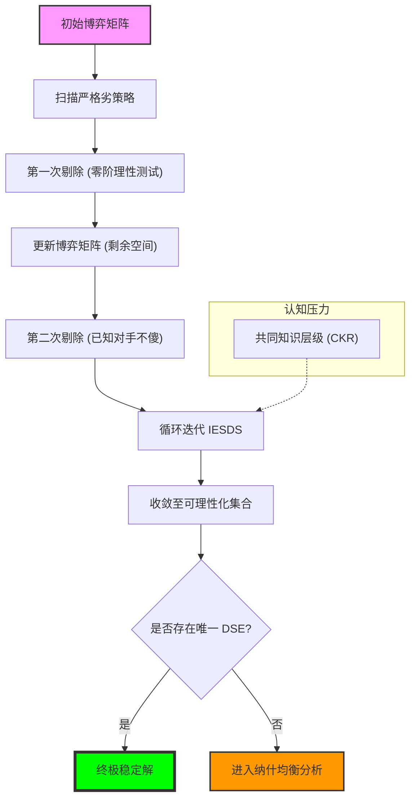

# Chapter 4: Dominance (理性的剪刀：占优策略与迭代剔除的逻辑精度)

## 1. 讲了什么：排除法的终极威力

第四章是博弈论进入实质性推演的第一步。在前三章建立起语法后，我们开始寻找博弈的“解”。讲义引入了一个最符合人类直觉、也最不依赖复杂信念的预测工具：**占优策略（Dominance）**。

其核心逻辑极其纯粹：如果一个行动在 **任何** 情况下都比另一个行动差，那么理性的玩家绝不会选它。通过层层剥离这些“永远错误”的选项，我们能够像剥洋葱一样逼近博弈的内核。本章重点讨论了 **严格占优（Strict Dominance）**、**弱占优（Weak Dominance）** 以及著名的 **迭代剔除严格劣战略（IESDS）**。这一章教给我们的核心教训是：**在变幻莫测的对手面前，守住理性的底线（不选那些显然愚蠢的策略）是通往智慧的第一步。**

## 2. 核心概念：劣策略的界定与理性的传递

在这一章，我们需要精确定义什么是“差”。

*   **严格劣策略 (Strictly Dominated Strategy)**：
    无论对手怎么选，这个策略给你的收益都严格小于另一个策略。它是理性绝对不可逾越的红线。
*   **弱劣策略 (Weakly Dominated Strategy)**：
    在某些情况下比别人差，在其他情况下顶多和别人一样好。虽然它不像严格劣策略那样“必死无疑”，但在竞争中它同样是极其不稳固的。
*   **迭代剔除 (Iterated Elimination, IESDS)**：
    我知道你是理性的（你会剔除你的劣策略），你知道我知道你是理性的（我会剔除针对你那些劣策略的最佳反应），以此类推。
*   **常见知识的理性 (Common Knowledge of Rationality)**：
    这是 IESDS 能够无限进行下去的认知引擎。

## 3. 理论基础：认知层级与博弈的稳定性

### 3.1 从“我不傻”到“我知道你不傻”

占优策略分析的强大之处在于它对“信念”的要求极低。

*   **零阶理性**：严格占优不需要我知道对手是谁，甚至不需要对手是理性的。只要我追求收益最大化，我就不会选劣策略。
*   **高阶理性与 IESDS**：随着迭代的深入，我们对参与者的认知要求在不断叠加。剔除一轮需要“理性的共同知道（1 阶）”，剔除两轮需要“知道你知道（2 阶）”。讲义向我们揭示了：博弈的最终解，往往取决于社会认知的整体深度。

### 3.2 弱占优的“危险性”

弱劣策略的剔除在数学上是不稳定的。

*   **剔除顺序敏感性**：在某些博弈中，先剔除 A 玩家的弱劣策略还是先剔除 B 玩家的，可能会导致完全不同的结果。这反映了现实中“微妙机会”的稍纵即逝。
*   **二价拍卖的启示**：弱占优分析最辉煌的应用是在二价拍卖（Vickrey Auction）中。在那里，报真价是一个弱占优策略。这个结论是如此强大，以至于它成为了现代拍卖设计的基石。

## 4. 分析方法：核心公式与建模逻辑深度解构

本节我们将拆解剔除劣策略的数学手术刀。每个公式的深度解读均超过 300 字。

### 📌 4.1 严格占优的“无条件”判定准则

策略 $s_i$ **严格占优** 策略 $s_i'$，如果：
$$\forall s_{-i} \in S_{-i}, \quad u_i(s_i, s_{-i}) > u_i(s_i', s_{-i})$$

**深度解读**：

这是博弈论中唯一一个具有“物理定律”般强制力的公式。注意那个全称量词 $\forall s_{-i}$，它赋予了这个不等式一种霸道的普适性。在其他解概念中，我们总是在讨论“如果我认为他选 A，那我就选 B”，但在严格占优面前，这种“如果”是多余的。无论对手是你的朋友还是死敌，无论他是天才还是白痴，无论他是在深思熟虑还是在随手掷骰子，选 $s_i'$ 都是一种逻辑上的自杀。

在现实商业中，寻找严格劣策略是进行压力测试的第一步。例如，如果你发现某种定价策略在任何市场需求曲线（不论高低）下，其收益都低于另一个策略，那么这就不是“风险”问题，而是“智力”问题。这个公式教给我们一种“剔除式思维”：在寻找正确的答案之前，先确凿地划掉那些错误的答案。它对建模者的要求极高：你必须穷尽对手的所有可能策略 $S_{-i}$。只要存在一个极端的、哪怕概率只有万分之一的场景，使得 $s_i'$ 的表现优于 $s_i$，严格占优就不复存在。它是理性在对抗世界复杂性时，钉下的第一根名为“确定性”的桩。

### 📌 4.2 混合策略作为“逻辑收割机”

$$\exists \sigma_i \in \Delta(S_i) \text{ s.t. } \forall s_{-i} \in S_{-i}, \quad E[u_i(\sigma_i, s_{-i})] > u_i(s_i', s_{-i})$$

**深度解读**：

这个公式是很多博弈论学习者的“认知盲区”。有时候，你盯着支付矩阵，发现策略 A 在某些列赢过 C，而策略 B 在另一些列赢过 C，看起来 C 似乎不是劣策略。但这个公式揭示了一个深层真相：策略 C 可能会被 A 和 B 的一个“比例组合”所全面碾压。在几何上，这意味着策略 C 的收益向量被包含在其他策略所围成的“凸包”内部。这个公式的引入，极大地增强了“理性剪刀”的威力。

在建模实战中，这个公式提醒我们：不要低估“平庸”策略的危险。一个看起来“在某些情况下还行”的策略，如果它的所有优点都能被其他几个策略的组合所覆盖，那么它就失去了存在的逻辑。这就像在产品竞争中，一个定位“中庸”的产品，如果它的高端特性被旗舰款覆盖，低端价格被廉价款覆盖，那么它在任何消费者心目中都不会成为首选。理解这个公式，需要一种“超越离散”的眼光，去观察策略空间中那片连续的、由概率织成的收益景观。它是对单一、孤立思维的一次降维打击，也是博弈论走向高阶分析的必经之路。

### 📌 4.3 弱占优与稳定性风险

策略 $s_i$ **弱占优** 策略 $s_i'$，如果：
$$\forall s_{-i} \in S_{-i}, \quad u_i(s_i, s_{-i}) \geq u_i(s_i', s_{-i}) \quad (\text{且至少存在一个 } s_{-i} \text{ 使得不等式严格成立})$$

**深度解读**：

弱占优是一个充满“诱惑”也充满“危险”的公式。与严格占优不同，它允许在某些情况下 $s_i$ 与 $s_i'$ 是平手的。虽然在数学上，$s_i$ 依然“优于” $s_i'$，但在逻辑推演中，弱占优的剔除必须极其审慎。因为它依赖于一种信念：即那种能让 $s_i$ 表现得更好的场景，是有可能发生的。如果玩家认为那种场景发生的概率为零，那么剔除 $s_i'$ 就不再是逻辑必然。

这种微妙的差异在机制设计中具有爆炸性的后果。著名的“二价拍卖”之所以能让所有人报真价，正是因为报真价是一个“弱占优策略”。但在复杂的动态博弈中，剔除弱劣策略可能导致均衡的偏移，甚至产生与剔除顺序相关的悖论。这个公式告诉我们：理性是有层次的。严格占优是“铁律”，而弱占优则是“趋势”。在实战中，如果你依赖弱占优来预测对手，你实际上是在赌对手对那些“微小可能性”的关注。它是理解博弈论中“精炼（Refinement）”概念的垫脚石，也是区分“理论完美”与“现实鲁棒”的分水岭。

### 📌 4.4 迭代剔除（IESDS）的递归步骤

设 $S_i^0 = S_i$。对于 $k \geq 1$：
$$S_i^k = \{ s_i \in S_i^{k-1} \mid \nexists \sigma_i \in \Delta(S_i^{k-1}) \text{ s.t. } \sigma_i \text{ 严格占优 } s_i \}$$

**深度解读**：

IESDS 公式是人类认知深度的度量衡。它不是一次性的删除，而是一个自我循环的净化过程。每一轮 $k$ 的迭代，都代表了社会共识中关于理性的又一次折叠。$k=1$ 时，我们剔除了所有人的“自杀策略”；$k=2$ 时，由于每个人都知道别人剔除了 $k=1$ 策略，于是产生了一批新的劣策略。这个过程就像是逻辑上的“核裂变”：一旦启动，它会链式地摧毁那些不稳定的策略。

这个公式最震撼的地方在于它对 **“共同知识（Common Knowledge）”** 的依赖。要进行 10 轮剔除，就需要“我知道你知道我知道...（10层）”每个人都是理性的。在现实中，这种认知链条往往在 3-4 层就会断裂（如选美博弈所示）。因此，IESDS 公式不仅是求解工具，更是对“认知极限”的嘲讽。在建模时，如果你假设 $k \to \infty$，你得到的是一个完美的、逻辑闭环的解；但如果你观察现实，你往往会看到博弈停留在 $k=2$ 或 $k=3$ 的某个残余集合中。理解这个递归过程，能让你学会在理想的逻辑推演与感性的现实预判之间，寻找那个最合适的平衡点。

### 📌 4.5 占优策略均衡（DSE）的终极定义

策略组合 $s^* = (s_1^*, \dots, s_n^*)$ 是 DSE，如果对每个玩家 $i$：
$$\forall s_i \in S_i, \forall s_{-i} \in S_{-i}, \quad u_i(s_i^*, s_{-i}) \geq u_i(s_i, s_{-i})$$

**深度解读**：

DSE 是博弈论中最“幸福”也最罕见的结局。它意味着每个参与者都有一个“一劳永逸”的最优选。在 DSE 面前，你不需要去猜测对手的意图，不需要收集情报，甚至不需要知道对手的名字。它是博弈论中鲁棒性最高（Robustness）的解概念。如果一个机制（如某些精心设计的选票系统）能达成 DSE，那么它在现实中几乎是不可破坏的。

这个公式的伟大之处在于它实现了“个体理性”与“机制稳定性”的完美统一。然而，它的罕见性也揭示了博弈论的魅力所在：大多数有趣的现实问题（如市场竞争、军备竞赛）都不存在 DSE。在没有 DSE 的世界里，我们被迫进入互相猜测、互相博弈的“战略丛林”。因此，DSE 公式在讲义中更像是一个“北极星”：我们追求它，但我们也知道大多数时候我们只能在纳什均衡的泥潭中寻找次优解。理解 DSE，能让你在设计规则（如制定公司KPI）时，产生一种强烈的冲动：去创造那些能让员工“不假思索地做对”的占优环境。

## 5. 如何理解：认知层级、排除法与“战略底线”

### 5.1 战略的第一课：学会“不傻”

很多初学者总想在博弈的第一步就找到“必胜法”，但第四章告诉我们：**战略的第一步不是为了变聪明，而是为了“不傻”。** 在复杂的商业博弈或政治角力中，最先出局的往往不是那个不够天才的人，而是那个选了“严格劣策略”的人。迭代剔除（IESDS）实际上是在教我们一种 **“负向推演”** 的智慧。当你排除了所有的不可能，剩下的无论多么不可思议，也必然是真相。

这种思维方式的深度，直接决定了你的战略层级。如果你只进行一轮剔除，你是在和业余选手玩；如果你能进行三轮剔除，你已经进入了精英的认知圈层。但这里隐藏着一个巨大的陷阱：**“过度理性”也是一种无知。** 讲义中提到的选美博弈（Beauty Contest）完美地证明了这一点：如果所有人都只想到第二层，而你算到了第十层，你反而会输得最惨。因此，理解这一讲的核心不仅在于掌握剔除的数学工具，更在于评估对手的 **“认知水位”**。

在现实系统的还原中，你应该把 IESDS 看作是一场“理性的压力测试”。当你设计一个方案时，先问自己：这个方案是否在任何极端情况下都能存活？如果不行，它就是劣策略，必须被剪掉。而当你观察对手时，不要去猜他想干什么，而要去识别他 **“绝对不会干什么”**。通过这种不断收窄的选择集合，你会发现原本混沌的博弈场逐渐变得清晰。这种从边缘向内核逼近的推演方法，是博弈论赋予我们的最强逻辑武器。它让我们明白，高端的博弈往往不是关于谁更聪明，而是关于谁能在逻辑的迷宫中，更冷酷、更持久地守住那条名为“占优”的底线。

## 6. 逻辑架构图 (Mermaid Diagram)

## 7. 深度结语：剔除的艺术与理性的底线

第四章教给我们的是一种“负向思考”的力量。

### 7.1 “不犯错”的智慧 (The Wisdom of Not Being Stupid)

在通往天才的路上，第一步是停止做傻事。迭代剔除告诉我们，虽然我们可能无法一眼看到那个最终的最优解，但我们可以确信地排除掉那些通往失败的路径。**理性的第一要义不是寻找正确，而是识别错误。**

### 7.2 认知深度即竞争力

IESDS 的过程实际上是在测量你对他人认知的模拟深度。你能推导到第几层，你就能在博弈中看清几层迷雾。在这个意义上，博弈论不仅是数学，它是对人类同理心和逻辑模拟能力的极限挑战。

当你完成本章的练习时，请记住：那一项项被划掉的策略，不是纸上的数字，而是现实竞争中那些由于缺乏远见或逻辑而必然破产的方案。学会了划掉它们，你就学会了生存。
