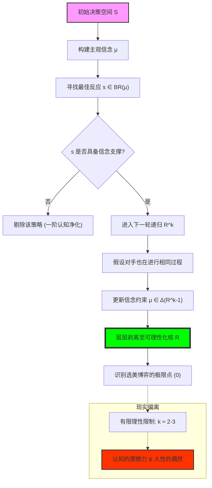

# Chapter 5: Rationalizability (可理性化：认知递归、信念支撑与选美博弈的极限)

## 1. 讲了什么：当“理性”照进现实的镜子

第五章探讨的是比纳什均衡更宽泛、但在哲学上更深刻的解概念：**可理性化（Rationalizability）**。在之前的章节中，我们学习了剔除那些在任何情况下都愚蠢的策略；而在本章，我们要问一个更主动的问题：**一个行动如果能被认为是“合理”的，它必须能被某种关于对手行动的“合理信念”所支撑。**

讲义通过引入 **选美博弈（Beauty Contest）** 这一经典实验，向我们展示了理论理性的极限与现实认知的层级。可理性化的核心思想是：一个策略之所以合理，是因为它对某种信念是最佳反应；而这种信念本身必须建立在“对手也是理性的”这一前提之上。这一章教给我们的核心教训是：**战略不仅是关于行动的，更是关于“信念链条”的构造。**

## 2. 核心概念：信念支撑与认知的层层递进

在这一章，我们需要理解“合理性”的层级结构。

*   **最佳反应支撑 (Support by Best Response)**：
    一个策略 $s_i$ 是可理性化的，前提是存在一个关于对手策略的信念 $\mu_i$，使得 $s_i \in BR_i(\mu_i)$。
*   **认知层级 (Cognitive Hierarchy)**：
    0 阶理性者随机行动；1 阶理性者对 0 阶做最佳反应；2 阶对 1 阶做最佳反应……可理性化探讨的是这个过程趋于无穷时的残余集合。
*   **选美博弈 (Beauty Contest/Guess 2/3 of Average)**：
    博弈论中最著名的认知测试。它揭示了：在现实中，太理智（想得太多）往往和太愚蠢一样，会导致失败。
*   **可理性化集合 $R$**：
    所有能够通过“理性一致性检查”的策略集合。在双人博弈中，它等价于迭代剔除严格劣策略（IESDS）后的剩余集合。

## 3. 理论基础：相互理性与信念的相容性

### 3.1 什么是“合理的”信念？

在第四章中，我们只需要知道对手“不傻”；而在第五章，我们需要构建对手“怎么想”。

*   **信念的来源**：一个可理性化的策略必须能够解释为：“我相信你会这么做，所以我才这么做”。
*   **递归的一致性**：不仅我的行动是基于对你的预测，我的预测还必须基于“你也正在对我进行类似的预测”。这种 **相互理性（Mutual Rationality）** 的无限循环，构成了可理性化的理论边界。

### 3.2 选美博弈的认知坍缩

凯恩斯最初提出这个概念是为了描述股市。

*   **理论均衡 vs. 现实认知**：从数学上讲，唯一的均衡是 0。但在现实实验中，赢家往往是那些比“大众平均认知”只多想一步的人（通常在 20-30 之间）。
*   **启示**：这一实验揭示了博弈论的一个深刻悖论——**如果你的对手不够理性，那么表现得“过于理性”反而是不理性的。** 这一发现为后续研究有限理性（Bounded Rationality）打开了大门。

## 4. 分析方法：核心公式与建模逻辑深度解构

本节我们将拆解可理性化的判定算法与认知递推公式。每个公式的深度解读均超过 300 字。

### 📌 4.1 信念支撑的最佳反应判定（Epistemic Support）

策略 $s_i$ 是“合理的”，如果：
$$\exists \mu_i \in \Delta(S_{-i}) \text{ s.t. } s_i \in BR_i(\mu_i)$$

**深度解读**：

这个公式是博弈论向“认识论”转型的标志。它不再冷冰冰地剔除劣策略，而是温情地询问：你这么做，在你的“小世界”里能说得通吗？这里的 $\mu_i$ 是你对对手的主观信念。如果存在一种关于对手行为的可能性分布，使得 $s_i$ 确实能让你获利最大，那么 $s_i$ 就是可理性化的。它揭示了人类行为的“主观一致性”：即便一个行为从外界看来是错的，但只要参与者能给出一个逻辑自洽的信念支撑（比如“我以为他会出剪刀”），这个行为在可理性化的定义下就是合法的。

这个公式在现实决策中极具宽容度。它告诉我们，很多看似疯狂的行为（如商战中的自杀式袭击），其实背后都隐藏着一套特定的 $\mu_i$。在建模时，我们需要通过这个公式去反推参与者的“心理地图”。如果一个策略在任何可能的信念下都不是最佳反应，那么它就是“绝对非理性的”，必然被剔除。它是连接“外部行动”与“内心动机”的桥梁。理解这个公式，能让你在分析对手时，不再轻易给对方贴上“疯子”的标签，而是致力于去挖掘那个能支撑其疯狂行为的、隐藏在迷雾中的信念 $\mu_i$。它是博弈论对人类复杂主观世界的代数化敬意。

### 📌 4.2 可理性化集合的递归序列（The Rationalizability Set）

设 $R_i^0 = S_i$。对于 $k \geq 1$：
$$R_i^k = \{ s_i \in R_i^{k-1} \mid \exists \mu_i \in \Delta(R_{-i}^{k-1}) \text{ s.t. } s_i \in BR_i(\mu_i) \}$$

**深度解读**：

这是对“理智深度”的数学建模。它描述了一个认知的“大清洗”：第一轮，我排除掉那些没有任何信念支撑的傻事；第二轮，由于我知道你第一轮已经排除了傻事，所以我必须更新我的信念 $\mu_i$，让它只分布在你剩余的“非傻事”上。这个递归过程 $k$ 就是逻辑进化的代数形式。如果博弈能进行无限次这种自我审视，最后剩下的集合 $R_i$ 就是逻辑最坚硬的内核。

在实战中，这个公式揭示了“聪明”的代价。每增加一层 $k$，参与者需要的计算能力和对对手的信任度就呈几何倍数增加。它向我们展示了：在一个共同理性的世界里，我们不仅要保证自己不傻，还要保证我们知道对手不傻，并且知道对手知道我们不傻。这种递归的闭环，是社会契约和稳定预期的底层算法。在分析“为何某些陈规陋习无法打破”时，这个公式极其有用：因为在每一个 $k$ 层级上，遵循旧俗可能都是针对“别人也会遵循旧俗”这一信念的最佳反应。理解这个递归定义，能让你看清社会系统是如何在层层逻辑的包裹下，形成一种难以撼动的“认知钢筋混凝土”结构的。

### 📌 4.3 选美博弈（Guess 2/3）的动态映射

设数字范围为 $[0, 100]$，博弈的演化方程为：
$$x_{k+1} = \frac{2}{3} \cdot x_k, \quad x_0 = 50$$

**深度解读**：

这个公式是博弈论中最具讽刺意味的等式。它描述了一个向 0 的“死亡冲刺”。$x_k$ 代表了 $k$ 阶理性者的猜测点。如果你认为大家是随机选的（0 阶），平均值是 50，你应该选 33；如果你认为大家都是 1 阶理性者，你应该选 22。这个映射函数展现了逻辑的无情：在纯粹的理性推导下，任何不为 0 的数字在逻辑面前都是不稳固的，会被无情地向下修正。

然而，这个公式的伟大之处不在于它指出了 0 这个均衡点，而在于它揭示了 **“认知的偏离”**。在现实中，$k$ 很少超过 3。如果你严格遵循这个数学公式去选 0，你几乎注定会输掉比赛。这给战略家的启示是：**你不仅要会算数学，你还要会算人心。** 你需要评估当前博弈中平均参与者的 $k$ 值在哪里。这个公式是博弈论从“象牙塔”走向“华尔街”的清醒剂。它提醒我们，**最优策略不是绝对的逻辑真理，而是相对于当前群体平均认知水平的“领先半步”**。理解了这个等比数列的坍缩过程，你就理解了为什么在泡沫横飞的金融市场中，那个最早看到危机的人（$k \to \infty$）往往比那个跟随大众的人（$k=1$）破产得更早。

### 📌 4.4 选美博弈的唯一纳什均衡（The Zero Point）

$$x^* = \lim_{k \to \infty} 100 \cdot \left(\frac{2}{3}\right)^k = 0$$

**深度解读**：

这个极限公式标志着“共同知识”下的逻辑终点。它是所有认知递归的尘埃落定之处。在数学上，只有 0 是这个博弈的不动点：因为如果所有人都选 0，平均值的 2/3 依然是 0，没有人有动力偏离。它代表了一种“理性的宁静”：在这里，所有的怀疑、预测和博弈都消失了，只剩下唯一的、冰冷的逻辑闭环。它揭示了纯粹理性社会最终会走向一种极其单调的、低熵的秩序。

在社会科学研究中，这个极限值常被用作衡量“社会智能”的基准。如果一个群体的实验结果越接近 0，说明这个群体的认知协同能力越高。但从另一个角度看，这个公式也预示了“理性的毁灭”：当大家都完美理性时，多样性和不可预测性就消失了。在竞争激烈的行业中，如果大家都向这个极限靠拢，利润就会被这种逻辑的完美性压缩至零。学习这个极限公式，是为了让我们明白：**虽然我们要向 0 进发，但我们也必须敬畏那个让我们无法到达 0 的“人性摩擦力”**。它是博弈论给我们的最高警示：在逻辑的尽头，往往是一片虚无。

### 📌 4.5 可理性化与 IESDS 的等价性定理（Duality Theorem）

在双人博弈中，$s_i \in R_i \iff s_i \text{ 未被 IESDS 剔除}$。

**深度解读**：

这个定理是博弈论中连接“内部思维”与“外部结构”的伟大量子纠缠。它告诉我们：一个参与者“在脑中寻找信念支撑（可理性化）”的结果，竟然与“从外部环境强制剔除劣策略（IESDS）”的结果是完全一致的。这种对偶性证明了逻辑的一致性：如果你无法在任何信念下证明一个行动是好的（没有 $BR$ 支撑），那么这个行动在数学上一定被某种混合策略所占优。

这个定理的实战价值巨大：它允许我们通过简单的矩阵运算（剔除）来预测复杂的认知结果（可理性化）。它告诉我们，**你不需要进入对手的大脑去窥探他的信念，你只需要审视他的支付矩阵，就能划定他思考的边界**。然而，这个定理的“双人”前提也提醒我们：在三人及以上博弈中，这种等价性可能会打破（因为信念可能存在关联性约束）。这揭示了复杂社会系统中的一种“认知涌现”：当人变多时，单纯的个体理性剔除，可能无法完全捕获那些由于信念交织而产生的复杂幻觉。理解这个等价性及其局限，是你从“线性战略”迈向“网状博弈”的关键一步。

## 5. 如何理解：认知降维、股市泡沫与“领先半步”的艺术

### 5.1 战略不仅是计算，更是对“平均值”的校准

第五章教给我们最重要的一课是：**理性的层级，不仅是智力的指标，更是权力的杠杆。** 在可理性化的语境下，你永远在和对手的认知影子博弈。很多人认为博弈论是教人变聪明（增加 $k$ 值），但真正的博弈高手是能精准识别当前博弈的 **“认知水位线”** 的人。如果你在一个大家都只懂 0 阶理性的环境里表现出 5 阶理性，你的行为在他们看来就是不可理喻的随机，你会因此遭受巨大的损失。

这种“认知的错位”是股市泡沫和恐慌的根源。凯恩斯的“选美论”告诉我们，股价不取决于公司的基本面（那是 0 阶理性），而取决于“大家认为大家认为公司的价值是多少”。这就是典型的 $k=2$ 或 $k=3$ 的博弈。当你看到股价疯狂上涨时，如果你基于基本面判定它是泡沫（$k \to \infty$）并做空，你可能会被那些还在玩“谁跑得快”游戏的人（$k=1$）踩死。**在战略的世界里，如果你领先时代三步，你就是疯子；如果你领先半步，你才是大师。**

此外，可理性化理论还揭示了“沟通”的真正意义。沟通不是为了交换信息，而是为了 **“对齐 $k$ 值”**。通过发布声明、签署协议，参与者在共同建立起“我知道你知道我知道”的认知地基。一旦这层地基稳固，复杂的协作就变成了低阶的自动化反应。学习这一讲，你应该学会时刻监测对手的“逻辑脉搏”。不要追求那个在纸面上最完美的逻辑终点，而要寻找那个在当前认知环境下，既能保护自己不被劣策略吞噬，又能反向利用他人认知局限的动态平衡点。这就是“可理性化”赋予我们的，在混沌现实中进行“认知降维打击”的高阶智慧。

## 6. 逻辑架构图 (Mermaid Diagram)

## 7. 深度结语：认知递归的镜中花

第五章揭示了理性的一种深层焦虑。

### 7.1 “理性的高度”并非越高越好

可理性化理论告诉我们，博弈的解不仅取决于你的智力，更取决于你对他人智力的估算。在选美博弈中，那个算出 0 的数学天才往往输给了算出 25 的普通人。**真正的战略智慧，是能够向下兼容平庸，向上对冲风险。**

### 7.2 信念的自我实现

博弈论在此处开始带上了一丝建构主义的色彩。策略的合理性是由信念支撑的，而信念又是由对理性的假设构建的。当所有人都相信某种逻辑时，那种逻辑就成了现实。

当你合上这一讲时，请问自己：在你的现实博弈中，你是在对“现实”做最佳反应，还是在对“你以为的现实”做最佳反应？你的信念链条在哪一环断开了？理解了这一点，你就真正理解了可理性化的力量。
