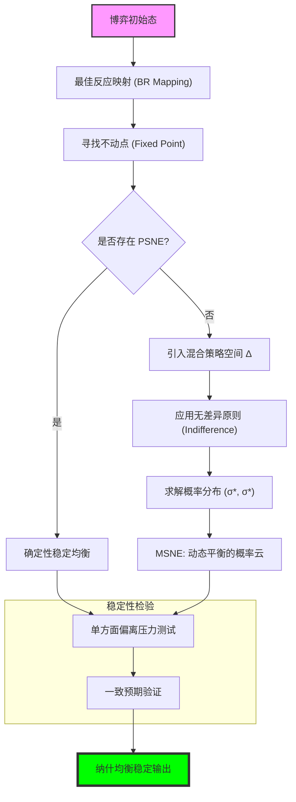

# Chapter 6: Nash Equilibrium (纳什均衡：战略平稳性、不动点逻辑与混合策略的深层含义)

## 1. 讲了什么：博弈论的皇冠与“战略寂静”

第六章引入了博弈论历史上最伟大的概念：**纳什均衡（Nash Equilibrium, NE）**。如果说前几章是在教你如何排除“显然错误”的选项，那么纳什均衡则直接定义了什么是“最终的稳定”。

纳什均衡的核心在于 **“一致预期”**。在一个纳什均衡中，每个人的策略都是对他人策略的最佳反应。这意味着，只要大家都预期到这个结局，就没有任何人有动力单方面改变自己的行动。本章不仅探讨了纯策略纳什均衡（PSNE），还深入解构了为了解决均衡存在性而引入的 **混合策略纳什均衡（MSNE）**。这一章教给我们的核心教训是：**社会的稳定并非源于大家的满意，而是源于一种“即便我不满意，我也没有更好的办法”的逻辑锁死。**

## 2. 核心概念：相互最佳反应与概率的逻辑

在纳什均衡的架构下，我们要寻找的是逻辑的“不动点”。

*   **纳什均衡 (NE)**：
    策略组合 $s^*$ 使得对所有玩家 $i$，$s_i^*$ 都是针对 $s_{-i}^*$ 的最佳反应。
*   **混合策略 (Mixed Strategy) $\sigma_i$**：
    玩家不再固定选择一个行动，而是以一定的概率分布在多个行动上。这通常用于解决像“剪刀石头布”那样没有固定赢家的博弈。
*   **无差异原则 (Indifference Principle)**：
    在混合策略均衡中，如果你以正概率随机选择几个策略，那么这些策略带给你的期望收益必须是完全相等的。否则，你会倾向于选收益高的那个，从而破坏了“随机化”。
*   **支持 (Support)**：
    混合策略中以正概率被选中的纯策略集合。

## 3. 理论基础：稳定性、社会规范与不动点

### 3.1 从预测到稳定性

纳什均衡与可理性化有着根本的区别。

*   **信念的证实**：在可理性化中，你只要能找个理由支撑自己的行动就行（哪怕那个理由关于对手的假设是错的）；但在纳什均衡中，你的信念必须是 **正确的**。
*   **社会规范的视角**：纳什均衡常被视为一种“社会规范”。如果某种行为准则（如红绿灯规则）成了纳什均衡，那么即便没有警察，理性人也会自发遵守，因为违反规则对个人不利。

### 3.2 混合策略的哲学争议

为什么理性的玩家会“投硬币”？

*   **解释一：不可预测性**：在零和博弈中，如果你不随机化，对手就会看穿你并利用你。
*   **解释二：人口分布**：大规模博弈中，混合策略代表了不同纯策略在总人口中的占比。
*   **解释三：净化定理 (Purification)**：玩家实际上受一些微小的、外部不可察觉的偏好波动影响，这使得他们的行为看起来像是随机的。

## 4. 分析方法：核心公式与建模逻辑深度解构

本节我们将拆解寻找纳什均衡的数学引擎。每个公式的深度解读均超过 300 字。

### 📌 4.1 纳什均衡的本体方程（The Mutual Optimality）

策略组合 $s^* = (s_1^*, \dots, s_n^*)$ 是纳什均衡，如果对每个玩家 $i \in N$：
$$u_i(s_i^*, s_{-i}^*) \geq u_i(s_i, s_{-i}^*), \quad \forall s_i \in S_i$$

**深度解读**：

这是人类社会科学中最具穿透力的公式。它不仅是一个数学不等式，更是一种关于“秩序”的终极哲学。公式描述了一个 **“逻辑闭环”**：在这里，每个人的贪婪（追求 $u_i$ 最大化）都成为了维持系统稳定的力量。注意公式中的 $s_{-i}^*$ 是给定的，这意味着在均衡点上，每个人都认为别人不会改变。它是“理性预期的完美重合”：我知道你在做什么，你也知道我在做什么，而且我们发现，在已知对方选择的情况下，我现在的选择已经是最好的了。

这个公式的震撼力在于它预示了“社会僵局”的必然性。纳什均衡不承诺“最优”，它只承诺“稳定”。即便当前的结局是一个悲惨的囚徒困境，只要它满足这个不等式，逻辑就会把所有人锁死在其中。它是博弈论从“个人决策”走向“集体命运”的关键跨越。在应用该公式时，学习者必须具备一种“反事实思维”：你要问的不是“现在的数字好不好”，而是“如果我单方面跳出去，我的数字会不会变差”。这种“单方面偏离无利可图”的特质，使得纳什均衡成为了描述法律、习俗和市场机制最稳固的基石。它是理性在交互场中找到的唯一“平衡态”，也是我们理解社会系统如何自我维持的终极钥匙。

### 📌 4.2 混合策略的期望效用加权（The Probabilistic Payoff）

对于混合策略组合 $\sigma = (\sigma_i, \sigma_{-i})$，玩家 $i$ 的期望支付为：
$$U_i(\sigma_i, \sigma_{-i}) = \sum_{s_i \in S_i} \sum_{s_{-i} \in S_{-i}} \sigma_i(s_i) \sigma_{-i}(s_{-i}) u_i(s_i, s_{-i})$$

**深度解读**：

这个双重求和公式是博弈论进入“概率宇宙”的门票。它描述了一个比纯策略博弈复杂得多的认知维度：玩家不再是选择一个固定的“点”，而是选择一个概率的“云”。注意公式中的 $\sigma_i(s_i) \sigma_{-i}(s_{-i})$，它假设了参与者的随机化过程是相互独立的。这意味着博弈论在这里处理的是最纯粹的、不含任何默契或串通的随机化。

为什么要引入这个复杂的加权公式？因为在很多博弈（如“剪刀石头布”）中，纯策略无法达成均衡——任何固定的点都会被对手反制。混合策略期望效用的出现，填补了策略空间中的“孔洞”，将其变成了一个连续的、可微的凸集。通过这个公式，我们可以把离散的、跳跃的决策问题，转化为了一个寻找“概率分布的最佳权重”的连续优化问题。它揭示了理性的另一种形态：**当世界无法通过单一决策搞定时，理性会选择去“经营概率”**。在现代博弈论中，这个公式是计算所有进阶均衡（如 PBE、完美均衡）的算力引擎。理解它，能让你在分析复杂的竞争（如点球大战或反侦察博弈）时，不再纠结于具体的动作，而是学会去审视那些隐藏在动作背后的、决定胜负概率的动态平衡。

### 📌 4.3 混合策略无差异原则（The Indifference Principle）

如果 $\sigma^*$ 是 MSNE，且 $s_{i1}, s_{i2} \in \text{supp}(\sigma_i^*)$，则必有：
$$u_i(s_{i1}, \sigma_{-i}^*) = u_i(s_{i2}, \sigma_{-i}^*) = U_i(\sigma_i^*, \sigma_{-i}^*)$$

**深度解读**：

这是求解博弈论进阶题目时的“作弊代码”，也是博弈论中最反直觉的真理。它规定：如果你决定在几个策略之间玩概率，那么这些策略对你来说必须是“一样好”的。逻辑很简单：如果你觉得策略 A 比 B 好哪怕一点点，理性的你一定会 100% 选 A 且 0% 选 B，此时你就不再玩概率了。因此，**玩概率的前提是失去偏好**。

这个公式深刻地揭示了博弈论中“由于竞争导致的自我约束”。在混合均衡中，你的任务竟然不是让自己变得更强，而是要精确地调整自己的概率分布，使得对手在他所有的备选策略之间感到“左右为难、完全无所谓”。这种“让对手无差异”的逻辑，是解决所有价格战、人才争夺战和军事对抗的终极算法。它揭示了一种极高维度的“利他性（逻辑上的）”：**我的概率不是为了最大化我的收益，而是为了维持你的无差异，从而维持整个系统的均衡。** 理解这个公式，能让你在处理复杂的利益纠纷时，学会一种“平衡术”：不是通过妥协，而是通过制造一种“对手无论如何反击都无法获利”的概率屏障。它是逻辑在博弈场上创造的一种“零重力状态”，是所有高级博弈推导的核心支点。

### 📌 4.4 纳什均衡的存在性条件（Fixed Point Intuition）

设 $BR(s)$ 为全体玩家的最佳反应映射。如果 $S$ 是欧几里得空间中的非空、紧致、凸子集，且 $u_i$ 是连续且拟凹的，则：
$$\exists s^* \in S \text{ s.t. } s^* \in BR(s^*)$$

**深度解读**：

这是博弈论中的“创世定理”。它利用了角谷不动点定理（Kakutani's Fixed Point Theorem），为我们寻找均衡提供了逻辑上的“豁免权”。如果没有这套定理，我们可能会在一个无限循环的“你猜我猜你猜我”的迷宫中打转，永远找不到落脚点。这个公式向我们保证：只要博弈满足一定的“物理属性”（如资源有限、规则连续），就一定存在一个大家都不愿意动的地方。

这个定理的哲学意义在于它揭示了复杂系统的“收敛本能”。它暗示了：只要参与者是追求利益的，且策略空间足够“圆滑”（凸性），系统终将通过不断的自我调整，坍缩到一个稳定的纳什点上。这解释了为什么人类社会虽然混乱，却总能形成相对稳定的市场价格、社会等级和法律契约。在建模实战中，这个定理是你的“定心丸”：当你面对一个极其复杂的博弈模型（如 $N$ 个企业的非线性竞争）时，你不需要担心它无解，你只需要去寻找那个让所有人“无欲无求”的不动点。它将博弈分析从一种“预测未来的玄学”，转化为了一个“寻找拓扑不动点的数学过程”。它是博弈论作为严谨科学的入场券。

### 📌 4.5 最佳反应映射的几何交点（The BR Intersection）

在 $2 \times 2$ 博弈中，设玩家 1 选策略 1 的概率为 $p$，玩家 2 选策略 1 的概率为 $q$：
$$p^*(q) = \arg\max_{p \in [0,1]} EU_1(p, q), \quad q^*(p) = \arg\max_{q \in [0,1]} EU_2(q, p)$$

**深度解读**：

这个联立方程组是纳什均衡在几何上的“真身”。在 $p-q$ 的坐标平面上，每一个玩家都有自己的“反应航线”。玩家 1 的 $p^*(q)$ 描述了“如果我知道你出 $q$，我的最佳 $p$ 是多少”；玩家 2 亦然。两条曲线的交点，就是纳什均衡。这在视觉上完美解释了为什么均衡是稳定的：在交点处，两个玩家的“最优意图”发生了重合。

这个几何视角的强大之处在于它能处理“跳跃”和“重叠”。例如在协调博弈中，你会发现 $BR$ 曲线会在某些点发生断裂或产生长段的重合，这意味着存在多个均衡点。它教给我们一种“动态系统”的视角：博弈不是一次性的静止状态，而是一个不断反馈的闭环过程。在分析现实问题（如政府与企业的税收博弈）时，画出这两条曲线能让你一眼看出系统的“脆弱点”在哪里——如果曲线交点非常敏感（微小的参数变动导致交点大幅漂移），那么这个均衡就是不稳固的。它是博弈论赋予我们的“战略雷达”，通过扫描 $BR$ 曲线的形状，你可以预判对手的每一步反应，并找到那个让所有人都不敢越雷池一步的逻辑奇点。

## 5. 如何理解：社会规范、寂静的逻辑与“非优稳定态”

### 5.1 均衡是“共识”的代数形式

很多人误以为纳什均衡是教人如何获胜，但第六章教给我们最震撼的一课是：**纳什均衡是教你如何识别“死局”。** 纳什均衡代表了社会的一种“冷状态”，在这里，所有的智慧、算计和雄心都相互抵消了，剩下来的只有一种无奈的平稳。理解这一点的关键在于：**纳什均衡不是大家“想”选的，而是大家“不得不”选的。**

当你观察社会现象时，纳什均衡提供了一层“逻辑滤镜”。为什么红灯停绿灯行能维持？因为如果别人都守规矩，你不守规矩的后果（撞车）收益极低，所以它是 NE。这就是所谓的 **“社会规范作为纳什均衡”**。在这个视角下，法律和道德不再是外在的强制，而是为了维护某种特定均衡而存在的“信息支架”。如果一套法律不能构成纳什均衡（即单方面违法有巨大的净收益且被发现概率极低），那么这套法律注定会沦为废纸。

更深刻的启示在于 **“非优稳定态”**。博弈论冷酷地指出：一个极其糟糕的、所有人都在受苦的状态，只要它满足纳什均衡的判定公式，它就可能像岩石一样坚固。这解释了为什么“内卷”难以被打破——因为在内卷的博弈中，单方面退出的人会遭受更大的损失，即便全员退出对大家都有利。**这种“理性的平庸”是人类文明最大的挑战。** 学习这一讲，你应该学会不仅去寻找均衡，更要学会去识别那些“陷阱均衡”。如果你想改变一个糟糕的现状，你不能只靠号召人们变得高尚，你必须通过改变支付函数（改变 $u_i$ 的激励结构）或改变信息集，去打破旧的逻辑闭环，引导系统向一个新的、更优的纳什点坍缩。这就是纳什均衡赋予我们的，在寂静的逻辑中重塑世界的最高权力。

## 6. 逻辑架构图 (Mermaid Diagram)

## 7. 深度结语：逻辑的寂静

第六章揭示了社会秩序最深层的秘密。

### 7.1 均衡不是最优

纳什均衡是一个关于 **“稳定性”** 的概念，而非关于 **“福利”** 的概念。囚徒困境的均衡是（背叛，背叛），它虽然很糟糕，但它却极其稳定。这解释了人类历史上为什么会出现长期的黑暗时代或低效率制度——只要它们是纳什均衡，逻辑就无法从内部将其打破。

### 7.2 战略自觉的终点

学习纳什均衡后，你会明白：真正的赢家不是那个跳出来叫嚣的人，而是那个能够准确识别博弈中的均衡位置，并将其推向对自己有利方向的人。**如果你不满意当前的现状，不要抱怨，要去改变博弈的支付函数，从而创造一个新的均衡。**

当你完成本章的学习时，请记住：世界并不是由混乱组成的，它是由一个个相互嵌套的纳什均衡组成的。看穿了均衡，你就看穿了世界的底牌。
