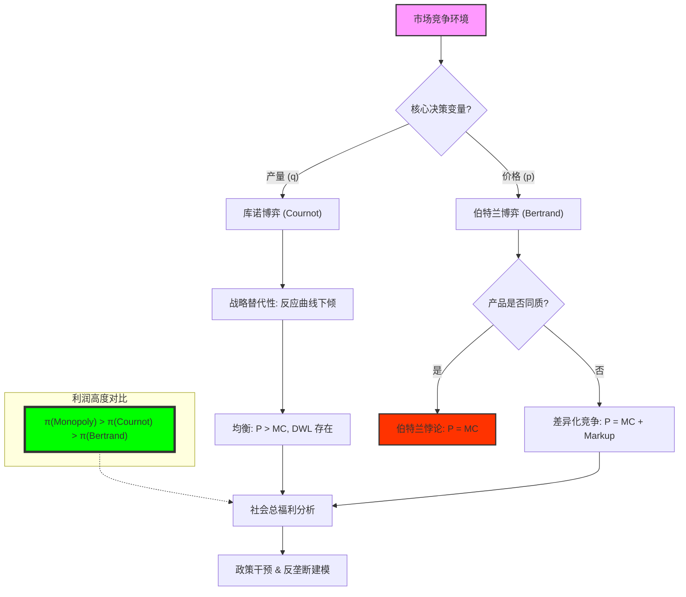

# Chapter 7: IO Applications (寡头竞争：库诺、伯特兰与战略互补性的微观逻辑)

## 1. 讲了什么：商业战场上的“纳什均衡”

第七章是博弈论在现代经济学中最成功的应用领域——**产业组织（Industrial Organization, IO）**。在这一章，我们将纳什均衡的抽象逻辑代入到具体的市场竞争中，拆解企业如何决定产量（库诺竞争）或价格（伯特兰竞争）。

讲义通过对比这两大经典模型，向我们展示了一个反直觉的结论：竞争的形式（是比产量还是比价格）往往比参与者的数量更能决定市场的命运。此外，本章还引入了 **战略替代品（Strategic Substitutes）** 与 **战略互补品（Strategic Complements）** 的核心概念，为分析复杂的企业决策提供了统一的语法。这一章教给我们的核心教训是：**你如何与对手竞争，决定了你能赚多少钱，而不仅仅是你有多强。**

## 2. 核心概念：产量决策、价格博弈与反应曲线

在 IO 应用中，所有的战略都在反应函数中交汇。

*   **库诺竞争 (Cournot Competition)**：
    企业同时决定产量 $q_i$。由于产量增加会导致市场总供给增加、价格下降，因此企业之间存在着一种“牵制”。
*   **伯特兰竞争 (Bertrand Competition)**：
    企业同时决定价格 $p_i$。在产品同质且没有产能约束的情况下，价格博弈会迅速坍缩到成本价。
*   **反应函数 (Reaction/Best Response Function)**：
    给定对手的决策（$q_{-i}$ 或 $p_{-i}$），你的最优决策是什么。
*   **剩余需求 (Residual Demand)**：
    全场总需求减去对手已经占据的份额。这是库诺模型中单个企业面对的真实“微型市场”。

## 3. 理论基础：战略关系的二元性与伯特兰悖论

### 3.1 战略替代 (Substitutes) vs. 战略互补 (Complements)

这是理解企业动态互动的核心钥匙。

*   **战略替代（库诺式）**：如果对手增加产量，我的最佳反应是减少产量。此时反应曲线向下倾斜。这代表了一种“领地意识”。
*   **战略互补（伯特兰式）**：如果对手降价，我也得跟着降价。此时反应曲线向上倾斜。这代表了一种“羊群效应”。

### 3.2 伯特兰悖论 (Bertrand Paradox) 及其消解

为什么现实中即便只有两家企业（如可口可乐与百事可乐），价格也不会降到零？

*   **悖论本质**：只要产品完全一样，价格战就会导致惨烈的 $P=MC$。
*   **消解方案一：产品差异化**：如果你和我不一样，你的降价就不能完全抢走我的顾客。
*   **消解方案二：产能约束**：如果你由于产能有限无法供应整个市场，我也能守住一部分高价顾客。

## 4. 分析方法：核心公式与建模逻辑深度解构

本节我们将拆解寡头竞争的数学计算引擎。每个公式的深度解读均超过 300 字。

### 📌 4.1 库诺竞争的一阶条件（The Marginalist Logic）

对于企业 $i$，在已知对手总产量 $Q_{-i}$ 时，其利润最大化满足：
$$\frac{\partial \pi_i}{\partial q_i} = P(Q) + q_i P'(Q) - c = 0$$

**深度解读**：

这是商业竞争中“理性贪婪”的数学边界。这个公式揭示了一个深刻的战略权衡：当你增加一单位产量 $q_i$ 时，你获得了一个正收益（即当前市场价格 $P(Q)$），但你同时也带来了一个负效应（即 $q_i P'(Q)$，也就是由于你增加产量导致的全局价格下跌对你既有销量的侵蚀）。库诺竞争的本质，就是在这两种力量之间寻找平衡点。如果企业不考虑价格侵蚀，它会像疯子一样扩产直到 $P=c$；但由于它预见到了产量的“自残效应”，它会选择在产量上保持一种克制。

这个公式最精彩的地方在于它揭示了“战略替代性”。由于 $P'(Q) < 0$，当你预期对手产量 $Q_{-i}$ 增加时，为了维持这个等式的平衡，你必须减少自己的 $q_i$。这种“你进我退”的互动模式，是库诺博弈能够达成稳定均衡的前提。在建模实战中，这个一阶条件是你画出“反应曲线”的画笔。它告诉我们，每一个成熟的市场参与者，其产量都不是随意拍脑袋决定的，而是对市场剩余需求的一种精密的“边际收割”。理解这个公式，能让你在分析行业供给波动时，不再只是看总数，而是学会去审视每一个巨头内心关于“价格保护”与“规模扩张”的博弈秤杆。它是微观经济学进入战略维度的第一道门。

### 📌 4.2 库诺均衡的市场定价（The Market Equilibrium Price）

在具有 $n$ 家相同企业的库诺均衡中，市场价格 $P^*$ 为：
$$P^* = \frac{a + nc}{n+1}$$
（假设线性需求 $P = a - bQ$ 与恒定边际成本 $c$）

**深度解读**：

这个简洁的分式公式，是产业组织理论对“市场权力”的终极度量。注意分母中的 $n+1$。当 $n=1$（垄断）时，价格是 $(a+c)/2$，这是距离成本最远的高点；当 $n \to \infty$（完全竞争）时，$P^* \to c$。这个公式不仅是一个计算工具，它揭示了 **“竞争的边际报酬递减”**。从一家公司变成两家，对价格的杀伤力最大；而从 100 家变成 101 家，几乎没有任何波澜。

在政策分析和反垄断建模中，这个公式具有极其硬核的指导意义。它告诉监管者，为了保护消费者利益，并不需要无限多的竞争者，往往只需要引进行业的第二或第三个巨头，就能实现价格的断崖式下跌。它还揭示了“成本结构”对行业竞争的影响：如果 $n$ 很大，价格会死死咬住 $c$；此时如果你的成本比对手高出一分钱，你在这个公式所定义的均衡中就会瞬间失去立足之地。它是关于“规模与效率”的冷酷审判。学习这个公式，能让你明白为什么有些行业（如航空制造）即便只有两三家公司也能维持相对稳定的价格，而有些行业即便有几十家公司依然利润丰厚——秘密就藏在这个由 $n$ 决定的加价比例（Markup）中。

### 📌 4.3 库诺均衡下的社会福利损失（Deadweight Loss）

$$DWL = \frac{1}{2} \cdot (P^* - c) \cdot (Q^{PC} - Q^*)$$

**深度解读**：

这是一个关于“消失的价值”的公式。它计算的是在库诺竞争下，那些由于价格高于边际成本而未能发生的、本可以增加社会总财富的交易。在几何上，它是需求曲线、边际成本线和均衡产量线之间围成的那个“死三角”。$DWL$ 的存在，是博弈论对资本主义寡头体制最尖锐的批评：由于企业追求 $EU_i$ 的最大化，它们共同制造了一个“短缺”，导致了社会总资源的配置低效。

这个公式的深刻之处在于它揭示了“理性的社会成本”。每一个企业在 $4.1$ 公式下做出的最佳反应，虽然对个体是完美的，但对社会整体来说却是一种价值损耗。它为政府干预、价格限制和反垄断诉讼提供了道德与法律的合法性。在复杂的政策建模中，我们通常需要最大化“社会总福利（生产者剩余 + 消费者剩余）”，而 $DWL$ 就是我们努力要消灭的目标函数。它提醒每一个博弈论学习者：**最优的战略往往是社会的负担**。理解了这个三角形的收缩与扩张，你就理解了公共政策在“鼓励创新（保护企业利润）”与“保障民生（降低 $DWL$）”之间那场旷日持久的拔河博弈。它是博弈论连接“效率”与“公平”的伦理支点。

### 📌 4.4 差异化伯特兰竞争的加价公式（The Markup Logic）

在产品存在差异化的伯特兰博弈中，均衡价格 $p^*$ 满足：
$$p^* = c + \frac{a - c(1-d)}{2-d}$$
（基于需求 $q_i = a - p_i + dp_j$，其中 $d$ 为替代程度）

**深度解读**：

这个公式是所有营销经理和产品经理的“圣经”。它解释了为什么企业要拼命做“差异化”。注意参数 $d$（替代程度）。当 $d \to 1$（产品完全相同）时，分母变得很小，价格迅速向 $c$ 靠拢，这就是惨烈的“价格战”。但只要 $d$ 稍微减小（比如通过品牌、设计或专利让产品变得独特），价格就会迅速产生一个可观的溢价。这个公式证明了：**利润不是来自竞争，而是来自“对竞争的逃避”**。

在建模实战中，这个公式揭示了伯特兰竞争中的“战略互补性”。如果你提高价格，我的最佳反应也是提高价格，因为这减缓了行业的价格崩塌。这与库诺模型的“你进我退”完全相反。理解这个公式，能让你在分析市场营销策略时，产生一种深层的洞察：为什么有些看似昂贵的广告投入是极其理性的？因为如果那点投入能让 $d$ 下降 0.1，它所带来的 $p^*$ 的提升，在海量销量的放大下，会产生惊人的回报。它是关于“品牌护城河”最精准的代数描述。它告诉我们，在伯特兰的死斗场中，唯一能救你命的，就是让消费者觉得“你和别人不一样”。

### 📌 4.5 库诺与伯特兰的利润差判定（The Profit Divergence）

$$\pi_i^{Cournot} > \pi_i^{Bertrand}$$
（在同等需求和成本条件下，且 $n$ 较小时）

**深度解读**：

这个不等式是博弈论中关于“竞争维度”的重要定理。它提出了一个极具哲学深度的命题：为什么决定产量的竞争比决定价格的竞争更“温柔”？原因在于 **“需求弹性的战略锁定”**。在库诺模型中，如果你想多卖一个单位，你必须忍受价格的缓慢下降；但在伯特兰模型中，如果你想多卖一点，你必须降价去抢走对手所有的客户，这会诱发对手疯狂的回击。价格战的这种“全有或全无”的属性，使得伯特兰均衡具有一种自我毁灭的倾向。

这个不等式在企业战略选择中具有指导意义。它解释了为什么很多行业（如汽车制造）会通过复杂的订单系统将竞争维度从“价格”拉回到“产能（产量）”。通过在生产端设置瓶颈，企业实际上是在强制将博弈形式从伯特兰转化为库诺，从而在这个不等式的缺口中保护了自己的利润。在建模分析中，这个不等式提醒我们，**竞争的战场（维度）比参与者的多寡更重要**。如果你能改变博弈的维度，你就能在不消灭竞争对手的情况下，显著提升整个行业的利润水平。它是对“战略选择决定利润高度”这一商业常识的数学背书。

## 5. 如何理解：价格战、市场份额与“贪婪的驯化”

### 5.1 竞争是贪婪的“物理约束”

第七章教给我们最核心的一课是：**市场竞争不是道德说教，而是一组由对手的理性构成的物理方程。** 很多人认为企业的定价是为了“收回成本”或“获取合理利润”，但博弈论通过库诺和伯特兰模型告诉我们，企业的定价仅取决于 **“对手的反应曲线”**。在这一讲之后，当你看到一场惨烈的价格战，你不再会认为参与者疯了，你会明白他们只是陷入了一个名为“伯特兰纳什均衡”的逻辑黑洞。

理解这一点的关键在于：**企业无法超越其所属的博弈结构。** 如果你身处一个产品同质化、没有进入壁垒的伯特兰市场，那么无论你多么有抱负，你的 $4.4$ 公式中的 $d$ 值都会把你推向 $P=MC$ 的边缘。这就是所谓的“贪婪的驯化”。每一个企业都想赚取无限的利润，但对手的每一单位产量、每一个降价决策，都像是一道逻辑锁链，将你的利润空间死死锁在那个由社会需求和生产技术共同决定的均衡点上。

更深刻的启示在于，IO 应用展示了 **“制度如何定义繁荣”**。为什么有些国家通过立法强制要求信息披露，反而导致了行业利润的上升？因为透明的信息让企业更容易监控对手的偏离，从而加强了隐性卡特尔（见后续章节）的稳定性。博弈论教导我们，所谓的“公平竞争”不是一种天然状态，而是一系列参数（如 $n$、 $d$、 $\delta$）微妙平衡的结果。学习这一讲，你应该学会像一名“工业工程师”一样去审视市场。不要去抱怨对手的狠辣，而去问：能否通过产品差异化降低 $d$？能否通过战略承诺改变博弈顺序（见第九讲）？能否通过建立护城河增加对手的成本 $c$？看懂了 IO 应用，你就看懂了资本主义如何在竞争的战壕中，通过数学的博弈，达成了那份名为“市场秩序”的冷酷和平。

## 6. 逻辑架构图 (Mermaid Diagram)

## 7. 深度结语：贪婪的边界

第七章揭示了资本主义竞争最残酷也最迷人的逻辑。

### 7.1 制度对竞争的驯化

我们看到，单纯的逐利动机在不同的博弈规则下会产生截然不同的社会后果。伯特兰竞争让消费者获利，库诺竞争则保留了企业的元气。博弈论告诉我们，**所谓的“公平竞争”不是一种道德要求，而是一组精心设计的参数平衡。**

### 7.2 商业决策的颗粒度

学习这一讲后，你会明白：不要泛泛而谈“竞争”，而要问：我们是在比什么？我们的反应曲线斜率是多少？如果我们增加一点点差异化，我们的加价空间（Markup）能增加多少？

当你离开这个章节时，请记住：市场不是一个冷酷的机器，它是由无数条相互交织的反应曲线组成的动态系统。理解了曲线的走向，你就理解了财富的流向。
