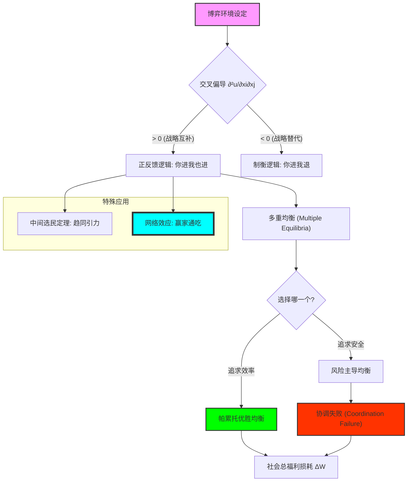

# Chapter 8: Strategic Complementarity (战略互补性：协调博弈、中间选民与社会共识的引力)

## 1. 讲了什么：当大家都想“随大流”

第八章探讨的是博弈论中一类非常特殊且极其重要的关系——**战略互补性（Strategic Complementarity）**。在前一章中，我们看到企业往往通过“你进我退”来划分领地（战略替代）；但在本章，我们要研究的是“你进我也进”的逻辑。

这种逻辑广泛存在于技术标准的选择（如 Windows vs. Mac）、产业集群的形成（如硅谷）、甚至政治选举的定位（中间选民定理）中。讲义通过引入 **超模博弈（Supermodular Games）** 的数学框架，向我们展示了为什么某些社会系统会存在多个均衡点，以及为什么一旦某种趋势形成，就会产生一种强大的、难以逆转的“惯性”。这一章教给我们的核心教训是：**在互补性的世界里，成功往往取决于你对“大多数人会做什么”的精准预测，而非单纯的个人卓越。**

## 2. 核心概念：协调、网络效应与中间选民

在互补性博弈中，战略的斜率是向上的。

*   **战略互补 (Strategic Complementary)**：
    如果对手增加 $x_{-i}$，你的最佳反应也是增加 $x_i$。即 $\frac{\partial^2 u_i}{\partial x_i \partial x_j} > 0$。
*   **多重均衡 (Multiple Equilibria)**：
    互补性往往导致系统中存在多个稳定的平衡点（一个好的，一个坏的）。
*   **协调失败 (Coordination Failure)**：
    即便大家都知道存在一个更好的均衡，但如果没人相信别人会转向那个均衡，系统就会锁死在低效率的状态。
*   **中间选民定理 (Median Voter Theorem)**：
    在单峰偏好的政治博弈中，为了获得最大支持，竞争双方都会向政治光谱的最中间靠拢。

## 3. 理论基础：正反馈循环与社会的锁死

### 3.1 聚集效应与网络外部性

互补性在经济地理和技术竞争中表现得最为淋漓尽致。

*   **为什么有硅谷？**：因为优秀的程序员越多，吸引的公司就越多；公司越多，对程序员的吸引力就越大。这种互补性创造了一个“好的均衡”。
*   **标准战争的残酷**：如果你周围的人都在用微信，那么即便有更好的社交软件，你也会选择微信。这种“网络效应”让先行者获得了巨大的护城河。

### 3.2 协调博弈的脆弱性

讲义通过对比“猎鹿博弈（Stag Hunt）”，向我们展示了社会共识的脆弱性。

*   **风险优胜 (Risk Dominance)**：有时候人们不选最好的均衡，而是选最“安全”的均衡（比如抓兔子而不是猎鹿）。这解释了为什么变革在组织内部如此困难。
*   **中间选民的引力**：霍特林（Hotelling）的经典模型证明了，在空间竞争或政治竞争中，这种互补性（靠近对手能抢走对手另一侧的所有选民）会导致一种单调的“趋同性”。

## 4. 分析方法：核心公式与建模逻辑深度解构

本节我们将拆解互补性博弈的数学判定与均衡动态。每个公式的深度解读均超过 300 字。

### 📌 4.1 超模博弈的交叉偏导准则（Strategic Complementarity）

对于玩家 $i$，博弈具有战略互补性，当且仅当其支付函数满足：
$$\frac{\partial^2 u_i}{\partial x_i \partial x_j} > 0, \quad \forall j \neq i$$

**深度解读**：

这是解释社会现象中“群聚（Clustering）”与“羊群效应”的原子级公式。在数学上，正的交叉偏导数意味着：当你的对手增加投入 $x_j$ 时，你增加投入 $x_i$ 的边际收益也随之增加了。这与上一章库诺模型中负的交叉偏导（你进我退）形成了鲜明的对比。它揭示了一种“良性循环（或恶性循环）”的引力。只要一个人迈出了一步，这一步本身就成为了其他人跟进的逻辑理由。

在经济学和管理学建模中，这个公式是“聚集经济（Agglomeration Economics）”的地基。为什么所有的科技公司都想往硅谷挤？为什么所有的奢侈品牌都开在同一条街上？原因就在于这个大于零的偏导数。它告诉我们，在某些特定的行业中，竞争不仅不削弱利润，反而通过互补性创造了更大的市场。理解这个公式，能让你从一种“零和博弈”的狭隘视角中解脱出来，学会去寻找那些能产生正反馈的“互补性轴心”。它是关于“共赢”最理性的数学表达。在实战中，如果你能找到一个满足这个公式的领域，你实际上是找到了一台自动加速的逻辑引擎。

### 📌 4.2 中间选民均衡的一维稳定性（The Gravity of Median）

在两党竞争中，设选民偏好分布为 $F(v)$。唯一稳定的位置 $x^*$ 满足：
$$x^* = \text{Median}\{V_1, V_2, \dots, V_n\}$$

**深度解读**：

这是政治博弈论中最具震撼力的结论，也是大众民主“平庸化”的数学注脚。该公式证明了：如果选民的偏好是单峰的（即每个人都有一个最爱的点，且离这个点越远越讨厌），那么政客为了获得 51% 的选票，唯一的最佳反应就是跳向那个把所有人一分为二的“中点”。这个公式揭示了一种强大的“逻辑重力”：它无情地抹平了所有的极端色彩，逼迫所有的竞争者变得极其像。

在建模分析中，这个公式揭示了为什么商业竞争（如麦当劳和肯德基的选址）往往表现出极度的趋同。由于靠近对手可以抢走对手另一侧的所有潜在客户，双方都会像磁铁一样被吸向中点。它向我们展示了：**竞争有时不是为了差异化，而是为了“物理占位”**。理解这个公式，能让你看穿很多社会现象背后的“伪样性”：为什么两党制国家的政纲越来越像？为什么热门视频的选题越来越重合？原因就在于这个 Median 的引力。它是对“多样性丧失”的一种冷酷解释。学习这个公式，能让你明白，如果你想在博弈中保持独特，你必须打破这个公式的假设条件（如引入多维竞争或改变选民的单峰偏好）。

### 📌 4.3 风险主导均衡的判定准则（Risk Dominance）

在 $2 \times 2$ 协调博弈中，均衡 $(A,A)$ 风险主导 $(B,B)$，如果：
$$(u_{AA} - u_{BA}) \cdot (u_{AA} - u_{AB}) > (u_{BB} - u_{AB}) \cdot (u_{BB} - u_{BA})$$
（注：$u_{XY}$ 为己方选 X 对手选 Y 时的支付）

**深度解读**：

这是博弈论中关于“信心崩溃”的量化描述。它解决了一个深刻的悖论：为什么有时候大家明明知道一个更好的均衡（帕累托优胜）存在，却偏偏选择去守着一个烂摊子？原因就在于这个公式所刻画的“风险对冲”。它比较了两边“偏离风险”的乘积。即使 $(A,A)$ 给出的绝对收益极高，但如果它要求的信任度太高（即一旦对方不配合，你的损失巨大），那么逻辑就会把你推向那个虽然猥琐但“稳健”的 $(B,B)$ 均衡。

在组织变革和技术升级的建模中，这个公式具有原子级的解释力。为什么很多公司宁愿用老旧的系统也不愿升级更高效的新系统？因为新系统要求“全员同步”，而一旦有人不配合，先行者的风险代价太大。风险主导原则告诉我们：**“更安全”的均衡往往比“更好”的均衡更具有传染性**。理解这个不等式，能让你在推动社会或组织变革时，不再只是强调“好处（帕累托）”，而会致力于去降低那个“偏离代价”。它是对人类保守本能的一种深刻致敬。在实战中，如果你想让系统向好均衡迁移，你必须人为地修改支付矩阵，让这个不等式的方向发生逆转。

### 📌 4.4 网络效应下的个人效用映射（Network Externality）

玩家 $i$ 选择加入某个网络（如社交平台）的效用为：
$$u_i(n, \theta_i) = v + n \cdot \theta_i - P$$
（其中 $n$ 为现有用户数，$\theta_i$ 为该玩家对互补性的敏感度，$P$ 为准入门槛）

**深度解读**：

这个公式是互联网时代的“财富密码”。它展示了互补性如何通过 $n$ 这个变量实现指数级的增长。注意 $n \cdot \theta_i$ 这一项：你的价值不仅取决于你自己，更取决于其他 $n-1$ 个人。这导致了效用的“内生性增长”。这个公式揭示了为什么互联网平台存在一个“临界点（Critical Mass）”：一旦用户数 $n$ 超过某个阈值，效用就会迅速盖过成本 $P$，引发后续用户的排队加入。

在平台博弈的建模中，这个公式解释了“补贴战”的理性基础。烧钱不是为了抢客户，而是为了人为地抬高 $n$，从而改变后续潜在用户的 $u_i$ 预期。它向我们展示了一个极度不公平的竞争环境：一旦一个平台通过互补性构筑了高 $n$ 的护城河，即便后来者拥有更好的技术 $v'$，也很难打破前者的垄断，因为后者无法在初期提供同等的 $n \cdot \theta_i$ 价值。理解这个公式，能让你明白为什么现代商业的竞争维度已经从“产品质量”转向了“网络协同”。它是关于“赢家通吃”逻辑最精炼的数学概括。在实战中，它提醒你，如果你想做一个社交或平台类产品，你的首要任务不是打磨功能，而是去制造那个能让 $n$ 产生爆炸性增长的“互补性引信”。

### 📌 4.5 社会总福利的协调损耗方程（Coordination Failure）

设 $x^*$ 为最优均衡，$x^k$ 为当前劣质均衡。社会福利损耗为：
$$\Delta W = \sum_{i \in N} [u_i(x^*, x^*) - u_i(x^k, x^k)]$$

**深度解读**：

这是一个带有“悲剧色彩”的求和公式。它衡量了由于参与者缺乏“共同信心”而导致的全社会福利蒸发。在博弈论中，这种损耗被称为 **“协调失败”**。它最震撼的地方在于：这笔巨大的财富损失，既不是因为资源匮乏，也不是因为技术落后，纯粹是因为大家在心理上无法达成共识。每个人的理性决策共同制造了一个集体的地狱。

这个公式为“政府作为协调者”的角色提供了理论背书。当系统锁死在 $x^k$ 时（如全社会都用低效率的键盘布局），市场自身是无法通过 $4.1$ 那样的微观改进来跳出的。此时，需要一个外部力量（政府或行业标准组织）通过强制性的号召或补贴，将所有人一次性推向 $x^*$。在宏观经济建模中，这个公式揭示了“信心”的物理价值。它告诉我们，一个社会的繁荣程度，很大程度上取决于它能够减少多少这种“协调损耗”。学习这个公式，能让你学会从更高的维度去审视社会矛盾：很多时候，与其指责个体的自私，不如去建设那个能让大家放心协作、消除 $\Delta W$ 的社会互信架构。它是博弈论对文明整合能力的一种冷峻度量。

## 5. 如何理解：引力、趋同与“多样性消失”的悲剧

### 5.1 战略互补性：社会秩序的“逻辑胶水”

第八章教给我们最深刻的一课是：**稳定不一定是因为正确，而可能仅仅是因为大家都在这么做。** 战略互补性就像是一种逻辑上的万有引力，它让所有的参与者都身不由己地向中心靠拢。在这一讲之后，当你看到大家在职场中疯狂“内卷”，或者看到所有国产手机长得越来越像 iPhone，你不再会简单地用“没创意”来解释，你会明白这是一种 **“超模博弈下的逻辑必然”**。

理解这一点的关键在于：**在互补性的世界里，特立独行是极度昂贵的。** 根据 $4.3$ 的风险主导公式，如果你尝试创新（选 A），而别人都在守旧（选 B），你遭受的将是毁灭性的孤立代价。这种恐惧感形成了一道无形的墙，将所有人禁锢在那个虽然低效但“安全”的均衡里。这就是所谓的“中间选民的引力”。在这种引力下，所有的多样性和极端性都会被磨灭。政客不再谈论远大的理想，而是在抠那 1% 的摇摆票；商家不再钻研颠覆性的技术，而是在模仿对手的 UI 界面。

这种“趋同性”是文明演化中的一种悲剧性代价。虽然互补性降低了协作成本，创造了稳定的社会预期（我们都知道明天会发生什么，因为大家都一样），但它也窒息了进化的可能性。**当一个系统彻底达到了中间选民均衡时，它也就失去了应对环境突变的冗余度。** 学习这一讲，你应该学会警惕那种“大家都在做”的诱惑。真正的战略家，不仅要会利用互补性去快速扩张（利用网络效应），更要学会在系统锁死之前，通过制造局部的“战略替代性”，来为组织保留那一线生机。看懂了协调博弈，你就看懂了社会惯性最深层的数学起源，也就能在万众一心的潮流中，识别出那些隐藏在稳定表象下的、由于协调失败而蒸发的巨大社会财富。

## 6. 逻辑架构图 (Mermaid Diagram)

## 7. 深度结语：共识的引力与多样性的丧失

第八章揭示了社会演化中一种带有悲剧色彩的必然。

### 7.1 引力的代价

战略互补性创造了稳定，但也创造了平庸。当整个社会都向中间靠拢，或者所有企业都锁死在同一个技术标准中时，系统就失去了探索其他分支的能力。**均衡的深度，往往就是创新的坟墓。**

### 7.2 成为那个“打破均衡的人”

学习这一讲后，你会明白：要改变一个互补性系统，靠个体的努力是不够的。你需要改变的是大环境的 **“预期”**。你要么创造一个新的技术标准并迅速积累初始规模，要么通过制度改革打破原有的交叉激励。

当你翻过这一页时，请记住：世界不仅是竞争的，更是相互映衬的。你的每一个行动，都在增加或减少他人跟随你的动力。看懂了互补性，你就看懂了文明的共振。
