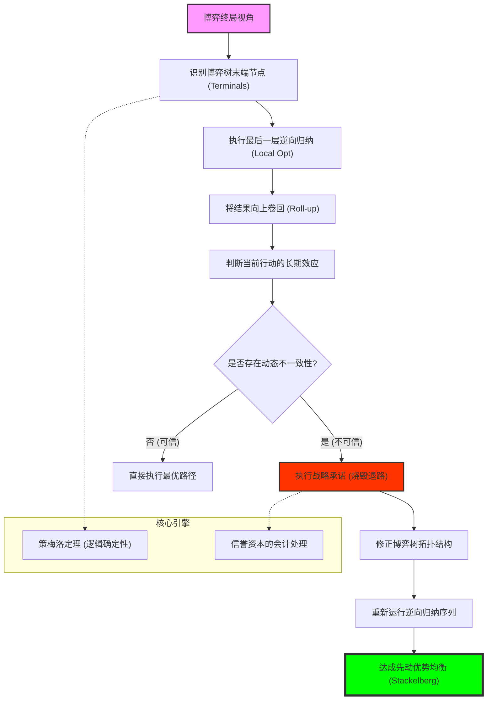

# Chapter 9: Backward Induction (逆向归纳：动态一致性、战略承诺与斯塔克伯格模型)

## 1. 讲了什么：时间流逝中的理性之箭

第九章将博弈从“瞬间抉择”推向了“时间序列”。在此之前，我们大多讨论同时行动博弈；而在本章，我们要研究玩家按顺序行动时，后动者如何观察先动者的选择，而先动者又如何预判后动者的反应。

核心工具是 **逆向归纳法（Backward Induction）**。它的逻辑简单得令人震撼：如果你想知道今天该怎么做，你必须先站在博弈的终点，看最后一步的人会怎么选，然后倒推回现在。讲义通过 **斯塔克伯格（Stackelberg）产量领导模型**，向我们展示了“先动优势”的本质。这一章教给我们的核心教训是：**时间本身就是一种资源，而能够预见到结局的人，才能掌握当下的主动权。**

## 2. 核心概念：先行者、承诺与序贯理性

在动态博弈中，逻辑是倒着走的。

*   **先行者优势 (First-mover Advantage)**：
    通过抢先行动锁定某个产量或价格，迫使后动者只能在既定事实下做出反应。
*   **战略承诺 (Strategic Commitment)**：
    一种主动限制自己未来选择的行为。例如，项羽“破釜沉舟”就是通过斩断退路，向对手发出了一个强力信号：我除了拼命别无选择。
*   **逆向归纳 (Backward Induction)**：
    从博弈树的终端节点开始，由后向前剔除掉不理性的行动，最终找出整条最优路径。
*   **动态一致性 (Dynamic Consistency)**：
    要求一个计划在制定的那一刻是好的，在执行的那一刻依然是好的。

## 3. 理论基础：信誉的底线与“破釜沉舟”的悖论

### 3.1 承诺的可信性问题

动态博弈中最大的挑战是：**不可置信的威胁（Incredible Threats）**。

*   **口头威胁的苍白**：如果对手知道你到了那个关口一定会为了自保而放弃抵抗，那么你之前的强硬表态就是空谈。
*   **承诺的物理化**：真正的战略承诺必须是 **不可逆的**。这揭示了博弈论中一个深刻的辩证法——**如果你想变得更强，你必须先让自己变得更弱（比如烧毁退路）。**

### 3.2 策梅洛定理 (Zermelo's Theorem)

这是博弈论中关于动态博弈的基石定理。

*   **理论高度**：它指出在任何有限步、完美信息的零和博弈中（如象棋），只要没有平局，必然存在一方拥有必胜策略。虽然我们无法在计算上穷尽象棋的每一步，但逆向归纳法在理论上已经终结了这个博弈。

## 4. 分析方法：核心公式与建模逻辑深度解构

本节我们将拆解动态博弈的计算路径与斯塔克伯格模型。每个公式的深度解读均超过 300 字。

### 📌 4.1 逆向归纳的逻辑递归方程（Backward Recursion）

在一个有限步博弈树中，对于任意节点 $h$，其最优策略 $s_i^*(h)$ 满足：
$$s_i^*(h) = \arg\max_{a \in A(h)} u_i(a, s^*|_{h,a})$$
（其中 $s^*|_{h,a}$ 是在 $h$ 点采取行动 $a$ 后，由后续节点产生的均衡结果）

**深度解读**：

这个公式是所有动态战略的“终局算法”。它强制性地要求参与者具备一种 **“跨时空的理性”**。注意公式右侧的 $s^*|_{h,a}$，它意味着你当下的选择 $a$，不仅仅是为了当下的爽快，而是为了导向那个由未来所有理性的、带刺的对手共同决定的最终结局。这是一种极其冷酷的倒推：你必须先假设未来的那个自己、未来的那个对手都是完美理性的，然后看看在那个“逻辑终点”上，现在的这步棋会把你带向何方。

在建模实战中，这个公式揭示了“时间顺序”如何重塑因果。它将复杂的树状博弈解构成了一个个局部的最优化问题。每一层递归，都是在剔除掉那些在未来会被证明是“不可信”的路径。它告诉我们，**战略不是走一步看一步，而是站在终点看回起点**。如果一个行动在当下看起来获利丰厚，但递归方程显示它会诱导对手在下一轮采取报复性行动，那么在逆向归纳的眼光下，这个行动就是“劣后的”。它是对人类短视本能的一次逻辑处决。理解了这个递归方程，你就理解了为什么高手下棋能看十步——他们不是在算概率，而是在脑中运行这个 $4.1$ 公式，修剪掉所有逻辑上不可能成立的未来。

### 📌 4.2 斯塔克伯格领导者利润最大化（Stackelberg Leader's Objective）

企业 1（领导者）的决策公式为：
$$\max_{q_1} \pi_1(q_1, q_2^*(q_1))$$
其中 $q_2^*(q_1) = \arg\max_{q_2} \pi_2(q_1, q_2)$ 是跟随者的最佳反应函数。

**深度解读**：

这是解释“行业霸权”和“先发制人”的核心公式。它最震撼的地方在于：领导者在做决策时，已经把对手的“理性的反击”当作了一个已知的内部变量。注意公式中的 $q_2^*(q_1)$：这意味着领导者不再是在猜测对手会干什么，而是在 **“操控”** 对手干什么。通过选择 $q_1$，领导者改变了跟随者所面对的市场环境，从而强制性地诱导跟随者做出了有利于领导者的选择。

在商业竞争的还原中，这个公式揭示了“先动优势”的本质并非时间早晚，而是 **“信息的锁定”**。通过抢先扩产或抢先定价，领导者向跟随者展示了一个“既定事实（Fait Accompli）”。由于跟随者是理性的，他在看到既定事实后，不得不缩减自己的计划以维持其自身的 $4.1$ 公式平衡。这种“以己之进，逼人之退”的逻辑，使得领导者获得了远超库诺均衡的利润。理解这个公式，能让你看穿很多巨头的霸道行径：他们的大规模投资往往不是为了当下的效率，而是为了占据那个 $q_1$ 的先行者位点，从而在未来的 $q_2^*$ 反应函数中锁定胜局。它是关于“权力如何在时间线上分配”的最强代数证明。

### 📌 4.3 战略承诺的价值差判定（Value of Commitment）

设 $V(\text{Flexible})$ 为保留选择权时的均衡收益，$V(\text{Commit})$ 为烧掉退路、锁定策略后的收益。
承诺有效（且值得）的充要条件是：
$$V(\text{Commit}) > V(\text{Flexible})$$

**深度解读**：

这个不等式是博弈论中最具辩证美感的公式。它挑战了“选择越多越好”的常识。在单人决策中，多留一条退路总是好的；但在博弈论中，**你的退路就是你的弱点**。如果你有一条“投降”的退路，对手就会利用这一点来威胁你；如果你当众烧毁了那条路（即 $V(\text{Commit})$ 状态），你就向对手发出了一个不可置信的强硬信号。对手看到你已无路可退，他的最佳反应就会被迫向你妥协。

这个公式是“破釜沉舟”和“威慑理论”的代数根基。在建模实战中，它提醒我们：**战略的最高境界是“自我束缚”**。通过签署带有巨额赔偿的合同、或是公开宣布不妥协的声明，你实际上是在人为地修改自己的支付函数，使得那个不等式方向发生有利于你的偏转。理解这个不等式，能让你看清很多看似“愚蠢”的行为：为什么将军要下令炸毁身后的桥梁？为什么企业要投入无法挪作他用的专用设备？原因就在于，他们通过这种“残忍的自残”，在博弈的逻辑链条中换取了对手的退缩。它是关于“如何将意志转化为物理约束”的终极逻辑图谱。

### 📌 4.4 策梅洛定理的零和确定性（Zermelo's Determinism）

在有限步、完美信息的零和博弈中：
$$\exists s_1^*, s_2^* \text{ s.t. } \text{Result} \in \{\text{Win}_1, \text{Win}_2, \text{Draw}\}$$

**深度解读**：

这是对“运气”和“偶然性”的最彻底否定。它证明了，像象棋、围棋这类博弈，结局在开始的那一刻就已经由规则和递归逻辑注定了。之所以我们还觉得下棋有意思，纯粹是因为人类的算力还运行不了那个 $4.1$ 公式。在博弈论的视野下，所有的动态博弈最终都会坍缩为一个确定的值（Value of the Game）。这个定理告诉我们，**所谓的“策略灵感”，本质上只是对那个早已存在的递归路径的一次偶发性的捕捉。**

在宏观战略建模中，策梅洛定理提供了一种“宿命感”的分析框架。它告诉我们，如果一个系统的规则是透明的且没有随机干预，那么胜负早在资源配置和行动顺序确立的那一刻就定格了。它促使研究者去关注 **“初始条件的构建”**，而不是中间的技巧。理解这个定理，能让你获得一种“冷酷的远见”：你会明白，很多时候努力是无效的，因为你正处于一个由策梅洛定理锁定的失败路径上。唯一的自救方法不是提高技巧，而是跳出当前的博弈，去改变那个定义了博弈规则的元结构。它是博弈论赋予我们的，看透世间一切繁华表象下，那个冰冷的逻辑死结的显微镜。

### 📌 4.5 动态一致性的激励相容条件（Dynamic Consistency）

一个策略 $s$ 是动态一致的，如果对于博弈树上的每一条路径分叉，满足：
$$u_i(s|_t) \geq u_i(a', s|_{t+1}), \quad \forall a' \in A(t)$$

**深度解读**：

这是衡量“领导力”和“信誉”的数学标准。它揭示了时间带来的“诱惑腐蚀”。一个策略在第 1 天看是完美的，但在第 10 天执行时，由于环境变了，或者对手已经被你诱入陷阱，你可能不再有动力去执行当初的惩罚或奖励。这就是“动态不一致性”。这个公式要求参与者具备一种 **“自律的自利”**：你不仅要骗过对手，还要防住那个未来想偷懒或想毁约的自己。

在宏观经济（如央行制定货币政策）或企业治理中，这个公式是所有信誉机制的逻辑原点。为什么我们需要法治和契约？就是为了通过外部约束，强行让这个不等式成立。如果一个领导者的策略违反了动态一致性，他就会陷入“塔西佗陷阱”：即便他今天说的是真话，由于未来的他有动机违约，理性的对手在逆向归纳时就会直接忽视他今天的表态。学习这个公式，能让你学会评估一份承诺的 **“含金量”**。不要听别人说了什么，而要去看那份承诺在未来的每一个子博弈节点上，是否依然符合他的利益最优解。它是关于“时间长河中的真诚”的一种最不带感情色彩的代数验证。

## 5. 如何理解：终局观、信誉崩溃与“未来的暴政”

### 5.1 逆向归纳：站在终点看回起点

第九章教给我们最核心的一课是：**一个没有终局观的人，是不配谈论战略的。** 动态博弈论告诉我们，现实生活中的每一步棋，本质上都是在对“最后一步”的影子进行防御。这就是所谓的 **“未来的暴政”**。如果你不能预见到博弈在五年后如何结束，你今天所有的精明可能都只是在自掘坟墓。

理解这一点的关键在于：**动态博弈是一场关于“信誉资本”的经营。** 很多人在面临诱惑时会选择“随机应变”，但在博弈论看来，这种缺乏动态一致性的灵活性，实际上是在自毁长城。根据 $4.3$ 的承诺价值不等式，你的权力并不来自你的“自由度”，而来自你的 **“受缚感”**。一个敢于把自己的手铐在方向盘上的人（战略承诺），比一个可以随时转动方向盘的人，在狭路相逢的博弈中更具统治力。这种反直觉的智慧，是动态博弈论赋予我们的最强精神武装。

更深刻的启示在于，逆向归纳揭示了社会契约的“脆弱性”。如果一段关系的终点（如离职、离婚或合同到期）是确定的，那么这种“终点的恶意”会通过 $4.1$ 公式，像病毒一样倒流回这段关系的每一个阶段。这就是为什么长期合作需要一个“没有确定终点”的幻觉（见重复博弈章节）。学习这一讲，你应该学会像一名“编剧”一样去审视人生。不要沉迷于当下的即时收益，而要去问：这场戏的最后一幕是什么？在那一幕里，我的对手会有什么动机？如果那一幕的逻辑是崩溃的，那么我今天所做的一切努力都是在为崩溃添砖加瓦。看懂了逆向归纳，你就看懂了权力的时间结构，也就理解了为什么真正的领袖，总是那个即便在最黑暗的时刻，也死死盯着那个远方“逻辑灯塔”的人。

## 6. 逻辑架构图 (Mermaid Diagram)

## 7. 深度结语：未来的暴政

第九章揭示了人类决策中一种深邃的时间观。

### 7.1 结局控制当下 (The End Dictates the Beginning)

逆向归纳法告诉我们：一个没有终局观的人，是无法做出正确决策的。你在第一步的成败，早在你对最后一步的预判中就已注定。**真正的战略家，是站在未来的尘埃里观察今天的废墟。**

### 7.2 承诺的勇气

学习这一讲后，你会明白：有时候，“留后路”才是最大的风险。博弈论教导我们，要在战略性的时刻勇敢地烧掉退路，将自己的命运与那个唯一的成功目标死死锁在一起。

当你合上这一讲时，请问自己：在你的博弈中，哪些是口头的威胁，哪些是真实的承诺？你是否敢于为了改变对手的预期，而先对自己痛下狠手？看懂了逆向归纳，你就看懂了权力的游戏。
