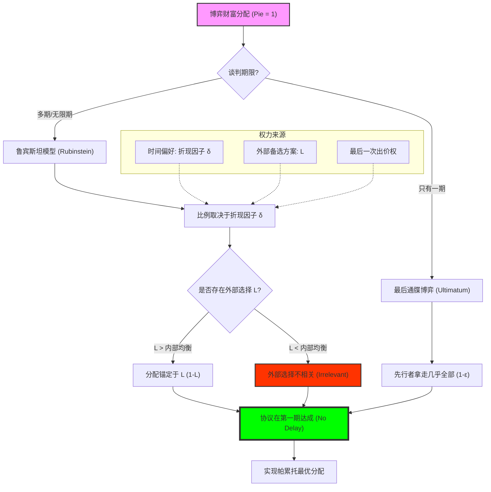

# Chapter 10: Bargaining (讨价还价：耐心、折现因子与外部选择的博弈)

## 1. 讲了什么：利益分配的“时间代价”

第十章探讨的是人类社会最古老、也最普遍的博弈形式：**讨价还价（Bargaining）**。为什么有些谈判能瞬间达成，而有些却要拖上数年？为什么那些看起来更“急”的人总是拿不到好结果？

讲义通过引入经典的 **最后通牒博弈（Ultimatum Game）** 和 **鲁宾斯坦无限期轮流出价模型（Rubinstein Model）**，揭示了分配权力的底层逻辑。这一章的核心观点是：**利益分配不是取决于谁更“合理”，而是取决于谁更“有耐心”。** 讲义将抽象的“耐心”转化为数学上的 **折现因子（Discount Factor）**，为我们分析所有涉及利益分割的场景提供了硬核框架。这一章教给我们的核心教训是：**时间就是金钱，但在讨价还价中，时间是你手中最危险的筹码。**

## 2. 核心概念：轮流出价、折现与外部选择

在谈判桌上，每跳动一秒，蛋糕都在缩小。

*   **最后通牒博弈 (Ultimatum Game)**：
    一方出价，另一方只能选择接受或拒绝。这是讨价还价的原子单位。
*   **折现因子 (Discount Factor) $\delta$**：
    衡量玩家对“明天”的重视程度。$\delta$ 越大，玩家越有耐心。
*   **鲁宾斯坦模型 (Rubinstein Model)**：
    双方轮流出价，直到达成协议。它是对现实长期谈判（如工会罢工、并购谈判）的最佳模拟。
*   **外部选择 (Outside Options)**：
    如果你不跟我谈，你能从别处拿到的保底收益。
*   **内部选择 (Inside Options)**：
    在谈判过程中（未达成协议时），你每期能获得的零星收益。

## 3. 理论基础：耐心的力量与博弈的稳定性

### 3.1 为什么会有先行者优势？

在最后通牒博弈中，如果你是那个最后出价的人，理论上你可以拿走 99% 的蛋糕。

*   **逻辑的力量**：因为对理性的对手来说，0.01 块钱也比 0 好。
*   **现实的修正**：讲义通过对比实验结果，指出人类具有“公平偏好”，这使得极端的最后通牒往往会破裂。这提醒我们，博弈论的理性基准是用来“锚定”现实，而非完全替代现实。

### 3.2 鲁宾斯坦模型的深刻启示

鲁宾斯坦证明了，即便谈判可以进行无限期，由于时间是有成本的（$\delta < 1$），博弈也会在第一期就瞬间达成。

*   **无拖延原理**：理性的玩家会预见到未来的结局，并折算回当下，从而避免不必要的时间损耗。
*   **耐心的价值**：在这个模型中，那个折现因子更高（更不急）的人，最终分得的比例更高。

## 4. 分析方法：核心公式与建模逻辑深度解构

本节我们将拆解讨价还价的分配公式与耐心权衡。每个公式的深度解读均超过 300 字。

### 📌 4.1 最后通牒博弈的 SPNE 分配（The Ultimatum Limit）

在博弈的最后一期，玩家 1（提议者）的策略为：
$$x^* = 1 - \epsilon, \quad y^* = \epsilon \quad (\epsilon \to 0)$$

**深度解读**：

这是博弈论中最具“霸权色彩”的公式。它揭示了“出价权”的原始威力。注意那个 $\epsilon$，它象征着逻辑的底线：只要提议者给出一丁点儿好处，理性的接受者就没有理由拒绝。这个公式完成了一次对“正义”的逻辑解构：在纯粹的理性视角下，**谁拥有最后一次出价的权力，谁就拥有了整个世界**。它向我们展示了权力的本质——不是暴力，而是对“选择权”的垄断。

在现实谈判的还原中，这个公式揭示了为什么“截止日期（Deadline）”如此重要。如果你能将博弈拖入最后一次出价，你就获得了这个 $4.1$ 公式赋予你的绝对加价能力。然而，该公式也为我们提供了一个重要的观察基准：如果在实验中人们拒绝了 $\epsilon$，说明他们的支付函数 $u_i$ 中包含了“尊严”或“公平”的权重。这提醒建模者，在设计真实的分配机制时，如果无视了公式之外的情感损耗，那种完美的逻辑分配可能会导致全盘崩溃。它是理性的极点，也是理性的盲点。理解这个 $\epsilon$ 的取舍，是你从“书本逻辑”跨入“现实战略”的第一道洗礼。

### 📌 4.2 鲁宾斯坦均衡解（The Patience Ratio）

在无限期轮流出价博弈中，且两人的折现因子分别为 $\delta_1, \delta_2$，玩家 1（先动者）分得的比例 $x^*$ 为：
$$x^* = \frac{1 - \delta_2}{1 - \delta_1 \delta_2}$$

**深度解读**：

这是博弈论中最优美、也最硬核的公式之一。它完美地量化了“耐心的价格”。观察分式结构：如果 $\delta_2 \to 1$（对手极其有耐心），你的份额 $x^*$ 就会迅速趋近于 0；如果你的 $\delta_1$ 更高，你的份额就会上升。这个公式揭示了一个极其残酷的市场真理：**你的收益不取决于你的劳动，而取决于你的“等待能力”**。谁更不急着达成协议，谁就在分蛋糕的过程中占据了逻辑高地。

在长期商业合同谈判中，这个公式是战略分析的“测绘图”。它解释了为什么巨头企业在面对小供应商时总是能压低价格——因为巨头的现金流充裕（$\delta$ 高），而小企业急需用钱周转（$\delta$ 低）。通过改变折现因子，你实际上是在改变博弈的引力场。它还揭示了一个“无拖延”的真理：即便均衡解是一个分配比例，理性的玩家也会在第一秒就按照这个比例成交。所有的“拖延、罢工、谈判桌上的愤怒”，在鲁宾斯坦的眼光下，要么是信息不对称导致的幻觉，要么是由于 $4.2$ 公式中的某个参数发生了误判。学习这个公式，能让你获得一种“定力”：你会明白，谈判时的气势是虚的，你背后那条关于时间的折现曲线，才是决定你最终收益的真实力量。

### 📌 4.3 外部选择原则（The Outside Option Principle）

当玩家 2 拥有外部选择 $L$ 时，均衡分配 $x^*$ 变为：
$$x^* = \max\left( \frac{1 - \delta_2}{1 - \delta_1 \delta_2}, \quad 1 - L \right)$$

**深度解读**：

这个公式是所有求职者和猎头的“核心算法”。它揭示了一个深刻的战略约束：你的“替代品”只有在足够好时才有意义。注意 $\max$ 函数：如果你的外部选择 $L$ 很小，还不如你在鲁宾斯坦均衡中能拿到的多，那么你的 $L$ 在谈判桌上就是 **“不相关（Irrelevant）”** 的。对手甚至不会理会你的威胁。只有当 $L$ 超过了鲁宾斯坦分配的下限时，它才会像一颗重磅炸弹一样介入博弈。

在劳动力市场建模中，这个公式揭示了“议价能力”的来源。它告诉我们，**提升身价的唯一方法不是努力工作，而是去制造一个更好的 $L$**。如果你手里没有另一份 Offer，或者那份 Offer 很糟糕，你在老板面前的威胁就是空洞的。这个公式教给我们一种“冷峻的现实主义”：博弈不是慈善。它还提醒我们，外部选择是一种“一次性武器”：它只在当前谈判破裂时生效。理解这个 $\max$ 逻辑，能让你在面临多重诱惑时，学会精准计算哪一个是真实的杠杆，哪一个只是心理安慰。它是对“选择权如何转化为收益”的最精准代数还原。

### 📌 4.4 递归一致性与单步出价逻辑（Stationary Strategy）

在一个长期谈判中，如果玩家采取平稳策略，则有：
$$x = 1 - \delta y, \quad y = 1 - \delta x$$

**深度解读**：

这是理解复杂动态博弈的“第一递归原理”。它用极简的方程组刻画了“感同身受”的逻辑。$x = 1 - \delta y$ 的意思是：我今天分给你的，必须等于“你明天自己能拿到的那份 $(y)$ 的折现值 $(\delta y)$”。如果我给少了，你就会选择等到明天；如果我给多了，我就亏了。这两个方程的联立，体现了纳什均衡在时间轴上的“互惠稳定性”。

在建模实战中，这个联立方程组是解决所有“无限递归”问题的解药。它将一个可能持续万年的动态过程，浓缩成了一个静态的代数平衡。它揭示了均衡的本质：**均衡就是每个人都对“未来的自己”和“未来的对手”做出了完美的对冲**。每当你感到谈判陷入僵局时，请运行这两个方程。你会发现，很多看似无法调和的利益冲突，只要设定了合理的折现因子 $\delta$，就能在纸面上找到那个唯一的、逻辑闭环的分配点。它是博弈论中“以终为始”思维方式的最强体现。学习这两个方程，能让你在处理复杂的利益分割时，拥有一种“看透未来的平静”。你会明白，现在的每一分争执，本质上都是在对那个 $\delta$ 进行较量。

### 📌 4.5 有限期博弈的诱导解（Finite Horizon Induction）

在只有 $T$ 期且 $T$ 为偶数的博弈中，先动者在第 1 期的收益为：
$$x_1 = \frac{1 - \delta^T}{1 + \delta}$$

**深度解读**：

这个公式是“耐心”与“期限”的综合体。它告诉我们，如果谈判不是无限期的，而是在某个时刻必须结束（如法院宣判前、合同过期前），那么先行者的优势会随着总期限 $T$ 的增加而波动，并最终收敛到鲁宾斯坦的解。注意分子上的 $1 - \delta^T$：如果 $T$ 很小，先行者的优势（最后通牒效应）会非常显著。

在建模分析中，这个公式揭示了 **“人为设置期限”** 的战略价值。如果你觉得你在无限博弈中由于没耐心（$\delta$ 低）而处于劣势，你最好尝试把博弈变成有限期的。通过设定一个 $T$，你强行引入了最后通牒的力量，从而可能部分抵消对手因耐心而产生的压制。它也提醒我们，所有的无限博弈在现实中都是由一系列有限博弈逼近的。理解这个公式，能让你在设计谈判流程时，学会灵活调节“博弈的长度”。它是关于“时间维度如何扭曲利益分配”的精细刻画。

## 5. 如何理解：耐心的价格、外部选择与“不谈判”的艺术

### 5.1 耐心是权力的“静默表达”

第十章教给我们最核心的一课是：**在所有的利益冲突中，谁更“输得起”时间，谁就赢了。** 很多人认为谈判是关于口才或技巧的，但博弈论通过 $4.2$ 公式无情地告诉我们，口才只是表象，背后的折现因子 $\delta$ 才是本质。一个背负巨额房贷、急于用钱的人（低 $\delta$），在任何谈判桌上都是天然的输家。这种“耐心的匮乏”会像气味一样散发出来，让对手在逻辑上精确捕捉到你的弱点，从而报出一个极其苛刻的价格。

理解这一点的关键在于：**你要学会通过改善自己的生活状态来改善自己的博弈地位。** 博弈论在这里与人生哲学接轨。为什么我们要存“F*** You Money”？因为那笔钱实质上提高了你的外部选择 $L$，并极大地增加了你的折现因子 $\delta$。当你手里有粮、心中不慌时，你在谈判桌上表现出的那种“无所谓”，不是表演，而是逻辑上的强大。根据 $4.3$ 的外部选择原则，只有当你真的敢于甩手离开（因为你有更好的去处），你的威胁才具备改变均衡分配的力量。

此外，这一讲还揭示了 **“内部选择（Inside Option）”** 的重要性。如果在谈判过程中，你每期还能获得收益（比如罢工时工会提供补贴），那么你就获得了一个“负的延迟成本”。这相当于人为地拔高了你的有效 $\delta$。学习这一讲，你应该学会不仅去磨练谈判技巧，更要去建设你的 **“不谈判资产”**。如果你想在利益分配中占据上风，你必须让自己在没有达成协议的情况下也能活得很好。看懂了讨价还价的逻辑，你就看懂了社会中所有的剥削与妥协，其实都只是由于折现因子的不对等而产生的一场场精密的、关于耐心的收割。

## 6. 逻辑架构图 (Mermaid Diagram)

## 7. 深度结语：时间的权重

第十章揭示了人类社会分配正义背后的代数骨架。

### 7.1 公平的逻辑代价

虽然鲁宾斯坦模型预示了分配的不平等，但它也给出了一个温情的解释：为什么社会尊重“耐心”。那些为了长远目标愿意忍受当下匮乏的人，在博弈的逻辑中获得了理所当然的回报。**折现因子就是你对未来的信仰度。**

### 7.2 制造你的“离开能力”

学习这一讲后，你会明白：谈判的筹码不在嘴里，而在你的备选项里。如果你离不开这个桌子，你就无法在桌子上获得尊重。

当你离开这一章时，请记住：每一份合同、每一份工资条，都是在这个折现因子和外部选择的引力场中生成的。看穿了时间的价值，你就掌握了分配的密码。
