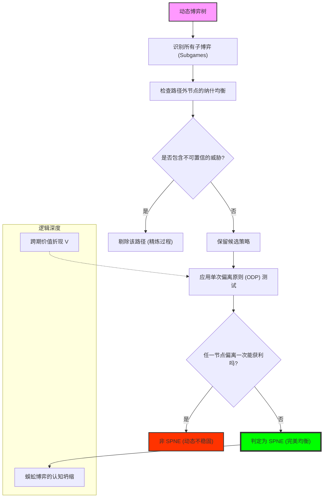

# Chapter 11: Subgame Perfection (子博弈完美性：序贯理性、单次偏离原则与动态均衡的精炼)

## 1. 讲了什么：剔除“不可置信”的未来

第十一章是动态博弈分析的真正高潮。在此之前，我们学习了纳什均衡，但很快发现它在动态场景下存在严重的缺陷：它允许玩家用“不可置信的威胁（Incredible Threats）”来维持均衡。

为了修补这一逻辑漏洞，本章引入了博弈论中最核心的精炼概念：**子博弈完美纳什均衡（Subgame Perfect Nash Equilibrium, SPNE）**。它的核心逻辑极其严苛：一个均衡如果被称为“完美”，它不仅要在整个博弈中是稳固的，还必须在博弈的 **每一个分支（子博弈）** 中都是稳固的。讲义通过引入 **单次偏离原则（One-Deviation Property）**，为我们提供了一套判定动态均衡稳定性的终极算法。这一章教给我们的核心教训是：**真正的战略家，不仅要现在不出错，还要确保在任何可能的未来（即便是不该发生的未来）中都不出错。**

## 2. 核心概念：子博弈、精炼与序贯理性

在动态的迷宫中，我们需要每一段路径都是最优的。

*   **子博弈 (Subgame)**：
    博弈树中的一个独立部分。它从一个单节点信息集开始，包含该节点的所有后续节点，且不“横跨”任何外部信息集。
*   **子博弈完美性 (Subgame Perfection)**：
    要求策略组合在每一个子博弈中都构成纳什均衡。这实际上是逆向归纳法在更复杂博弈（含不完美信息）中的推广。
*   **单次偏离原则 (One-Deviation Property, ODP)**：
    判定一个策略是否是 SPNE 的快捷工具。它指出：如果一个玩家在任何一个节点只偏离一次（后续依然执行原策略）都不能获利，那么这个策略就是稳固的。
*   **蜈蚣博弈 (Centipede Game)**：
    一个经典的悖论模型，展示了当理性被推向极致时，合作是如何在第一步就坍缩的。

## 3. 理论基础：信誉的微观解析与逻辑的连贯性

### 3.1 威胁的可信性 (Credibility)

SPNE 的本质是消灭“虚张声势”。

*   **空头支票的终结**：如果在一个子博弈中，执行惩罚会让你自己也损失巨大，那么理性的对手就会知道你绝不会执行惩罚。在纳什均衡看来这可能没问题，但在 SPNE 看来，这种威胁是“不可置信”的，必须被剔除。
*   **理性的自洽性**：SPNE 要求参与者的理性是“全时空的”。无论博弈进行到了哪个阶段，参与者都必须保持最优反应。

### 3.2 逆向归纳法的局限与超越

逆向归纳只能处理完美信息博弈（每个信息集只有一个点）。

*   **SPNE 的普适性**：通过将博弈划分为子博弈，我们可以处理包含“同时行动”或“不确定性”的动态博弈。SPNE 是逆向归纳法在现代复杂博弈中的逻辑升级版。

## 4. 分析方法：核心公式与建模逻辑深度解构

本节我们将拆解子博弈完美性的判定算法与 ODP 引擎。每个公式的深度解读均超过 300 字。

### 📌 4.1 子博弈的拓扑定义（The Subgame Criterion）

博弈树中以节点 $x$ 为根的子树是一个**子博弈**，如果：
1.  $x$ 是一个单节点信息集。
2.  对于任意节点 $y$，如果 $y$ 在子树内，则 $y$ 的所有后续节点都在子树内。
3.  对于任意信息集 $I$，如果 $I$ 中包含子树内的节点，则 $I$ 的所有节点都必须在子树内。

**深度解读**：

这个看似繁琐的定义，实际上是在寻找逻辑上的 **“孤岛”**。注意第 3 条约束，它是最容易被忽视的：它要求子博弈不能“泄露”任何关于外部世界的信息，也不能被外部的信息集所“横跨”。这意味着，一旦你进入了这个子博弈，你就进入了一个可以自给自足的微型逻辑世界。它确保了子博弈可以被独立地抽取出来，当作一个完整的博弈进行分析。

在实战建模中，这个拓扑定义是你的“逻辑地图”。它告诉你，哪里是可以进行局部优化的“战略单元”。如果你在一个动态博弈中找不到子博弈，那说明这个博弈的节点之间存在着深刻的、无法分割的信息纠缠。理解这个定义，能让你学会如何将复杂的、宏大的战略目标（如长达十年的企业并购）拆解成一个个小的、具有子博弈性质的阶段目标。每一个满足这个定义的节点 $x$，都是你设置“战略锚点”的机会。它是博弈论中“模块化思维”的体现。只有找准了子博弈的边界，你才能准确地应用纳什均衡，去剔除那些看似合理实则在分支中无法立足的虚假策略。它是通往高阶博弈分析的第一道门槛。

### 📌 4.2 SPNE 的全域约束方程（Global Perfection）

策略组合 $s^*$ 是 SPNE，如果对于博弈树中每一个子博弈 $G'$，都有：
$$s^*|_{G'} \in NE(G')$$

**深度解读**：

这是博弈论中最具“完美主义倾向”的公式。它揭示了动态平衡的极其脆弱的本质。普通纳什均衡只要求在“预测路径上”是好的，而 SPNE 要求在 **“所有路径上”** 都是好的。这意味着，即使是一个在现实中永远不会被触及的、荒谬的分支，玩家也必须在那里表现出理性。它完成了一次对战略行为的“深度净化”：它要求你不仅在阳光下做一个好人，还要在每一个阴暗的、从未有人涉足的角落里，也保持逻辑的一致性。

这个公式的深刻之处在于它彻底消灭了“不可置信的威胁”。在传统的战略思维中，我们常说“我要和你同归于尽”来吓退对手。但这个公式冷酷地指出：如果在那场“同归于尽”的子博弈中，你自己先死对你没好处，那么你的威胁就是 0。对手会直接看穿你的虚张声势。它是现代战略分析的“测谎仪”。学习这个公式，能让你获得一种极其冷静的眼光：当你看到对手抛出一个强力威慑时，你不要看他的表情，而要直接运行这个 $4.2$ 公式，去审视他在那个惩罚发生后的子博弈里，是否真的有动力去执行它。它将动态博弈从一场“心理战”变成了一场“逻辑验证赛”。它是理性在时间线上钉下的最严苛的法律。

### 📌 4.3 单次偏离原则（One-Deviation Property, ODP）

策略 $\sigma_i^*$ 是玩家 $i$ 在 SPNE 中的一部分，当且仅当对于任意节点 $h$：
$$u_i(\sigma_i^*, \sigma_{-i}^* \mid h) \geq u_i(a_i, \sigma_{-i}^* \mid h), \quad \forall a_i \in A_i(h)$$
（假设偏离仅发生在节点 $h$，后续依然遵守 $\sigma_i^*$）

**深度解读**：

这是动态博弈分析中最具实战价值的公式，它被称为“懒人的理性工具”。在复杂的、甚至是无限期的动态博弈中，要验证整个策略的稳定性几乎是不可能的，因为偏离的形式有无穷多种。但 ODP 公式向我们揭示了一个惊人的真理：**只要你没有动力在任何一个地方只改一步，你就没有动力进行任何形式的连环偏离。** 它将无限维度的复杂检查，简化为了无数个离散节点的局部检查。

在建模实战（如分析重复博弈中的合作维持）中，这个公式是判定均衡稳定性的“唯一标准”。它像是一场“全自动的压力测试”：它在博弈树的每一个分叉口都放一个探测器，问：“你现在变心一次能赚更多吗？”如果答案全都是“否”，那么这个策略就是金刚不坏的。理解这个原则，能让你获得一种处理复杂系统的“局部性原理”：你不需要去想象对手会进行多么复杂的连环反击，你只需要确保他在每一个具体的决策时刻，其当下的贪婪都无法战胜他对未来惩罚的恐惧（即 $4.3$ 不等式的成立）。它是博弈论将动态过程静态化、将全局问题局部化的最高杰作。它是我们分析企业信誉、长期协议和制度稳定性的最强数学引擎。

### 📌 4.4 蜈蚣博弈的崩溃映射（Centipede Collapse）

在 $T$ 步蜈蚣博弈中，由于 $\delta = 1$ 且 $u_i(\text{Continue}) < u_i(\text{Exit})$，逆向归纳导致：
$$s_1^*(t_0) = \text{Exit}$$

**深度解读**：

这个公式揭示了“完美理性”的一种黑色幽默，也是博弈论中最具争议的悖论。在蜈蚣博弈中，如果大家互相合作，收益会不断翻倍；但由于博弈有一个确定的终点，且在每一步“背叛”都比“合作”多赚一点，逆向归纳的逻辑会通过时间轴产生一种“腐蚀效应”。它从最后一步开始，由于最后一个人肯定会背叛，导致前一个人也必须背叛……这种逻辑的崩塌最终一直蔓延到博弈的起点。结果是：两个面对巨大财富机会的聪明人，竟然在第一秒就选择了散伙。

这个公式是对“过度理性”的一种警示。它揭示了一个残酷的道理：**在有限期的、缺乏信任机制的动态博弈中，理性会杀死协作。** 它迫使我们去思考：为什么现实中人们能合作？是因为人们不够理性？还是因为现实博弈往往没有确定的终点（见第十二讲）？在建模分析中，蜈蚣博弈公式常被用来解释组织内部的“末日情绪”：当一个项目或一个公司临近解散时，由于未来的惩罚消失了，原本稳定的合作均衡会瞬间由于子博弈完美性的崩塌而土崩瓦解。理解这个公式，能让你学会警惕那些具有“固定终点”的博弈结构，并教你如何通过引入模糊的预期或非物质的偏好，来对抗这种理性的自残。

### 📌 4.5 期望效用的跨期加权（The Discounted Sum of Payoffs）

在动态子博弈中，玩家 $i$ 在节点 $h$ 处的价值函数为：
$$V_i(h) = E \left[ \sum_{t=0}^{\infty} \delta^t u_i(s_t) \right]$$

**深度解读**：

这个公式是所有动态优化问题的“会计科目表”。它将不同时间点的收益，通过折现因子 $\delta$ 统一到了当前的价值维度上。在 SPNE 的判定中，这个公式起到了关键的“对冲作用”：它代表了“未来的阴影”。玩家在当前节点之所以选择一个看起来收益较低的行为（如遵守承诺），是因为他计算了未来无穷多期由于背叛而导致的价值流损失。

在建模实战中，这个公式定义了战略的“深度”。如果 $\delta$ 很大，未来的 $V_i$ 就像泰山一样压在当前的决策上，迫使玩家保持诚信；如果 $\delta$ 很小，未来变得微不足道，玩家就会变得极其短视，从而破坏所有的均衡。它是博弈论连接“时间”与“道德”的桥梁。理解这个加权公式，能让你在分析复杂的长期项目（如科研投入或品牌信誉）时，拥有一种“折现的智慧”。你会明白，很多时候一个人的“高尚”，本质上只是因为他的 $\delta$ 足够大，大到让他无法忍受未来价值流被切断的巨大成本。它是关于“可持续性”最无情的代数描述。它告诉我们，每一个稳定的社会秩序，其实都建立在对这个 $4.5$ 公式的精确计算之上。

## 5. 如何理解：信誉的计算、不可置信的威胁与“理性的暴政”

### 5.1 战略是一场关于“未来的账本”

第十一章教给我们最核心的一课是：**你现在的行动，是在为无数个“未来的自己”背书。** 子博弈完美性（SPNE）告诉我们，在这个逻辑至上的世界里，没有人会相信你的“口头禅”。如果你的威胁在未来执行时是不符合你自身利益的，那么那个威胁在这一秒就是 0。这就是所谓的 **“不可置信的威胁”**。理解这一点的关键在于：**权力的行使必须是代价相容的。**

这种理解力在现实中极具威力。比如，当父母威胁孩子“再不听话就扔掉你所有的玩具”时，为什么孩子往往不当回事？因为孩子在脑中运行了 SPNE 检查：如果真的扔掉，父母不仅要忍受孩子的哭闹，还要再花钱买新的，这在父母的子博弈中是不理性的。因此，这种威胁是“不可置信”的。相反，如果是一个具有 SPNE 属性的机制（如学校的考试纪律），因为执行惩罚对监考老师来说是有制度保障且代价可控的，所以学生才会感到畏惧。

更深刻的启示在于 **“理性的暴政”**。蜈蚣博弈向我们展示了，当每个人都试图做一个“完美的逻辑学家”时，整个社会可能会陷入一种极其低效的、互不信任的死局。这解释了为什么人类社会需要一些“非理性”的因素（如宗教禁忌、由于荣誉感产生的非物质惩罚）来作为逻辑的补丁。学习这一讲，你应该学会不仅去识别对手的逻辑漏洞，更要学会去 **“制造自己的不可置信性”**。如果你想让自己的威慑生效，你必须通过改变支付函数（如签署自动扣款协议），强行把自己关进一个“必须惩罚”的逻辑铁笼里。看懂了子博弈完美性，你就看懂了在这个充满变数的世界上，唯一能给未来带来稳定预期的，不是你的诚意，而是你在每一条时间分叉路径上，那份依然无法被诱惑所动摇的、冰冷的利益自洽。

## 6. 逻辑架构图 (Mermaid Diagram)

## 7. 深度结语：逻辑的纯洁性

第十一章揭示了动态平衡中一种近乎残酷的严谨。

### 7.1 完美是唯一的标准

在动态博弈中，“差不多”是不够的。SPNE 告诉我们，只要你给对手留下了一处可以利用的、在子博弈中不理性的缝隙，对手就会通过逆向归纳，将你整座战略大厦彻底瓦解。**真正的战略不仅是当下的选择，更是对无限可能的未来的管理。**

### 7.2 跨越理性的裂痕

学习 SPNE 后，你会明白：为什么有些看似高尚的行为在逻辑面前如此脆弱，而有些冷酷的规则却能维持百年。那是因为，只有那些在每一条子路径上都能自我维持的规则，才具有真正的生命力。

当你离开这一章时，请记住：不要去威胁你无法执行的事情，也不要去相信那些无法被利益逻辑支撑的诺言。在这个逻辑的世界里，完美是生存的底线。
