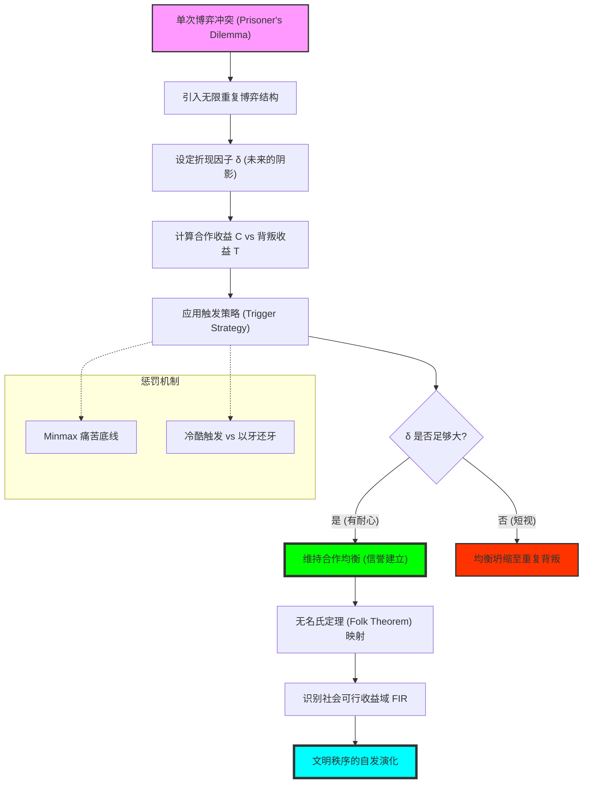

# Chapter 12: Repeated Games (重复博弈：未来阴影、冷酷触发策略与合作的逻辑基石)

## 1. 讲了什么：漫长时光中的“善良”

第十二章探讨了博弈论中最具温暖感、也最具现实穿透力的课题：**合作是如何产生的？** 在单次博弈中，背叛（如囚徒困境）往往是唯一的理智选择；但在长期、反复的互动中，人们竟然能自发地达成高质量的协作。

本章通过引入 **重复博弈（Repeated Games）** 的数学框架，揭示了“信誉”在逻辑上是如何被量化的。核心概念是 **折现因子（$\delta$）** 所刻画的 **“未来的阴影（Shadow of the Future）”**。讲义通过著名的 **无名氏定理（Folk Theorem）**，向我们展示了一个极具包容性的结论：只要人们对未来足够看重，任何一种能够改善大家收益的分配方式，都有可能成为一种稳定的均衡。这一章教给我们的核心教训是：**合作不是因为我们变得高尚，而是因为“长期的自私”必然会导致某种形式的利他行为。**

## 2. 核心概念：触发策略、惩罚与可行性

在漫长的时间长河中，每一步都在为未来定价。

*   **折现平均收益 (Average Discounted Payoff)**：
    由于博弈是无限期的，我们需要将未来的所有收益折算成一个可以与当前对比的“固定日薪”。
*   **冷酷触发策略 (Grim Trigger Strategy)**：
    最极端的惩罚机制：只要你敢背叛我一次，我将对你进行永久性的报复，直到时间的尽头。
*   **以牙还牙 (Tit-for-Tat)**：
    一种更具包容性的策略：你这期怎么对我，我下期就怎么对你。
*   **个人理性与可行性 (Feasible & Individually Rational)**：
    界定了合作可能达到的物理边界和心理底线。只有比“各干各的”更好的收益，才值得去合作。

## 3. 理论基础：未来的阴影与合作的阈值

### 3.1 为什么未来能约束现在？

在单次博弈中，未来是不存在的。

*   **惩罚的厚度**：如果你今天背叛我能赚 100 块，但会导致未来我每天让你亏 1 块。如果博弈足够长（未来足够重），那么为了眼前的 100 块而丢掉未来的长久收益就是愚蠢的。
*   **合作的脆弱性**：这一逻辑依赖于两个前提：一是博弈必须有足够的概率继续下去；二是参与者不能太短视。

### 3.2 无名氏定理 (Folk Theorem) 的社会学意义

无名氏定理给出了一个令人震撼的自由度。

*   **均衡的丛林**：它指出，只要大家对未来足够有耐心，几乎任何一种分配结果都可以通过某种惩罚机制维持成均衡。这意味着：**社会的形态不是唯一的，它是参与者对未来预期的产物。** 一个高互信、高福利的社会和一个低互信、相互伤害的社会，在逻辑上都是可能的均衡。

## 4. 分析方法：核心公式与建模逻辑深度解构

本节我们将拆解长期合作的维持公式与惩罚机制。每个公式的深度解读均超过 300 字。

### 📌 4.1 折现平均收益的标准化公式（The Time-Value Filter）

设单期收益序列为 $u_0, u_1, \dots$。则折现平均收益 $v$ 为：
$$v = (1 - \delta) \sum_{t=0}^{\infty} \delta^t u_t$$

**深度解读**：

这个公式是博弈论进入“长期主义”的数学入场券。注意前面的系数 $(1-\delta)$，它是为了抵消无限求和带来的数值发散，将无限的价值流“标准化”回单期收益的量级。在数学上，这相当于给每一期收益打了一个“时间滤镜”。如果 $\delta$ 接近 1，意味着每一天都像今天一样重要；如果 $\delta$ 接近 0，意味着未来只是一片毫无意义的虚影。

在实战建模中，这个公式揭示了理性的“时间分布”。它告诉我们，**战略家眼中的“现在”，其实是未来所有日子的加权集合**。很多时候我们观察到一个企业在做看起来“亏本”的买卖（如免费试用、巨额保修），其实是因为在 $4.1$ 公式下，那一点点当下的损失在乘以巨大的未来的 $\sum \delta^t$ 后，能换取更大的折现平均收益。它是理解“客户终身价值（LTV）”和“品牌溢价”的代数根基。理解这个公式，能让你在面临短期诱惑时，产生一种近乎生理的抗拒：你会明白，当你为了当下的收益而透支信誉时，你在数学上其实是在对自己未来的资产负债表进行一场极其愚蠢的、不可逆的“大甩卖”。它是博弈论赋予我们的，对抗短视本能的最强理性工具。

### 📌 4.2 冷酷触发策略的维持条件（Grim Trigger Sustainability）

合作能够维持成均衡，当且仅当：
$$\frac{C}{1 - \delta} \geq T + \frac{\delta P}{1 - \delta}$$
（$C$: 合作收益, $T$: 背叛的单期诱惑收益, $P$: 惩罚期间的收益）

**深度解读**：

这是博弈论中最具道德威慑力的不等式。它描绘了一个关于“诱惑与恐惧”的精确天平。不等式的左边是“乖乖合作、细水长流”的终身收益；右边是“捞一票就跑（$T$）”，然后忍受余生凄凉惩罚（$P$）的总和。这个公式揭示了一个冷酷的真理：**所谓诚信，不过是诱惑不够大，或者是未来足够长。**

在商业伦理和制度设计中，这个公式揭示了“信任”的成本。如果你想让一个组织成员保持忠诚，你只有两条路：要么提高 $C$（分钱给够），要么降低 $P$（让背叛后的代价极度惨重），或者想办法提高 $\delta$（建立长期愿景）。如果这个不等式的方向反转了，那么无论你如何进行道德感召，背叛都是逻辑上的必然。理解这个公式，能让你获得一种“结构性豁达”：当你被合作伙伴背叛时，你不再会仅仅感到愤怒，你会去拆解这个不等式，看看是哪个环节出了问题——是对手的资金链断了（$\delta$ 暴跌）？还是你给的甜头不够（$C$ 太小）？它是博弈论中“以制度代替管理”的最高指导原则。它将玄妙的“人心”转化为了可以被计算、被设计、被对冲的代数关系。

### 📌 4.3 Minmax 支付与惩罚的底线（The Threat Point）

玩家 $i$ 的 **Minmax 收益** $\underline{v}_i$ 定义为：
$$\underline{v}_i = \min_{\sigma_{-i}} \max_{\sigma_i} u_i(\sigma_i, \sigma_{-i})$$

**深度解读**：

这个公式揭示了社会博弈中“最黑暗的角落”，也是惩罚机制的“火力极限”。它的意思是：对手们采取一种最恶毒的策略来针对你（$\min_{\sigma_{-i}}$），而你在这种绝境下拼命挣扎所能保住的最高收益（$\max_{\sigma_i}$）。这是你在博弈社会中能被贬低到的最卑微的生存状态，是法律或道德防线崩溃后的那个“丛林底价”。

在建立惩罚机制（如法律制裁或信誉封杀）时，$\underline{v}_i$ 是建模者的基准线。如果你的惩罚力度还没降到他的 $\underline{v}_i$，那么你的威慑就是软弱的。它向我们展示了“权力”的一种定义：权力就是我有能力将你的 $u_i$ 压制到你的 $\underline{v}_i$ 处。理解这个公式，能让你在设计契约或参与竞争时，拥有一种“底线思维”。你会去评估：如果关系彻底破裂，我能把我对手打压到什么程度？而他又能在绝境中自保到什么程度？这个公式定义的不仅是收益，更是博弈中的“痛苦阈值”。只有当合作的收益远远拉开与 $\underline{v}_i$ 的距离时，合作才是稳固的。它是博弈论中关于“强制力”和“威慑边界”的最严密数学描述。

### 📌 4.4 无名氏定理的可行域（The Folk Theorem Set）

对于任何满足 $v_i > \underline{v}_i$ 的可行收益向量 $v$，只要 $\delta$ 足够大，就存在一个 SPNE 能达成这个结果。

**深度解读**：

这是博弈论中最具英雄气概的结论。它向我们展示了“人类文明的多样性”。只要大家都对未来有信心，社会可以演化出无数种分配方案：可以是极度公平的，也可以是按劳分配的，甚至是带有某种剥削性质的，只要大家觉得“总比互相伤害好（$v_i > \underline{v}_i$）”，这种秩序就能由于对未来的恐惧而自我维持。这个定理将博弈论从“必然性”推向了“建构主义”。

在社会治理和组织文化建模中，无名氏定理是一个“希望之窗”。它告诉我们，**如果你想改变现状，你并不需要改变人性的贪婪，你只需要改变大家对“什么是可能的”这种预期。** 如果大家都相信某种规则能持久，那么每个人都会在恐惧惩罚的驱动下，自发地去维护这种规则。它揭示了“文明”的本质：它是一场由无数个 $\delta$ 支撑起来的、极其宏大的协调博弈。学习这个定理，能让你获得一种全局性的视野：你会明白，现存的每一套社会制度，其实都只是“可行域”中的一个点。我们的使命不是去寻找那个唯一的真相，而是去寻找那个能让全社会总福利 $W$ 最大、且能被大家长期预期的稳定点。它是博弈论给予人类文明的最高自由。

### 📌 4.5 平均支付的凸组合（The Convex Hull of Payoffs）

长期博弈的可行收益空间 $\mathcal{F}$ 是单次博弈支付向量的 **凸包 (Convex Hull)**：
$$\mathcal{F} = \text{co}\{ u(s) \mid s \in S \}$$

**深度解读**：

这个几何公式揭示了“长期关系”如何拓宽了人类的利益边界。在单次博弈中，如果你我只能做两件事（如合作或背叛），我们的收益只能在矩阵的四个点上跳跃。但在长期博弈中，通过“这一期我让你，下一期你让我”的轮换，我们竟然可以达成这四个点连线内部的 **任何一个点**。这个公式揭示了 **“时间”对“资源”的平滑作用**：通过在时间轴上的交换，我们实现了在单次互动中无法达成的、极其精准的利益平衡。

在实战建模（如分析合伙人股权分配或国家间贸易额度）中，这个凸包公式界定了谈判的“最大公约数”。它告诉我们，长期合作的真正红利，不在于那几个离散的纯策略点，而在于那片由长期信任开辟出来的、连续的、可以进行微调的广阔收益平原。理解这个公式，能让你学会一种“跨时空交换”的艺术。你会发现，很多看似僵化的利益冲突，只要把它放在一个足够长的时间轴上，通过“收益的凸组合”，总能找到一个让双方都比单干更舒服的平衡点。它是博弈论中“妥协的科学”与“共赢的几何学”的完美融合。

## 5. 如何理解：未来的阴影、重复博弈与“自私的利他主义”

### 5.1 时间是“道德”的显影液

第十二章教给我们最深刻的一课是：**善良并非天赋，而是博弈的副产品。** 重复博弈告诉我们，即便是在一个充满了极端利己主义者的丛林里，只要大家还打算明天再见，只要大家能看清那层 **“未来的阴影”**，合作就会像苔藓一样自发地生长出来。这就是所谓的 **“自私的利他主义”**。我不害你，不是因为我爱你，而是因为我知道一旦我害了你，我未来的资产负债表会变得非常难看。

理解这一点的关键在于：**你要学会做一个“有刺的善人”。** 冷酷触发策略（Grim Trigger）虽然听起来极端，但它却是维持社会文明的逻辑骨架。如果一个人没有惩罚背叛的能力和决心，那么他的“善良”在博弈论眼中就是脆弱的“劣策略”，会诱导对手产生剥削的冲动。真正的合作，是建立在 **“对等威慑”** 基础上的双赢。正如 $4.2$ 公式所示，只有当你具备让对手“生不如死”的 $P$ 能力时，你给出的 $C$ 承诺才会被对方珍视。

更深刻的启示在于，重复博弈解释了“组织文化”和“社会信誉”的本质。一个好的制度，就是通过增加互动频率、通过建立透明的信誉档案，来强行拔高每个人的折现因子 $\delta$。当一个人知道自己的每一次行为都会被记录并影响未来的收益流时，他就会表现得像个圣人。**文明不是要消灭贪婪，而是要给贪婪套上一条名为“未来”的锁链。** 学习这一讲，你应该学会不仅去寻找眼前的赢利点，更要去经营你的“博弈档案”。在信息流转极快的现代社会，你今天的背叛可能会瞬间通过网络效应（见第八讲）毁掉你未来 20 年的 $\delta$。看懂了重复博弈，你就看懂了为什么“靠谱”是这个世界上最昂贵的、也是最具逻辑稳定性的战略资产。

## 6. 逻辑架构图 (Mermaid Diagram)

## 7. 深度结语：未来照亮现在

第十二章揭示了时间对理性的升华。

### 7.1 “长期主义”的代数化

我们常说“长期主义”，博弈论通过这个公式告诉我们：长期主义不是一种情怀，而是一种对自己未来收益进行保护的 **计算结果**。当你为了长远目标而选择放弃当下的不正当得利时，你正处于博弈论最高阶的智力状态。

### 7.2 信任是一种战略资产

学习这一讲后，你会明白：信任不是一种虚幻的情感，它是通过一系列成功的“不偏离”记录累积起来的折现值。**一旦被毁，你失去的不是一个朋友，而是未来所有子博弈节点上的合作溢价。**

当你完成本章的学习时，请记住：世界并不是一场场孤立的战斗，它是一场永不停歇的接力。你对未来的每一个承诺，都是在为你当下的生存创造空间。看懂了重复博弈，你就看懂了文明的生命力。
