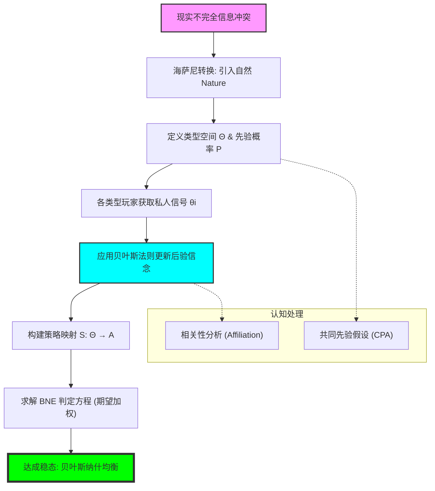

# Chapter 13: Incomplete Information (不完全信息：贝叶斯纳什均衡、类型空间与认知的迷雾)

## 1. 讲了什么：当“对手是谁”成为一个谜

第十三章带领我们进入了博弈论最接近现实、也最硬核的领域：**不完全信息博弈**。在此之前，我们假设所有人都知道对手的收益、成本和偏好（完全信息）。但现实中，你不知道对手的真实生产成本，不知道竞标者的真实心理估值。

本章通过引入 **海萨尼转换（Harsanyi Transformation）**，将这种“对对手身份的无知”转化为了“对自然（Nature）选择的无知”。核心概念是 **贝叶斯纳什均衡（Bayesian Nash Equilibrium, BNE）**。它要求玩家在不知道对手真实“类型”的情况下，根据自己持有的 **先验概率（Prior Beliefs）** 做出最优决策。这一章教给我们的核心教训是：**在充满迷雾的博弈场上，你不仅要对事实做出反应，更要对概率做出反应。**

## 2. 核心概念：类型、信念与贝叶斯均衡

在不完全信息的框架下，每个人都有一个“私人剧本”。

*   **类型 (Type) $\theta_i$**：
    包含一个玩家所有私人信息的变量（如：成本、技术水平、耐心程度）。
*   **先验信念 (Prior Beliefs) $p$**：
    在博弈开始前，大家公认的各类型出现的概率分布。
*   **策略 (Strategy) $s_i(\theta_i)$**：
    在 BNE 中，策略不是一个单一行动，而是一个 **“反应地图”**，规定了如果你是 A 类型该怎么办，如果你是 B 类型该怎么办。
*   **贝叶斯纳什均衡 (BNE)**：
    一种稳态，其中每种类型的每个玩家都在给定对手策略分布和自己信念的情况下，实现了期望效用最大化。

## 3. 理论基础：海萨尼转换与认知的统一

### 3.1 海萨尼转换的伟大逻辑

如何处理“我不知道他在想什么”？

*   **引入“自然”**：海萨尼认为，我们可以假设博弈开始前，有一个虚拟玩家“自然”随机决定了每个人的类型。
*   **从不完全到不完美**：通过这一转换，原本“信息不全”的困境变成了“信息不透明（不完美）”的动态过程。这使得我们可以继续使用纳什均衡的逻辑框架，只是支付函数变成了带权重的期望值。

### 3.2 贝叶斯法则作为理性的滤镜

在 BNE 中，玩家必须是优秀的概率统计学家。

*   **条件概率的应用**：当你观察到自己的类型时，你会利用贝叶斯法则来修正对对手类型的估计。这种“从局部推测全局”的能力，是 BNE 能够成立的认知基础。

## 4. 分析方法：核心公式与建模逻辑深度解构

本节我们将拆解贝叶斯纳什均衡的判定方程与类型空间的数学构造。每个公式的深度解读均超过 300 字。

### 📌 4.1 BNE 的核心判定方程（The Bayesian Best Response）

策略组合 $s^*$ 是 BNE，如果对于每个玩家 $i$ 和每种可能的类型 $\theta_i \in \Theta_i$：
$$s_i^*(\theta_i) = \arg\max_{a_i \in A_i} \sum_{\theta_{-i} \in \Theta_{-i}} p(\theta_{-i} \mid \theta_i) u_i(a_i, s_{-i}^*(\theta_{-i}); \theta_i, \theta_{-i})$$

**深度解读**：

这个公式是处理不确定性的“终极导航仪”。注意公式中的求和符号 $\sum_{\theta_{-i}}$，它揭示了一个极其深刻的真理：在不完全信息下，你不是在和 **一个** 对手博弈，而是在和 **一群潜在的影子** 博弈。当你作为一个“高成本型”企业决定产量时，你必须在脑中模拟：如果对手是“强硬型”，他会怎么做？如果他是“温和型”，他又会怎么做？然后，你根据贝叶斯条件概率 $p(\theta_{-i} \mid \theta_i)$ 对这些可能性进行加权。

这个公式将博弈论推向了 **“期望效用”的二次方**。首先，你要处理行动的不确定性；其次，你还要处理身份的不确定性。它是对人类“同理心”的严谨代数化：它要求你不仅要站在对方的鞋子里（考虑对方的激励），还要站在对方 **所有可能的鞋子** 里。在建模实战中，这个公式定义了战略的“平均鲁棒性”。一个好的 BNE 策略，必须保证你在不知道对手底牌的情况下，依然能达成一种逻辑上的最优平衡。理解这个求和过程，能让你学会在面对未知对手时，不再陷入盲目的猜测，而是学会构建一个关于对手类型的“概率分布模型”，并在这个分布之上寻找那条最稳健的反应曲线。

### 📌 4.2 贝叶斯概率更新公式（The Epistemic Update）

玩家 $i$ 在知道自己类型 $\theta_i$ 后，对对手类型 $\theta_{-i}$ 的后验信念为：
$$p(\theta_{-i} \mid \theta_i) = \frac{p(\theta_i, \theta_{-i})}{\sum_{\theta_{-i}' \in \Theta_{-i}} p(\theta_i, \theta_{-i}')}$$

**深度解读**：

这是博弈论中的“信息过滤器”。它描述了“私人信息”如何改变了参与者对世界的看法。在完全信息博弈中，大家共享同一个先验概率；但在不完全信息下，你手中那张写着自己类型的“纸条”，瞬间让你的世界观与他人产生了分叉。如果你发现自己抽到了一张“烂牌”，根据相关性（如果类型是相关的），你可能会推测对手抽到“好牌”的概率也随之变大。

这个公式在揭示“关联价值（Affiliated Values）”博弈中具有原子级的威力。在诸如土地拍卖或油田竞标的场景中，如果你观察到自己的勘探数据很差，这个公式会立刻提醒你：对手的数据可能也很差。它防止了理性的参与者产生“孤岛偏差”。在建模分析中，这个分式结构是所有贝叶斯推导的起点。它要求参与者具备一种 **“自省的逻辑”**：你不仅要看对手，还要看镜子里的自己，并问：由于我是现在的我，那么他更有可能是怎样的他？理解这个概率更新过程，能让你在处理复杂的非对称信息问题（如二手车交易或保险设计）时，拥有一种“穿透迷雾”的计算能力。它是博弈论将“主观偏见”转化为“逻辑一致性”的关键算法。

### 📌 4.3 类型空间与行动地图的耦合（Strategy as a Mapping）

在不完全信息博弈中，玩家 $i$ 的策略是一个映射：
$$s_i: \Theta_i \to A_i$$

**深度解读**：

这个定义完成了博弈论中最重要的 **“认知拓扑映射”**。在之前的章节里，策略是一个具体的点或概率分布；但在这一章，策略变成了一个 **“计划包”**。它规定了：如果你是聪明的，你应该怎么做；如果你是笨的，你又应该怎么做。这种定义方式强制性地要求玩家在博弈开始前，就必须对 **所有的自我可能性** 完成心理演习。

这个映射函数的深刻之处在于它揭示了“战略的一致性”。一个真正的 BNE 均衡，不是要求某一个类型的行动最优，而是要求这一整张地图在概率的冲刷下依然保持稳定。这解释了现实中很多“角色扮演”的现象：为什么一个性格温和的 CEO 在面对恶意收购时必须表现得极其强硬？因为在他的战略映射 $s_i(\text{CEO})$ 中，面对威胁的反应已经被预设好了，与他的真实性格无关。在建模实战中，我们通过求解这个映射函数的系数（见第十四讲的线性策略），来寻找那个让所有人、所有类型都感到舒适的逻辑平衡点。理解了“策略即映射”，你就会明白：**高端的博弈不是在现场临机应变，而是在开局前就完成了一套全类型覆盖的自动化反应逻辑。** 它是理性在面对“我是谁”这一本体论问题时给出的数学答案。

### 📌 4.4 类型间的战略相关性准则（Common Prior Assumption）

所有玩家的后验信念必须从同一个原始分布 $p(\Theta)$ 中导出。

**深度解读**：

这是博弈论中最具争议、也最强大的“共同先验假设（CPA）”。它规定：如果两个人拥有完全相同的信息，他们必须拥有完全相同的观点。所有的意见分歧，必须能够完全归结为“信息的不对称（即各自看到的私人信号 $\theta_i$ 不同）”，而不能归结为“逻辑或直觉的本质差异”。这个假设像一把手术刀，切除了所有关于“我觉得我的运气更好”或“我觉得概率不是这样”的非理性干扰。

这个公式在建模中起到了一种 **“一致性锚点”** 的作用。它保证了即便在认知的迷雾中，大家依然共处在同一个逻辑宇宙里。它排除了所谓的“同意不同意（Agreeing to Disagree）”悖论。在分析金融市场或政治选举时，CPA 让我们能把所有复杂的行为都还原为“信号处理”过程：如果你和我的行动不一样，那一定是因为你看到了一些我没看到的 $\theta_i$。理解这个假设，能让你在博弈分析中获得一种“逻辑净值”：你会明白，所有的博弈技巧最终都是在玩弄“信息差”，而不是在玩弄“概率定义的解释权”。它是博弈论作为一门精密科学的最后一道防线。

### 📌 4.5 期望支付的综合风险测度（Expected BNE Payoff）

玩家 $i$ 在 BNE 下的总期望支付（Ex-ante）为：
$$U_i(s^*) = \sum_{\theta_i \in \Theta_i} p(\theta_i) \left[ \sum_{\theta_{-i} \in \Theta_{-i}} p(\theta_{-i} \mid \theta_i) u_i(s_i^*(\theta_i), s_{-i}^*(\theta_{-i}); \theta) \right]$$

**深度解读**：

这个三重嵌套的公式是博弈论中的“总收益核算表”。它从一个“未出生的灵魂”的视角（Ex-ante），评估了这场充满迷雾的博弈的平均价值。它将所有的可能性——包括你自己可能的身份、对手可能的身份以及由于这些身份交织产生的行动结果——全部压缩进了一个单一的期望数值中。它是评价一个制度、一个机制（如某种拍卖规则）好坏的终极标准。

在机制设计（Mechanism Design）中，这个公式定义了“参与约束（Individual Rationality）”。如果这个总期望收益为负，理性的玩家在博弈开始前（甚至在知道自己是谁之前）就会拒绝参加。它向我们展示了 **“风险的全局景观”**：你不仅在承担对手不确定的风险，你还在承担“自己会变成谁”的风险。理解这个综合测度，能让你在制定长期战略时，学会从一个更高、更客观的维度去审视利益分配。你会明白，一个稳定的系统，必须保证大多数人在大多数类型组合下都能获得超越底线的收益。它是关于“社会契约”最严谨的数学底稿。它告诉我们，每一个稳定的秩序，其实都是在对这组重重叠加的期望概率进行一次宏大的“逻辑清算”。

## 5. 如何理解：身份的幻觉、信息的杠杆与“贝叶斯式生存”

### 5.1 博弈场是一场“认知的折叠”

第十三章教给我们最核心的一课是：**你眼中的真实，往往只是对手概率分布里的一个样本。** 在不完全信息博弈中，所有的战略行为其实都在围绕着两个字旋转——**“身份”**。正如 $4.1$ 公式所暗示的，当你采取一个行动时，你其实是在向世界（及对手）发送一个关于你类型的信号。而对手在运行 BNE 逻辑时，他其实是在试图通过你的行动来“折叠”他的认知。

理解这一点的关键在于：**你要学会管理对手的“后验信念”。** 很多人认为诚实是道德，但在贝叶斯博弈的眼光下，诚实其实是一种 **“降低认知熵”** 的战略选择。如果你能让对手通过 $4.2$ 公式精确地锁定你的类型，你就能降低博弈中的冲突噪音，达成更高质量的协作。相反，如果你处于竞争关系中，你的目标就是通过模糊自己的类型，增加对手在 $4.1$ 公式中的计算负荷，从而让对手无法做出针对性的最佳反应。这就是所谓的“战略模糊”。

更深刻的启示在于，BNE 解释了为什么“偏见”和“刻板印象”在逻辑上是难于消除的。因为在 $4.2$ 贝叶斯更新的过程中，先验概率 $p$ 具有巨大的惯性。如果你所在群体的先验形象较差，即便你表现得很好，对手基于贝叶斯法则计算出的关于你的后验评价依然会受到那个低 $p$ 值的强烈牵引。**这揭示了社会歧视的逻辑本质：它不是由于坏，而是由于贝叶斯更新的数学局限。** 学习这一讲，你应该学会不仅去磨练技巧，更要去经营你的“先验背景”。如果你想在职场或商业中获得优待，你必须在博弈开始前就尝试去修改大家脑中的那个初始分布 $p$。看懂了不完全信息博弈，你就看懂了在这个充满迷雾的世界上，所有的真相其实都只是概率的瞬时停留，而所有的智慧，其实都只是在对那层层嵌套的期望值进行一场永不停歇的、关于身份的逻辑追逐。

## 6. 逻辑架构图 (Mermaid Diagram)

## 7. 深度结语：迷雾中的理性

第十三章揭示了人类认知最本质的局限。

### 7.1 拥抱不确定性

贝叶斯纳什均衡告诉我们：追求“绝对的真相”是徒劳的。在战略世界里，唯一的真理是 **“逻辑一致的概率”**。你不需要知道对手手里确切拿了什么，你只需要知道他根据他拿到的东西，在逻辑上 **不得不** 做出什么。

### 7.2 身份即战略

学习这一讲后，你会明白：你表现出的每一个特质，其实都在修改对手脑中关于你的概率分布。**管理你的身份，就是在管理你的生存环境。**

当你完成本章的学习时，请记住：世界并不是由确定的事实组成的，它是由无数个相互猜测、相互修正的概率分布组成的。看穿了迷雾背后的贝叶斯逻辑，你就看穿了权力的游戏规则。
