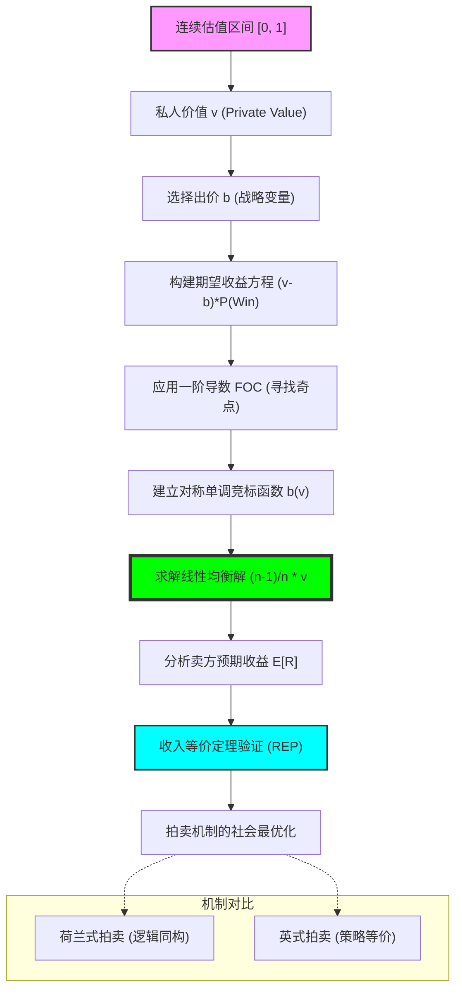

# Chapter 14: Continuous BNE & Auctions (连续贝叶斯均衡：一级拍卖、竞标策略与估值的博弈)

## 1. 讲了什么：价值与出价的“微分”博弈

第十四章是博弈论中最具实战价值、也最能体现数学美感的章节之一：**连续类型的贝叶斯纳什均衡**。在上一章学习了离散类型后，本章将参与者的身份（如对某件商品的估值）设定为一个连续的区间（如 $[0, 100]$）。

讲义通过剖析 **一级密封价格拍卖（First-price Sealed-bid Auction）**，向我们展示了如何通过微分方程来寻找那个完美的竞标函数。这里的核心挑战在于：你出的价越高，赢的概率越大，但赢了之后的利润越薄。这一章教给我们的核心教训是：**在竞标场上，最聪明的策略不是报出你的真心，而是报出那个能够精准对冲“贪婪”与“恐惧”的折扣值。**

## 2. 核心概念：竞标函数、赢家的诅咒与估值

在连续竞标的世界里，每一分钱的跳动都是一次逻辑的权衡。

*   **竞标函数 (Bidding Function) $b(v)$**：
    一个将你的真实估值 $v$ 映射为出价 $b$ 的法则。在均衡中，每个人都遵循相同的 $b(v)$。
*   **赢家的概率 (Probability of Winning)**：
    取决于你的出价是否高于所有对手的出价。在连续分布下，这被转化为一个积分问题。
*   **一级拍卖 (First-price Auction)**：
    价高者得，且支付自己的出价。这导致了必然的“压价（Shading）”行为。
*   **荷兰式拍卖 (Dutch Auction)**：
    价格由高向低降，第一个喊“停”的人得。在逻辑上，它完全等价于一级密封拍卖。

## 3. 理论基础：压价的艺术与对称均衡

### 3.1 为什么要压价 (Bid Shading)？

如果你按自己的真实估值 $v$ 出价，即便赢了，利润也是 0。

*   **利润最大化逻辑**：理性的出价者必须在 $v$ 的基础上打个折。这个折扣的大小取决于你对竞争对手数量的估计以及对手估值的分布。
*   **边际收益 = 边际成本**：多报一分钱增加的“赢的概率”带来的收益，必须正好抵消“赢了之后利润减少”的损失。

### 3.2 对称性假设的力量

在 MIT 的讲义中，重点讨论了对称 BNE。

*   **逻辑的一致性**：假设所有人的估值都来自同一个分布 $F(v)$。如果我的估值和你的估值一样，我们应该采取相同的竞标逻辑。这种假设大大简化了微分方程的求解过程。

## 4. 分析方法：核心公式与建模逻辑深度解构

本节我们将拆解一级拍卖的竞标方程与线性均衡的推导。每个公式的深度解读均超过 300 字。

### 📌 4.1 一级拍卖的期望利润方程（The Bidding Objective）

设玩家估值为 $v$，出价为 $b$。其期望收益为：
$$EU(b, v) = (v - b) \cdot \text{Prob}(b > \text{max } b_j)$$

**深度解读**：

这是竞标博弈论的“第一原理”。它精准地捕捉到了竞标者内心的二元冲突。左括号 $(v - b)$ 是“贪婪”的度量：你报的价格越低，赢了之后的利润空间就越大。右括号 $\text{Prob}(b > \text{max } b_j)$ 是“恐惧”的度量：你报的价格越低，你被别人超越、从而空手而归的概率就越高。整个博弈的本质，就是在这个乘号的两端寻找一个让整体乘积最大的平衡点。

在建模实战中，这个公式揭示了 **“利润与概率的对冲关系”**。它告诉我们，如果你在一个竞争极其激烈的市场（对手很多，导致右侧概率对 $b$ 的微小变动极其敏感），那么你不得不牺牲左侧的利润空间，将 $b$ 报得非常接近 $v$。相反，如果市场上只有你一个买家，右侧概率始终为 1，那么你就会将 $b$ 降到最低。理解这个公式，能让你在参与任何形式的竞标（无论是土地拍卖还是广告位竞价）时，不再盲目地出价，而是学会去建立一个关于对手出价概率的“精算模型”。它是博弈论将“主观竞争感”转化为“客观概率计算”的关键跨越。每一个成功的竞标者，本质上都是一个精通这个 $4.1$ 公式、能够在刀尖上行走（最大化乘积）的逻辑平衡大师。

### 📌 4.2 竞标均衡的一阶微分条件（The FOC for Bidding）

设所有人遵循对称单调策略 $b(v)$。对于估值为 $v$ 的玩家，其最优出价满足：
$$\frac{d}{db} \left[ (v - b) \cdot F(b^{-1}(b))^{n-1} \right] = 0$$

**深度解读**：

这个公式是求解竞标逻辑的“手术刀”。它通过微分，锁定了那个让收益曲线由升转降的奇点。注意其中的 $F(b^{-1}(b))^{n-1}$，它代表了在你看来，所有 $n-1$ 个对手的估值都低于某个阈值（该阈值由你的出价通过竞标函数的反函数映射回来）的概率。这个公式揭示了 **“逻辑的一致性自我实现”**：你在计算最优出价 $b$ 时，必须假设对手也都在使用那个还未被求出的均衡函数 $b(v)$。

在数学推导上，这个 FOC 将博弈问题转化为了一个常微分方程。它向我们展示了：**你的最优行动，其实是对手估值分布的函数。** 如果估值分布 $F(v)$ 发生了变化（比如大家普遍变得更富有了），这个微分方程的解就会整体发生平移。理解这个公式，能让你获得一种“深层洞察”：你会明白，当对手数量 $n$ 增加时，那个 $F$ 的方幂项会迅速缩小概率，逼迫你为了维持方程等于 0 而不得不减小 $(v-b)$ 的间距（即提高出价）。它是关于“竞争压力如何转化为定价逻辑”的最严谨代数描述。它告诉我们，每一个看似随意的报价单背后，其实都隐藏着这个由分布函数和竞争者数量共同编织的、极其致密的逻辑网格。

### 📌 4.3 均匀分布下的 BNE 竞标解（The Linear Shading Rule）

当估值 $v$ 服从 $U[0, 1]$ 且有 $n$ 个竞标者时，对称 BNE 策略为：
$$b(v) = \frac{n - 1}{n} v$$

**深度解读**：

这是博弈论中最具优雅感、也最常出现在教科书中的公式。它用一个简洁的分式揭示了“竞争对真相的修正程度”。注意系数 $(n-1)/n$。如果你面对一个对手（$n=2$），你应该报出估值的一半（$v/2$）；如果你面对 100 个对手，你会报出 $99/100 \cdot v$。这个公式清晰地勾勒出了 **“竞争的边际效应”**：随着对手增多，你不得不越来越诚实地对待你的真实价值。

这个公式不仅是一个计算结果，更是一套关于“激励与诚信”的哲学。它告诉我们，在缺乏监督的自由市场（一级拍卖）中，人们“撒谎（压价）”是逻辑必然。但有趣的是，这种撒谎竟然是有序的、可预测的。作为卖方，如果你了解这个公式，你就不会因为买家出价低而感到受挫，因为你明白那是买家在进行 $4.1$ 公式下的理性对冲。作为买家，这个公式赋予了你一种“集体理性”：你只需要关注你和对手的数量关系，就能找到那个防御性的最优报价。理解这个线性解，能让你在复杂的商业博弈中，迅速建立起一种“数量级感”：你会明白，竞争的多寡是如何通过一个简单的分式，精确地塑造了一个社会的定价基准。

### 📌 4.4 收入等价定理的微观表达（Revenue Equivalence Principle）

对于独立私人估值且风险中性的竞标者，所有分配方式一致且满足最低估值收益为 0 的拍卖形式，其卖方预期收益相等：
$$E[R] = \int_{\underline{v}}^{\bar{v}} \dots = \frac{n - 1}{n + 1} \bar{v}$$

**深度解读**：

这是博弈论中最具震撼力、也最“反常识”的定理。它告诉我们，无论你采取一级拍卖、二级拍卖（Vickrey）、英式拍卖还是荷兰式拍卖，只要满足特定的基本假设，卖方最终拿到的钱在统计学意义上是 **完全一样** 的。这个公式揭示了拍卖场上的“守恒定律”：无论规则如何花哨，最终决定的只是利益在不同参与者之间的分配，而无法改变那个由估值分布和参与人数定义的“价值总和”。

这个定理在机制设计中具有革命性的意义。它告诉卖方：不要去纠结于“出价形式”这种细枝末节，而应该致力于增加参与者的数量 $n$，或者挑选出那些高估值的参与者 $\bar{v}$。因为根据公式，增加一个 $n$ 对 $E[R]$ 的贡献是实打实的。它揭示了拍卖的本质不是技巧，而是 **“信息的发掘”**。只要规则能让那个估值最高的人赢得商品，那么无论买家怎么玩博弈，卖方都能在这个等价定理的庇护下，获得那个由市场竞争强度定义的“公平价格”。理解这个定理，能让你从琐碎的规则细节中解脱出来，学会去观察博弈场最底层的“价值流动逻辑”。它是博弈论对拍卖设计者最深刻的忠告：**与其玩弄手段，不如做大市场。**

### 📌 4.5 荷兰式与一级拍卖的逻辑同构性（Isomorphism）

对于任一路径 $\sigma$，有：
$$U(\sigma, \text{Dutch}) = U(\sigma, \text{First-price})$$

**深度解读**：

这个等式揭示了“博弈结构的深层统一”。表面上看，荷兰式拍卖是一个动态过程（价格跳动），而一级拍卖是一个静态过程（投标）。但博弈论通过 $4.5$ 等式告诉我们：它们在信息集和支付函数的逻辑上是 **完全重合** 的。在这两个博弈中，你在行动时所面临的信息环境是一模一样的——你只能在不知道别人出价的情况下，决定自己在哪个价位“出手”。

这个同构性在建模实战中极具启发性。它教导我们：**不要被博弈的外衣所迷惑**。很多看似新颖的交易方式，只要你剥开它的信息流和决策点，你就会发现它其实只是某个经典博弈的变体。这种“跨时空”的等价性，极大地简化了我们的战略分析。在分析复杂的实时在线拍卖（如广告位的竞价系统）时，我们可以利用这个同构性，直接套用成熟的一级拍卖模型，而不需要重新构建动态博弈树。理解这个等式，能让你在处理快速迭代的商业创新时，拥有一种“一眼看透本质”的冷峻。你会明白，无论价格是怎么跳动的，只要“第一个喊停者支付喊停价”这一核心逻辑不变，买家的博弈心态和最终的均衡结果就永远锁死在同一个点上。

## 5. 如何理解：竞标的艺术、恐惧的定价与“不诚实”的逻辑高度

### 5.1 战略是一场关于“贪婪曲线”的微分

第十四章教给我们最核心的一课是：**在理性的博弈中，诚实不是最好的策略，但“有逻辑的撒谎”是。** 一级拍卖的均衡解 $4.3$ 公式向我们展示了一个极其深刻的社会图景：在一个由理性人组成的社会里，每个人都在基于竞争压力进行“压价”。这不是道德败坏，而是为了对冲风险。如果一个人报出了真心（$b=v$），他虽然赢的概率最大，但他在逻辑上已经沦为了一个“无利可图的打工仔”。

理解这一点的关键在于：**你要学会给你的“恐惧”定价。** 竞标场上的出价 $b$，本质上就是你对“失去这次机会”的恐惧感所转化成的货币溢价。如果你是一个风险厌恶者（见第二章），你的 $4.1$ 公式中的效用函数会更加凹，这会逼迫你报出比 $(n-1)/n \cdot v$ 更高的价格。这意味着，你的对手通过你的报价，实际上在探测你内心的“焦虑程度”。在这个意义上，**拍卖场不是一个交易货物的场所，而是一个交易“心理韧性”的实验室。**

更深刻的启示在于，这一讲揭示了 **“竞争的公共价值”**。虽然每个买家都在拼命压价，但随着 $n$ 的增加，这种压价的空间被迅速压缩。卖方的预期收益 $4.4$ 公式告诉我们，竞争是最好的监督员。它让买家的“逻辑撒谎”变得越来越难。学习这一讲，你应该学会不仅去计算你的最佳出价，更要去理解那个隐藏在数字背后的 **“信息结构”**。如果你想在竞标中获胜，你不仅要了解商品，你还要了解你的对手。你需要问：我的对手面临的是什么样的 $F(v)$？他们的 $n$ 是多少？看懂了连续 BNE 均衡，你就看懂了为什么市场经济能通过这种看似混乱、自私的竞标过程，最终达成一种及其精密、且在统计学上极其稳定的价值发现。

## 6. 逻辑架构图 (Mermaid Diagram)

## 7. 深度结语：出价中的逻辑美学

第十四章揭示了竞争是如何将混乱的“欲望”转化为有序的“价格”的。

### 7.1 理性的阴影

我们看到，压价（Shading）不是一种欺骗，而是理性在面对不确定性时的 **“自我防御”**。在一个一级拍卖中，那个完全诚实的人是不可能在博弈中存活的。**真正的博弈智慧，是学会如何在不撒谎的情况下，通过调整报价来保护自己的利润空间。**

### 7.2 竞争作为一种净化

虽然每个人都想少付钱，但只要有足够的竞争对手 $n$，大家就不得不表现得越来越像个诚实的人。博弈论告诉我们，**所谓的“市场价格”，本质上就是无数个恐惧与贪婪在微分方程作用下达成的一次次瞬时平衡。**

当你完成本章的学习时，请记住：每一份报价单都是一封情书，也是一份挑战书。看穿了竞标函数背后的概率映射，你就掌握了财富分配的主动权。
