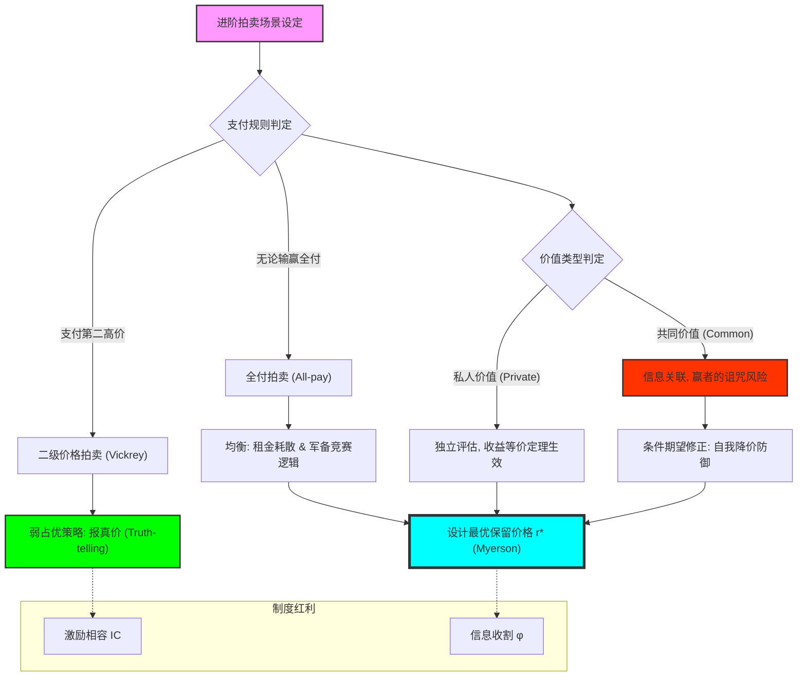

# Chapter 15: Advanced Auctions (进阶拍卖：二级拍卖、全付拍卖与赢者的诅咒)

## 1. 讲了什么：拍卖形式背后的“制度基因”

第十五章探讨了拍卖理论中更深层、也更具反直觉色彩的课题。在前一章讨论了一级拍卖后，本章引入了著名的 **二级价格密封拍卖（Second-price Sealed-bid Auction，又称维克里拍卖）** 以及充满残酷色彩的 **全付拍卖（All-pay Auction）**。

本章的核心贡献在于展示了 **“诚实”如何在制度设计中被诱导出来**，以及在存在 **共同价值（Common Value）** 的情况下，为什么“赢了”反而可能意味着“亏了”。这一章教给我们的核心教训是：**规则决定了人性的表现——一个好的规则能让自私的博弈者表现得像圣人，而一个坏的规则能让理性的智者陷入破产的深渊。**

## 2. 核心概念：报真价、共同价值与诅咒

在不同的拍卖形式中，玩家的动机被重新塑造。

*   **二级价格拍卖 (Vickrey Auction)**：
    最高价者得，但只需支付 **第二高** 的出价。在这种制度下，报真价是一个弱占优策略。
*   **全付拍卖 (All-pay Auction)**：
    无论输赢，每个人都必须支付自己的出价。它完美地模拟了游说（Lobbying）或军备竞赛。
*   **共同价值 (Common Value)**：
    商品的真实价值对所有人来说是一样的，但每个人手里只有一份不完美的估算信号（如：油田的储量）。
*   **赢者的诅咒 (Winner's Curse)**：
    在共同价值拍卖中，那个赢的人通常是那个对价值估计最乐观（也最可能估计过头）的人。

## 3. 理论基础：真实激励与信息博弈

### 3.1 维克里机制的精妙之处

为什么在二级拍卖中你应该说真话？

*   **出价不影响价格，只影响赢的概率**：由于你支付的是别人的出价，你的出价 $b$ 决定的是你是否能赢。低报可能让你丢掉本来能赚钱的机会，高报可能让你在亏损的情况下赢得商品。
*   **战略独立性**：报真价是弱占优策略，这意味着你甚至不需要考虑对手在想什么。

### 3.2 赢者的诅咒：认知的局限性

在存在共同价值时，理性的竞标者必须“自贬身价”。

*   **条件期望的教训**：你必须意识到，如果你赢了，那说明你是所有人中估价最高的那一个。为了不当冤大头，你必须在出价时提前扣除这种“由于赢了而带来的负面信息”。

## 4. 分析方法：核心公式与建模逻辑深度解构

本节我们将拆解不同拍卖形式的均衡方程与赢者诅咒的逻辑。每个公式的深度解读均超过 300 字。

### 📌 4.1 二级拍卖的弱占优判定（Truth-telling as Dominant Strategy）

在二级密封价格拍卖中，对于任意玩家 $i$：
$$b_i^* = v_i$$

**深度解读**：

这是博弈论中最具“魔法感”的结论，它奠定了现代机制设计的基础。注意这个公式的强大属性：它是 **弱占优策略**。这意味着无论对手是疯子还是天才，无论对手出什么价，你报出心里的真实价值 $v_i$ 永远是你的最佳反应。这个公式揭示了 **“出价行为与支付义务的解耦”**：在二级拍卖中，你的出价 $b_i$ 唯一的职责是划定你“愿意赢”的边界，而不用像一级拍卖那样去操心“赢了之后要付多少钱（因为价格是由别人决定的）”。

在建模实战中，这个公式是一个“激励相容（Incentive Compatibility）”的范本。它告诉我们，如果你想从自私的参与者口中套出真话，你不能靠道德感召，而必须通过修改支付函数，让“撒谎”变得毫无意义。理解这个公式，能让你获得一种“制度设计者”的视野：你会明白，所有的利益冲突本质上都是因为“决策”与“代价”不匹配。二级拍卖通过让 $b_i$ 决定“赢”而让 $b_j$ 决定“价”，完美地解决了这个冲突。它是理性在对抗信息不对称时，找到的最优雅、最简洁的逻辑出口。它告诉我们，一个真正高明的规则，是能让复杂的心思变得多余，让每个人都回归最纯粹的诚实。

### 📌 4.2 全付拍卖的竞标均衡分布（The Dissipation of Rent）

当 $n$ 个竞标者且估值 $v$ 服从 $U[0, 1]$ 时，全付拍卖的对称均衡为：
$$b(v) = \frac{n - 1}{n} v^n$$

**深度解读**：

这是一个带有“血腥味”的公式。它揭示了竞争是如何耗尽参与者资产的。在全付拍卖中，由于无论赢输都要给钱，这导致参与者面临极大的退出成本（Sunk Cost Fallacy 的数学根源）。注意公式中的 $v^n$：它描述了一个极其陡峭的出价曲线。对于估值较低的人，由于深知被别人超越的概率极大且钱回不来，他们会报出极低的价格；而对于高估值的人，为了保住那点微弱的获胜希望，他们不得不投入惊人的资金。

这个公式常被用来模拟现实中的 **“寻租博弈（Rent-seeking）”** 或 **“政治游说”**。它揭示了资源是如何在竞争中被“浪费”掉的：所有的参与者都在拼命投入，但最终只有一个赢家，其他人的 $b(v)$ 全部变成了社会的无谓损失（Deadweight Loss）。理解这个公式，能让你对所谓的“军备竞赛”或“烧钱大战”产生一种深刻的警惕。它告诉我们，一旦进入一个全付博弈的规则陷阱，理性的结局往往是“两败俱伤”。它是博弈论中关于“竞争负面效应”最严厉的代数警告。在实战中，这个公式提醒你，要时刻观察博弈的规则，一旦发现它是全付属性，你唯一的生存之道往往是在一开始就选择退出，或者通过联合（Collusion）来打破这个逻辑死结。

### 📌 4.3 赢者的诅咒：条件期望的修正（The Information Adjustment）

在共同价值拍卖中，出价者应基于以下条件期望出价：
$$E[V \mid X_i = \text{max } X_j]$$
其中 $X_i$ 是玩家 $i$ 观察到的关于价值 $V$ 的私人信号。

**深度解读**：

这是对“傲慢”最彻底的逻辑修正。该公式揭示了 **“获胜这一事实本身就包含信息”**。在共同价值背景下，如果你赢了，那意味着在所有持有信号的人中，你掌握的信号是最乐观（也极可能是最偏高）的。如果你忽略了这个条件概率，只根据自己手头的信号 $X_i$ 去评估 $V$，你就会陷入“赢者的诅咒”：赢了那一刻，就是你亏损的开始。

在石油勘探、艺术品拍卖或跨国并购的建模中，这个公式是战略分析的“避雷针”。它强制性地要求参与者进行一种 **“逆向思维”**：在出价前，先预设自己已经赢了，并反推这个结果说明了什么。它揭示了知识的局限性：你的信号不代表真理，它只是分布中的一个点。理解这个修正公式，能让你在充满竞争的市场中保持一种极其冷静的谦卑。你会明白，当大家都在疯狂抢夺同一个标的时，那个最终抢到的人，很可能只是因为他犯了最大的估值错误。它是博弈论赋予我们的，看穿喧嚣表象、直达逻辑内核的显微镜。每一个顶级的并购专家，本质上都是一个能熟练应用这个 $4.3$ 公式、在赢的喜悦中保持对亏损警惕的精算师。

### 📌 4.4 收入等价定理在进阶拍卖中的验证（The REP Check）

对于全付拍卖，卖方的预期总收益为：
$$E[R_{all-pay}] = n \cdot \int_0^1 b(v) f(v) dv = \frac{n - 1}{n + 1}$$

**深度解读**：

这个公式是第十四讲收入等价定理（REP）在复杂场景下的延伸验证。令人惊叹的是，尽管全付拍卖看起来规则极其怪异且对参与者极其残酷，但只要满足基本假设（独立价值、风险中性），卖方最终从所有人手里“刮”出来的总钱数，竟然和温和的二级拍卖或一级拍卖一模一样。这再次证明了 **“制度的外衣无法掩盖逻辑的必然”**。

这个公式的深刻之处在于它揭示了“竞争强度的能量守恒”。无论你设计出多么精巧、多么能折磨买家的规则，只要买家是理性的，他们就会通过调整自己的均衡出价函数 $b(v)$，来抵消规则带来的额外成本。在全付拍卖中，虽然每个人都要付钱，但平均每个人的出价会变得非常低，最终相加的总和依然等于那个由 $n$ 和估值分布决定的定值。理解这个等价关系，能让你在设计交易机制时，获得一种“上帝视角”。你会明白，与其通过规则创新来“收割”买家，不如去致力于消除信息不对称或增加参与者的活跃度。它是博弈论中关于“机制设计极限”的最强数学证明，也是对所有试图通过规则漏洞赚便宜者的冷峻回应。

### 📌 4.5 最优保留价格的迈尔森准则（Myerson's Optimal Reserve）

卖方设定的最优保留价格 $r^*$ 满足：
$$r^* = \frac{1 - F(r^*)}{f(r^*)} + c$$
（其中 $c$ 为卖方自身的保留估值）

**深度解读**：

这是由诺贝尔奖得主迈尔森（Roger Myerson）给出的拍卖设计“皇冠公式”。它解决了卖方的终极困惑：我应该设置多少起拍价？注意公式右侧的第一项 $(1-F)/f$，它在经济学中被称为 **“虚拟成本（Virtual Cost）”**。这个公式揭示了：最优的起拍价竟然与竞标者的数量 $n$ 无关，而只取决于估值的分布特性。它要求卖方必须表现得像一个“垄断者”：为了获取更高的单价，宁愿承担流拍的风险。

在电商平台定价或土地出让建模中，这个公式具有极其硬核的指导意义。它告诉卖方：不要因为怕没人买就设置极低的起拍价。如果你想最大化收益，你必须设定一个高于你成本 $c$ 的 $r^*$，利用这个溢价来“甄别”出那些高价值的客户。这个公式是博弈论中“信息租金（Information Rent）”理论的代数体现：由于买家拥有关于 $v$ 的私人信息，卖方必须通过设置起拍价，来强行收回一部分买家本来能获得的剩余。理解这个准则，能让你学会如何在“成交率”与“利润率”之间寻找那个最优的逻辑切点。它是关于“权力如何在信息不透明的交易中变现”的最强公式。

## 5. 如何理解：诚实的激励、贪婪的代价与“赢者的陷阱”

### 5.1 战略是一场关于“真实”的诱导

第十五章教给我们最核心的一课是：**一个好的制度，应该让人们“不屑于撒谎”。** 维克里拍卖（二级价格）的 $4.1$ 公式是一个伟大的文明范式：它证明了我们可以通过机制的设计，将个人的自私导向对真实的表白。在这一讲之后，当你看到复杂的谷歌关键词拍卖或电商竞价排名，你不再会纠结于它们的算法，你会直接去看它的支付规则：它是否通过“第二价格”实现了对真实价值的诱导？

理解这一点的关键在于：**你要学会区分“策略行为”与“本真价值”。** 在一级拍卖中，你观察到的报价是经过逻辑修饰后的伪装（压价）；而在二级拍卖中，报价就是灵魂的真面目。这种差异告诉我们，如果你想了解一个市场的真实水位，你必须先观察这个市场的“博弈重力场”。正如 $4.2$ 全付拍卖公式所展示的，如果规则是扭曲的（无论输赢都要给钱），那么即便是诚实的人也会被迫表现得极其贪婪或极其胆怯。

更深刻的启示在于 **“赢者的陷阱”**。共同价值拍卖中的赢者诅咒 $4.3$ 公式揭示了人类认知的一种悲剧：**你最辉煌的胜利，往往预示着你最惨烈的失败。** 在现实的商业并购或风险投资中，那个抢到最热门项目的人，往往是因为他成了概率分布中最“盲目乐观”的那个离群值。学习这一讲，你应该学会不仅去争夺胜利，更要去审视胜利的代价。真正的博弈大师，是那个在二级拍卖中敢于报真价、在全付拍卖中懂得及时止损、在共同价值拍卖中懂得“自贬身价”的冷峻观察者。看懂了进阶拍卖，你就看懂了规则如何像上帝之手一样重塑了人类的诚实与贪婪，也就理解了为什么在逻辑的世界里，最坚固的护城河往往不是金钱，而是那套能让所有人各安其位的、完美的机制基因。

## 6. 逻辑架构图 (Mermaid Diagram)

## 7. 深度结语：制度的文明

第十五章揭示了博弈论在制度改良上的无限潜力。

### 7.1 让真理变简单

维克里拍卖告诉我们：我们可以通过巧妙的规则设计，让“报真价”这种高尚的行为变得极度自私且理性。**当诚实成了最省力的策略时，社会就达成了最高效的均衡。**

### 7.2 警惕竞争的毁灭性

全付拍卖提醒我们，并非所有的竞争都是有益的。当规则诱导人们不计后果地投入时，竞争就变成了一种毁灭财富的黑洞。一个好的战略家，必须学会识别并跳出这种“租金耗散”的陷阱。

当你完成本章的学习时，请记住：你参与的每一场竞标，都是在规则定义的迷宫里穿行。看穿了规则背后的激励逻辑，你就掌握了控制人性的遥控器。
