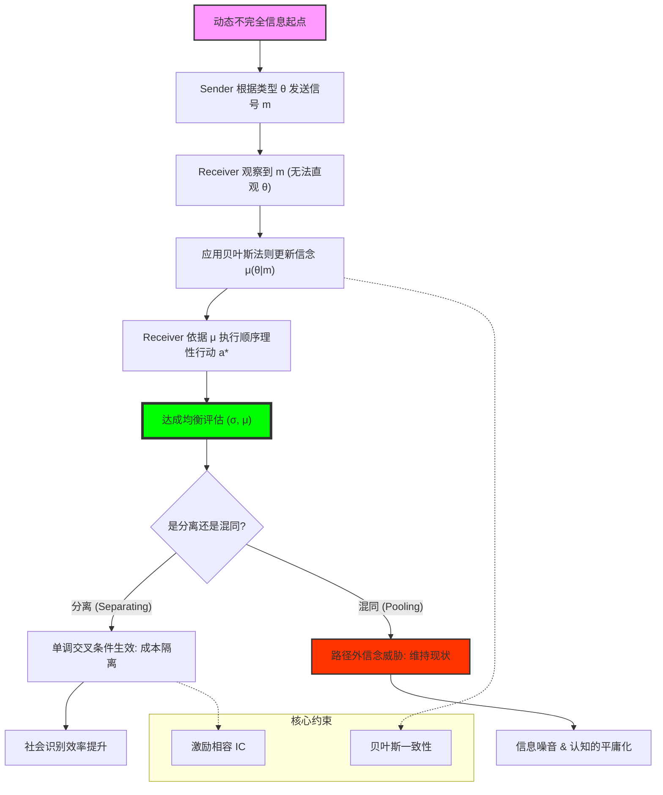

# Chapter 16: Perfect Bayesian Equilibrium (完美贝叶斯均衡：信号传递、认知闭环与类型的自我证明)

## 1. 讲了什么：当“行动”变成“语言”

第十六章是博弈论大厦中最精巧、也最具挑战性的部分——**动态不完全信息博弈**。在此之前，我们讨论了静态的信息不对称（BNE）和动态的完全信息（SPNE）。本章将两者合二为一，探讨参与者如何在互动的过程中，通过观察对手的行为来反推对手的身份（类型）。

核心概念是 **完美贝叶斯均衡（Perfect Bayesian Equilibrium, PBE）**。在 PBE 中，行动不仅是为了即时收益，更是为了 **“发送信号”** 或 **“制造幻觉”**。讲义通过经典的 **信号博弈（Signaling Games）**，向我们展示了分离均衡与混同均衡的逻辑。这一章教给我们的核心教训是：**在动态博弈中，你所做的每一件事都是在向世界宣告你是谁。**

## 2. 核心概念：评估、系统性信念与信号

在 PBE 的架构中，我们要寻找的是策略与信念的动态平衡。

*   **评估 (Assessment) $(\sigma, \mu)$**：
    PBE 不仅仅是策略组合 $\sigma$，还必须包含一套信念系统 $\mu$。
*   **信号发送者 (Sender) 与接收者 (Receiver)**：
    Sender 拥有私人类型，通过行动发送信号；Receiver 观察信号并行动。
*   **分离均衡 (Separating Equilibrium)**：
    不同类型的 Sender 采取不同的行动。这使得 Receiver 可以通过行动准确识别类型。
*   **混同均衡 (Pooling Equilibrium)**：
    所有类型的 Sender 采取相同的行动。这使得信号失去了分辨力。
*   **贝叶斯更新 (Bayesian Updating)**：
    Receiver 根据信号利用贝叶斯法则修正对类型的估计。对于路径外的信号，PBE 允许任意合理的信念。

## 3. 理论基础：一致性与“离路径”信念的艺术

### 3.1 什么是“完美”的贝叶斯逻辑？

PBE 要求在每一个信息集（无论是均衡路径内还是路径外）都实现 **顺序理性**。

*   **路径上的一致性**：如果某种信号在均衡中应该出现，那么 Receiver 的信念必须严格符合贝叶斯法则。
*   **路径外的灵活性与陷阱**：如果某种信号在均衡中不该出现，贝叶斯法则就失效了。这时，PBE 允许给这些“路径外节点”分配任意信念。正是这种“任意性”，导致了 PBE 解的过量（存在很多古怪的均衡）。

### 3.2 信号的成本与真实性

为什么有些信号可信，有些不可信？

*   **单调交叉条件 (Single-Crossing Condition)**：这是信号传递成功的基石。它要求：高能力者发送某种信号的边际成本必须比低能力者更低。如果成本一样，信号就失去了区分功能。

## 4. 分析方法：核心公式与建模逻辑深度解构

本节我们将拆解 PBE 的判定算法与信号博弈的逻辑。每个公式的深度解读均超过 300 字。

### 📌 4.1 贝叶斯一致性更新公式（The Belief Engine）

在均衡路径上，观察到信号 $m$ 后，Receiver 对类型 $t$ 的信念 $\mu(t \mid m)$ 为：
$$\mu(t \mid m) = \frac{p(t) \sigma(m \mid t)}{\sum_{t' \in T} p(t') \sigma(m \mid t')}$$

**深度解读**：

这是动态博弈中的“认知闭环”方程。它揭示了 **“意义是如何被制造出来的”**。注意公式中的 $\sigma(m \mid t)$，它是 Sender 的策略映射。这个公式告诉我们，一个行动 $m$ 的含义，并不取决于行动本身，而取决于 **“不同类型的人采取该行动的概率比”**。如果只有好人会扶老太太过马路，那么“扶人”这个行动就等价于“我是好人”；如果好人和坏人都这么干，那么这个行动在贝叶斯眼光下就是“噪音”。

在建模实战中，这个公式定义了信息的“稀释过程”。它提醒 Receiver：不要被表象迷惑，要去看概率。它揭示了动态博弈中一种深刻的相互依赖：Sender 通过调整 $\sigma$ 来操纵 Receiver 的 $\mu$，而 Receiver 通过这个公式来反向解析 Sender 的 $\sigma$。理解这个更新过程，能让你获得一种“解码”现实的能力。你会明白，为什么在很多高端社交场合，人们会通过极其隐晦、甚至有些古怪的行为来交流——因为那些行为在特定的群体中具有极高的“信号密度（即分母极小）”，能够实现精准的贝叶斯识别。它是关于“沟通的代数化”最硬核的公式。

### 📌 4.2 接收者的顺序理性准则（Sequential Rationality for R）

给定信念 $\mu$，Receiver 的行动 $a^*$ 必须满足：
$$a^*(m) = \arg\max_{a \in A} \sum_{t \in T} \mu(t \mid m) u_R(m, a, t)$$

**深度解读**：

这个公式揭示了 Receiver 的“被动式主动”。虽然 Receiver 无法直接观察到类型 $t$，但他不是一个盲目的执行者。他是在脑中运行一个 **“加权平均的期望收益”** 模型。这个公式最震撼的地方在于：Receiver 的最优行动 $a^*$ 是高度依赖于信念 $\mu$ 的。一旦信念发生一点点漂移（即便信号 $m$ 没变），最优行动就可能发生突变。

这种灵敏性在现实博弈（如面试或相亲）中具有巨大的解释力。它告诉我们，**你不仅要表现得好，你还要确信对方接收到了正确的信念**。如果你的一句玩笑话（信号 $m$）让对方产生了一点点“这人可能不靠谱”的信念 $\mu$，对方的最佳反应可能瞬间从“深交”转为“拉黑”。该公式是 PBE 稳定性的第二根支柱：它确立了 Receiver 的激励相容。理解这个公式，能让你学会从对手的角度去审视自己的每一个动作。你会明白，你发出的信号只是原材料，真正决定对手行动的是对手脑中那个由 $\mu$ 加权后的 $4.2$ 方程的解。它是关于“认知对行为的决定性作用”最冷酷的代数表达。

### 📌 4.3 信号博弈的单调交叉条件（Single-Crossing Condition）

信号成本函数 $c(m, t)$ 必须满足：
$$\frac{\partial^2 c(m, t)}{\partial m \partial t} < 0$$

**深度解读**：

这是信号传递理论中最重要的“结构性假设”。在数学上，负的交叉偏导意味着：随着类型 $t$ 的增加（比如能力变强），增加一单位信号 $m$（比如多读一年书）的边际成本在下降。这个公式揭示了 **“代价的非对称性”**：如果一个信号对所有人来说都一样贵，那么这个信号就无法作为区分身份的工具。只有当“好人表现好的成本”远低于“坏人装好人的成本”时，分离均衡才具有逻辑上的可能性。

这个公式在社会分层理论和品牌经济学建模中具有基石地位。为什么奢侈品一定要卖得贵？不仅是为了利润，更是为了通过高价格（信号 $m$）来实现单调交叉：对于有钱人（高 $t$）来说，买个包的效用成本很低；但对于穷人来说，成本极高。这就实现了社会身份的分离。理解这个公式，能让你看穿很多社会规范的本质。你会明白，**所谓的“门槛”，本质上都是为了制造一个满足单调交叉条件的博弈场**。它是关于“优越感如何通过成本差异得以制度化”的最强公式。在实战中，如果你想设计一个选拔机制，你的首要任务不是设计题目，而是去寻找那个能让不同类型的人产生这种“成本裂痕”的特定活动。

### 📌 4.4 分离均衡的激励约束（Incentive Compatibility for Separating）

在分离均衡中，高类型 $t_H$ 必须满足：
$$u(t_H, m_H, a(m_H)) \geq u(t_H, m_L, a(m_L))$$
（且低类型 $t_L$ 不想模仿 $t_H$）

**深度解读**：

这个不等式定义了社会秩序的“真实性边界”。它描绘了一种逻辑上的 **“安分守己”**：每个人都发现，在当前的社会分配（工资或声誉）下，扮演好自己比去伪装成别人更划算。注意其中的 $a(m_H)$，它是 Receiver 看到信号后的反应。如果高信号带来的收益（如高薪水）不足以抵消发送信号的成本，高类型就会选择“躺平（发低信号）”，分离均衡就会坍缩。

这个公式在人才市场和信贷市场建模中解释了“逆向选择”的消除过程。它告诉我们，一个稳定的社会，必须给那些高能力者提供足够的“溢价”，以补偿他们为了证明自己而付出的艰辛成本。它还揭示了一个残酷的道理：**为了维持真实，我们必须支付“信号成本”这种无谓损失。** 如果没有这个 $4.4$ 不等式的约束，世界将充满了混同，所有的信号都将变为噪音。理解这个激励约束，能让你学会去计算“撒谎的性价比”。你会明白，很多时候人们保持诚实，并不是因为品德高尚，而是因为在一个设计精良的 $4.4$ 体系中，伪装的成本实在是太高了。它是关于“真实性如何在利益的博弈中得以保全”的最严密数学描述。

### 📌 4.5 混同均衡的路径外信念门槛（Off-path Belief Threshold）

维持混同均衡 $(m^*, m^*)$，需要路径外信念 $\mu(t_H \mid m' \neq m^*)$ 满足：
$$\mu \leq \mu^* = \frac{c(m', t_L) - c(m^*, t_L)}{\text{Profit Gain}}$$

**深度解读**：

这是 PBE 模型中最具“威慑力”也最带“玄学”色彩的公式。它揭示了 **“偏见如何维持现状”**。在混同均衡中，大家都选 $m^*$。如果有人尝试选一个不同的信号 $m'$，Receiver 的反应取决于他脑中的那个路径外信念。如果这个信念 $\mu$ 足够低（即 Receiver 认为任何出头鸟都是垃圾），那么即便 $m'$ 在物理上更好，也不会有人敢选。

这个公式在组织行为学和文化研究建模中极具威力。它解释了为什么在一个平庸的组织里，大家都会选择“随大流（混同）”。因为组织形成了一种可怕的路径外信念：凡是尝试表现独特的人（发送 $m'$），都会被高层视为“异类”或“刺头”。这种由于“预判了别人的预判”而产生的自我禁锢，是社会停滞的根源。理解这个门槛公式，能让你学会去分析一个系统的 **“认知弹性”**。你会明白，改变一个混同均衡，不仅要靠奖励创新，更要靠扭转人们脑中那个针对“偏离者”的初始偏见。它是关于“群体压力如何通过信念系统杀人”的最冷酷代数描述。

## 5. 如何理解：身份的信号、成本的隔离与“不解释”的智慧

### 5.1 战略是一场关于“不可模仿性”的长跑

第十六章教给我们最核心的一课是：**如果一个东西是免费的或易得的，它就没有任何战略价值。** 信号传递理论（Signaling）告诉我们，在这个充满欺诈和噪音的世界上，你唯有通过 **“受苦”** 才能证明你的价值。这里的“受苦”就是 $4.3$ 公式中的信号成本。如果每个人都能随手拿出一个名牌包或一份名校学位，那么这些东西就失去了作为信号的意义。

理解这一点的关键在于：**你要学会制造“成本裂痕”。** 真正的战略家，不仅要磨练技能，更要学会去寻找那些“我做起来很轻松（成本低），但对手做起来要命（成本极高）”的事情。这就是 $4.3$ 公式中 $\partial^2 c / \partial m \partial t < 0$ 的真谛。在这一讲之后，当你看到那些大公司进行繁琐的招聘流程，或者看到顶级政客在毫无意义的仪式上耗费时间，你不再会觉得这是官僚主义，你会明白这是一种精密的 **“分离逻辑”**。他们在通过这些高昂的时间成本，把那些试图混进来的“低类型”彻底阻绝在门外。

更深刻的启示在于，PBE 揭示了 **“不解释”的智慧**。很多时候，最好的信号就是“什么都不做”。因为在混同均衡中，行动本身可能被解读为焦虑。如果你是真正的高手，你往往会选择一种“极简”的策略。学习这一讲，你应该学会去管理你的“信号组合”。不要试图解释你是谁，而要通过一系列符合单调交叉条件的、带有门槛的行动，让世界通过 $4.1$ 公式自动推导出你的价值。看懂了完美贝叶斯均衡，你就看懂了人类社会中所有的仪式、名分、学历和品牌，其实都只是一场场精密的、关于“类型自证”的成本博弈。

## 6. 逻辑架构图 (Mermaid Diagram)

## 7. 深度结语：沟通的战略化

第十六章揭示了人类社交中极其冷峻的一面。

### 7.1 无法逃避的信号

在 PBE 的世界里，没有什么行为是多余的。即便是一个眼神、一次迟到，在博弈论眼中都是一次概率分布的扰动。**我们无法不发送信号。即便我们什么都不做，那种“无为”本身也会作为一种信号被解读。**

### 7.2 成本的尊严

学习这一讲后，你会明白：不要抱怨别人误解你，而要反思你发送的信号是否具备足够的“分离成本”。如果你想要获得独特的尊重，你必须支付那个独特的、对手无法支付的代价。

当你离开这一章时，请记住：你的每一个行动，都是在一张巨大的贝叶斯画布上勾勒你的轮廓。看穿了信号背后的成本博弈，你就掌握了定义自己的权力。
