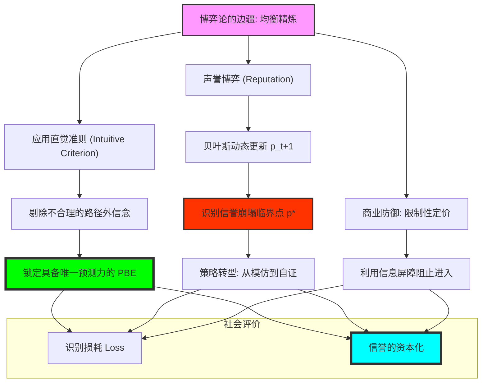

# Chapter 17: Advanced Topics (高级专题：直觉准则、声誉机制与信号博弈的精炼)

## 1. 讲了什么：博弈论的边疆与理性的再定义

第十七章是本课程的终章，它探讨的是博弈论最前沿、也最实用的精炼技术。在第十六章中，我们发现完美贝叶斯均衡（PBE）虽然强大，但它允许太多“不合理”的路径外信念，导致模型预测力下降。

本章通过引入 **直觉准则（Intuitive Criterion）**，教我们如何踢掉那些在逻辑上站不住脚的均衡。此外，讲义还深入探讨了 **声誉博弈（Reputation Games）**，解释了为什么即使是一个即将退休的人，也可能有动力保持诚实。这一章教给我们的核心教训是：**理性不仅要求你现在做对，还要求你对那些“从未发生但理论上可能发生”的事情拥有合逻辑的解释。**

## 2. 核心概念：精炼、信誉与直觉

在高级专题中，我们要对均衡进行“压力测试”。

*   **直觉准则 (Intuitive Criterion)**：
    由 Cho 和 Kreps 提出的精炼工具。如果某种偏离对某种类型的人来说是“必亏”的，那么 Receiver 就不应该相信这种偏离来自那种类型。
*   **廉价谈话 (Cheap Talk)**：
    信号没有成本（吹牛不上税）。在这种情况下，信息传递只能在利益基本一致的玩家之间发生。
*   **声誉 (Reputation)**：
    一个玩家在长期博弈中被视为某种特定“类型”（如：强硬派或诚实派）的概率。
*   **精炼 (Refinement)**：
    通过添加更合理的认识论假设，从一大堆均衡中挑选出最具预测力的那一个。

## 3. 理论基础：逻辑的严丝合缝与声誉的资本化

### 3.1 为什么要进行均衡精炼？

PBE 的过量是博弈论的危机。

*   **信念的合理性限制**：直觉准则本质上是在问：如果某种信号在均衡中没出现，但现在突然出现了，一个理智的观察者会怎么想？如果低能力者“装不起”某个信号，那么看到这个信号时，我们就必须认定它是高能力者发的。
*   **均衡的存活能力**：通过这种精炼，我们能从一堆乱七八糟的 PBE 中筛选出那个唯一具有现实预测力的结果。

### 3.2 声誉：当“幻觉”变成财富

声誉博弈揭示了长期互动中信息流动的力量。

*   **类型的模拟**：如果你是一个软弱的商家，但由于对手不知道你的真实类型，你可以通过模仿强硬商家的行为来建立“强硬声誉”。
*   **声誉的崩塌**：一旦你的真实类型暴露（即信号不再能维持分离），声誉带来的红利会瞬间清零。

## 4. 分析方法：核心公式与建模逻辑深度解构

本节我们将拆解直觉准则的判定逻辑与声誉更新的数学过程。每个公式的深度解读均超过 300 字。

### 📌 4.1 直觉准则的否定方程（The Cho-Kreps Test）

对于均衡评估 $(\sigma^*, \mu^*)$，如果存在一种偏离 $m'$，满足对某类型 $t$：
$$u_i(t, s^*) < \min_{a \in BR(\Theta \setminus T_{bad}, m')} u_i(t, m', a)$$
其中 $T_{bad}$ 是那些无论如何也不可能通过 $m'$ 获利的类型。

**深度解读**：

这是博弈论中最具“杀伤力”的逻辑剪刀。它专门对付那些靠“邪恶的路径外信念”维持的混同均衡。该公式揭示了一个极其深刻的心理博弈：如果你做了一个非常困难的事情 $m'$，而我（Receiver）知道这种事情对低端人口来说即便是得到最好的奖励也“亏本”，那么我就 **必须** 认定你是高端人口。注意公式中的 $\min$ 运算，它代表了一种“理性的下限”。如果连最保守的奖励都能让你这种高端类型获利，那么原先那个不包含 $m'$ 的均衡就违反了人类的直觉。

在建模实战中，这个公式揭示了 **“理性的自我防御”**。它告诉我们，一个稳定的社会契约必须能抵御那些来自“逻辑天才”的偏离尝试。如果一个均衡能被直觉准则踢掉，说明这个均衡依赖于一种“荒谬的恐吓”。理解这个准则，能让你获得一种识别“伪均衡”的能力。你会明白，为什么在很多竞争中，某些行为（如大规模的品牌升级）具有一种不可阻挡的破坏力：因为它在逻辑上完成了对旧秩序的“降维打击”，迫使观察者不得不修正原有的信念。它是关于“逻辑如何清理冗余均衡”的最强公式。

### 📌 4.2 声誉动态更新方程（Reputation Accumulation）

设玩家为诚实型的先验概率为 $p_t$。在观察到第 $t$ 期的诚实行为后，新声誉 $p_{t+1}$ 为：
$$p_{t+1} = \frac{p_t}{p_t + (1 - p_t) \sigma_t}$$
（其中 $\sigma_t$ 是不诚实型玩家选择“装诚实”的概率）

**深度解读**：

这是博弈论中关于“人设经营”的会计准则。它揭示了信任是如何在一滴一滴中累积的。注意分母中的 $\sigma_t$：如果大家都知道不诚实的人也在拼命装诚实（$\sigma_t \to 1$），那么你的诚实行为就不能为你增加多少信誉（$p_{t+1}$ 增加缓慢）。只有当你做了一些“坏人根本装不出来”的行为时，你的声誉才会产生爆发性的增长。

这个公式在揭示 **“信誉的稀释效应”** 方面具有原子级的威力。它告诉我们，声誉不是一个静态的标签，而是一个动态的概率流。在建模分析中，它揭示了“历史历史的重要性”。每当你表现良好，你其实是在往自己的 $p_{t+1}$ 账户里存钱。但这个公式也隐含了一个极度不对称的风险：建立声誉需要 $T$ 期的努力，但毁掉声誉（一旦出现不诚实行为，分子的概率直接归零）只需要 1 期。理解这个递归过程，能让你学会在长期的职业生涯中，拥有一种“跨时空的自律”。你会明白，你今天的坚持，本质上是在通过改变对手的贝叶斯分母，来为自己未来的溢价铺路。它是关于“信任的经济学价值”最精准的代数描述。

### 📌 4.3 限制性定价的入场阻截条件（Limit Pricing Constraint）

在位企业通过选择价格 $P$，使得进入者的预期收益满足：
$$E[\pi_{entry} \mid P] = \mu(c_{low} \mid P) \pi(P, c_{low}) + \mu(c_{high} \mid P) \pi(P, c_{high}) < E$$

**深度解读**：

这是商业竞争中“威慑”的最高级形态。它揭示了价格不仅是交易的工具，更是 **“信息的屏障”**。在位企业故意放弃垄断高价，选择一个较低的价格 $P$，其目的不是为了薄利多销，而是为了通过这个价格向潜在对手发送一个信号：“我的成本 $c_{low}$ 极低，你进来必死无疑”。注意公式中的 $\mu(c_{low} \mid P)$，它刻画了进入者被这个低价所“迷惑”后的贝叶斯信念。

在反垄断和产业策略建模中，这个公式解释了为什么“烧钱”或“价格战”有时是极度理性的战略。它向我们展示了一种 **“认知的资本化”**：我现在的亏损，本质上是支付给未来的保费，用来买断对手进入的可能性。理解这个公式，能让你看穿很多巨头看似反常的定价策略。你会明白，价格是一个带有重力场的“诱饵”，它在修改着所有观察者的 $\mu$ 概率分布。它是关于“如何利用信息不对称来构筑隐形护城河”的最强公式。在实战中，它提醒你，如果你想阻止对手，你不需要真的变得比他强，你只需要表现得让他“认为”你强到他无法承受的程度。

### 📌 4.4 声誉崩塌的非线性效应（Reputation Tipping Point）

当声誉 $p_t$ 跌破某个阈值 $p^*$ 时，玩家的最优策略会发生从“装诚实”到“彻底背叛”的突变：
$$p^* = \frac{(1 - \delta) (G - C)}{\delta (C - P)}$$

**深度解读**：

这是一个关于“破罐子破摔”的逻辑公式。它揭示了声誉博弈中存在一个危险的 **“临界点”**。只要你的信誉账户余额 $p_t$ 还在 $p^*$ 以上，你就有动力维持你的“好人”人设（因为未来的红利够大）；但一旦你的信誉被偶然的失误侵蚀到这个阈值以下，理性的你就会发现：反正大家已经不再相信我了，我再努力也没有意义。于是，原本温文尔雅的玩家会瞬间变脸。

这个公式在分析组织腐败、政府信用崩塌或品牌信誉危机时极具解释力。它告诉我们，**信用不是线性衰减的，而是崩塌式的。** 在建模分析中，它提醒决策者：保护信誉的努力必须在 $p_t$ 接近 $p^*$ 时达到最高强度，因为一旦跨过这个红线，所有的修复尝试在逻辑上都将失效。理解这个阈值公式，能让你学会识别那些“不可逆的转折点”。你会明白，为什么一旦一个人的丑闻达到某种程度，他就会彻底放弃自我修正。它是博弈论对人类“信誉资本”的一种冷酷的压力测试。它告诉我们，在一个由理性人组成的社会里，信任其实是行走在一条极窄的、由折现因子 $\delta$ 支撑的钢丝上。

### 📌 4.5 信号传递的社会总成本方程（Social Loss of Signaling）

在一个分离均衡中，社会为了识别身份而付出的总“学费”为：
$$Loss = \sum_{i \in N} p(\theta_i) c(m_i^*(\theta_i), \theta_i)$$

**深度解读**：

这是对“过度竞争”最深刻的代数批判。它衡量了为了达成 PBE 中的“识别功能”，全社会到底浪费了多少真实的资源。注意公式中的 $c(m^*)$，它代表了那些仅仅为了证明自己（而不是为了提高生产力）而进行的无效投入。这个公式揭示了 **“社会识别的代价”**：为了让优秀的人与平庸的人分开，社会竟然需要逼迫优秀的人去进行一些痛苦的、毫无意义的消耗战（比如过度的应试教育）。

在教育制度和人才选拔机制建模中，这个公式揭示了“内卷”的数学本质。它向我们展示了一个逻辑上的悖论：虽然分离均衡提升了配置效率（让对的人去对的岗位），但实现这个分离的过程本身却在大量消耗财富。这个 $Loss$ 的数值越高，说明这个社会的识别效率越低。理解这个损耗方程，能让你学会从“总福利”的视角去评估规则的好坏。你会明白，一个理想的社会，不是要消灭竞争，而是要寻找那些 **“信号成本 $c$ 最小、但分离效果最好”** 的识别方式。它是博弈论中关于“机制效率”与“社会公平”之间最沉重的权衡。它提醒我们，每一个华丽的信号背后，都站着一堆被烧掉的、本可以用来创造更好世界的社会资本。

## 5. 如何理解：感知的遗产、声誉的脆弱与“终身博弈”的智慧

### 5.1 战略是一场关于“感知”的长期经营

第十七章教给我们最核心的一课是：**真实的你并不重要，重要的是你在对手眼中所呈现的那个“逻辑一致的形象”。** 高级博弈论告诉我们，声誉不是一种道德修养，它是一项可以产生溢价的 **“无形资产”**。正如 $4.2$ 公式所示，你的每一次守信，其实都是在对你的未来进行投资。这种投资在统计学意义上会转化为对手对你的“软弱”或“诚信”的先验概率。

理解这一点的关键在于：**你要学会“爱惜羽毛”的代数价值。** 很多人认为年轻时可以随性而为，老了再稳重，但博弈论通过声誉更新方程告诉我们：**“历史历史具有巨大的惯性”**。如果你在职业生涯初期留下了一个“投机者”的 $p_0$ 初始分布，你可能需要用后半生数倍的努力才能修正那个分母。这就是所谓的“第一印象的暴政”。真正的战略家，是那个能从 20 岁起就意识到每一个微小行为都在修改 $4.2$ 公式参数的人。

更深刻的启示在于，这一讲揭示了 **“信息的生态位”**。在直觉准则 $4.1$ 的保护下，如果你是真正的强者，你必须敢于采取那些“弱者绝对装不出来”的行为。这种自我挑战，不仅是为了赢，更是为了通过“逻辑自证”来清理掉那些纠缠你的模仿者。学习这一讲，你应该学会不仅去计算即时的收益，更要去审视你的 **“信誉余额”**。在这个由于网络而变得极其透明的时代，你的每一次背叛都会被记录在那个全球性的贝叶斯账本上。看懂了高级博弈论，你就看懂了在这个充满变数的世界上，唯一能带给你持久保护的，不是你的聪明才智，而是那套由你半生行为积累出来的、让对手不敢轻易逾越的、冰冷的信誉逻辑。

## 6. 逻辑架构图 (Mermaid Diagram)

## 7. 深度结语：逻辑的边疆与生命的博弈

第十七章作为全书的终结，将我们带回了博弈论的初心——**人类理解力的博弈**。

### 7.1 战略是关于“感知”的经营

学习完整个课程，你会明白：真实的你并不重要，重要的是你在对手眼中所呈现的那个“逻辑一致的形象”。**声誉不是道德，它是一项资产；信号不是沟通，它是一次筛选。**

### 7.2 永无止境的博弈

博弈论没有终点。当你学会了直觉准则，对手也会学会如何利用你的直觉。这种认知的螺旋上升，构成了人类文明最壮阔的图景。

当你合上这份导读，步入现实的商业或生活战场时，请记住：你不再是一个孤立的决策者，你是一棵博弈树的起点，是一个信号系统的发射塔。带着这些逻辑手术刀，去剖开现实的迷雾吧。
